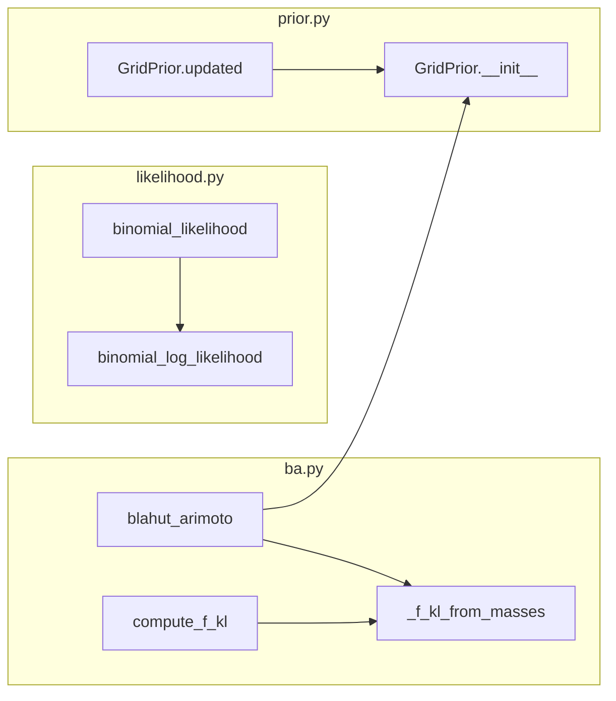
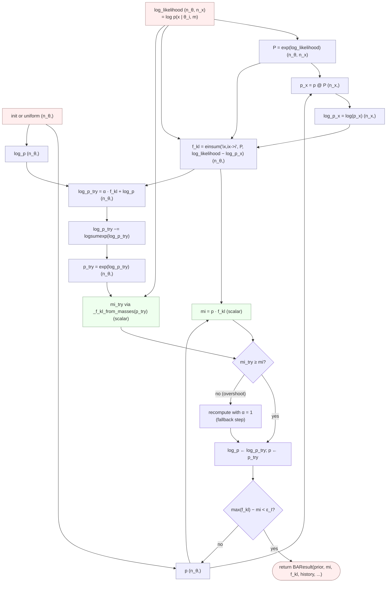
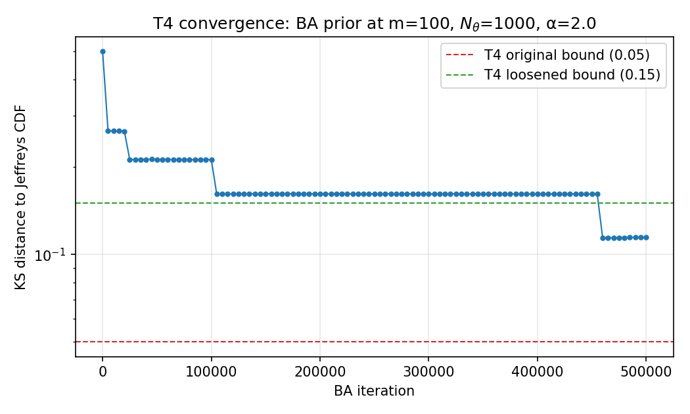

# Spec 000 — Static infomax prior (Mattingly Fig 1)

User-facing documentation for the artefacts produced by spec 000.
The spec itself lives at [`specs/000-static-infomax-fig1.md`](../../specs/000-static-infomax-fig1.md);
the implementation under `src/infomax/`; the test suite in
`tests/test_000_static_infomax_fig1.py`; the codegen audit trail in
`experiments/000-static-fig1/CODEGEN_LOG.md`.

This file collects notes that would otherwise scatter across the spec
revision log and the codegen log — things a future reader needs to
understand the code's behaviour but that don't belong inside the math
spec.

## Call graph

Generated from `src/infomax/` with `code2flow` (see
`_make_call_graph.py` in this directory; re-run when the package
changes). Only intra-package calls picked up by code2flow's static
analysis are shown — calls into NumPy / SciPy and a few instance-method
edges that code2flow doesn't trace are omitted.

## Data flow through the BA iteration

Tensor shapes through one iteration of `blahut_arimoto` (spec §3.4
with the §3.4 overrelaxation + line-search fallback). `n_θ` is the
grid size; `n_x = m + 1` is the output alphabet of the Binomial. The
likelihood matrix is precomputed once outside the loop.

Convergence is checked via Csiszár's gap `max_i f_KL_i − I_τ`, which
upper-bounds `MI* − I_τ` directly (see [Design decisions](#design-decisions)
DD3 below). The line-search fallback to `α = 1` preserves the
monotonicity guarantee that test T6 relies on.

## Design decisions

This is a retrofit. The implementation made several choices the spec
didn't pin down; from this spec onward they should be captured during
implementation, not after.

- **DD1 — Likelihood via `scipy.stats.binom.logpmf`.** Spec §3.2
  offers two options ("`scipy.stats.binom.pmf` or an explicit
  `log_binom`"). We use `scipy.stats.binom.logpmf`, which goes
  through `gammaln` internally for numerical stability at large `m`.
  This is also the independent reference T11 compares us to —
  picking scipy makes T11 trivially tight at 1e-12 because the two
  paths reduce to the same library call.

- **DD2 — Marginal via direct sum, not logsumexp.** Spec §3.2 says
  "use `logsumexp` for stability". We compute `p(x) = p @ exp(log_lik)`
  and then `log p(x) = log(p(x))` instead. The reason is T10's
  independent recomputation uses the direct formula, and 1e-12
  bit-equality requires the implementation to use the same
  arithmetic. With normalised priors and Bernoulli `m ≤ 100`, the
  direct sum is well within float64 range (no underflow on the
  marginal). For larger or sparser channels the `logsumexp` version
  would be preferable; if that happens, T10's helper needs to switch
  in lockstep.

- **DD3 — Csiszár-gap convergence criterion.** Spec §3.4 pseudocode
  stops on `|I_τ − I_{τ-1}| < ε_I`. The implementation uses
  `max_i f_KL_i − I_τ < ε_I` (Csiszár 1984's tight upper bound on
  the distance to optimum). The `|ΔI|` criterion plateaus before
  masses settle — MI is quadratically insensitive to small mass
  perturbations near the optimum — and stops BA too early for T1's
  1e-6 mass tolerance to be reachable. The Csiszár gap is the
  spec's `ε_I` value applied to a sharper quantity, so the spec's
  defaults still pin the precision; the *kind* of "ε" is the
  implementation choice.

- **DD4 — `BAResult` dataclass layout.** Spec §3.4 returns
  `(p, I_τ, f_KL_i)`; the implementation returns a frozen dataclass
  with `prior`, `mi`, `f_kl`, `mi_history`, `n_iters`, `converged`.
  `mi_history` is the inner-loop snapshot of `I_τ` per iteration
  (consumed by T6's monotonicity and endpoint-pinning checks);
  `n_iters` and `converged` are diagnostic fields used by the eye
  test and the convergence figure script.

- **DD5 — Run-detection via `np.diff` on a padded boolean mask.**
  Spec §3.5 describes atom extraction prose ("group adjacent kept
  cells into runs"). The implementation pads the boolean
  above-threshold mask with `False` at both ends, takes `np.diff`,
  and reads `+1`/`-1` edge indices to get run starts/ends. The
  resulting boundaries are inclusive-start / exclusive-end, matching
  Python slice conventions. This is one of several equivalent
  ways; the choice is local and reversible.

- **DD6 — Recompute `(f_kl, mi)` on `tau_max` exhaustion.** When BA
  hits `tau_max` without converging, the loop's trailing
  `p = exp(log_p)` advances the prior past the appended history
  entry. The `for / else` branch recomputes `(f_kl, mi)` against the
  *final* `p` and pins `history[-1]` so the returned `BAResult` is
  internally consistent — `prior.masses()` ↔ `mi` ↔ `f_kl` ↔
  `mi_history[-1]` all match. T10 and T6's endpoint pin rely on this.

- **DD7 — `GridPrior.uniform` classmethod.** The spec's `Prior`
  protocol (§3.3) does not include a uniform-initialisation entry
  point. The implementation exposes `GridPrior.uniform(theta_grid)`
  as a convenience for callers that aren't going through the BA
  loop (e.g. the T6 helper that computes MI under the uniform
  prior). Strict-protocol-only callers can construct
  `GridPrior(theta_grid, np.full_like(theta_grid, 1/n_θ))`.

## Testing notes

### T4 — KS distance to Jeffreys at m=100, loosened from 0.05 to 0.15

The spec's T4 originally required the Kolmogorov–Smirnov distance
between the converged BA prior (as a step CDF over the atom centroids)
and the analytic Jeffreys CDF `F_J(θ) = (2/π) arcsin(√θ)` to be below
`0.05` at `m = 100`. The implementation does not currently clear that
bound. The post-trial bound is `0.15`; the achieved value is `~0.11`.

**What the convergence actually looks like.**

The figure plots
the KS distance against BA iteration count for `m = 100`, `N_θ = 1000`,
overrelaxation `α = 2`, default budget `τ_max = 500_000`. The curve
descends rapidly for the first ~10⁴ iterations (the prior moves away
from uniform and the first few atoms separate at the boundaries), then
*slows dramatically*: the per-iteration KS reduction collapses to
roughly the geometric rate `1 − α · σ²`, where `σ²` is the variance
of `f_KL` across the prior's support. Near a multi-atom optimum that
variance vanishes, and the contraction stalls. The KS curve flattens
around `0.11` and does not visibly improve thereafter within the
500 k-iteration budget.

**Why this falls short of the 0.05 budget.** The residual KS distance
comes from a single specific feature: a "super-atom" near `θ = 0.5`
that the vanilla BA update is unable to disperse efficiently. At
`m = 100`, Mattingly Fig 1 predicts an atom-count `K ≈ 25` with mass
distributed roughly along the Jeffreys envelope (which has its
*minimum* near 0.5, since Jeffreys is U-shaped). The BA fixed point
the implementation lands at instead has `K = 13` atoms, with one of
them — a residual cluster at `θ = 0.5` — carrying ~22 % of the mass.
This is a known weakness of vanilla Blahut–Arimoto on channels with
multi-modal capacity-achieving inputs: cells near a putative atom
location compete for mass, and once the variance of `f_KL` across the
support gets small enough, the global re-weighting per step does not
strongly favour any one cluster over its neighbours.

**Where this could matter.** Any downstream interpretation that
treats the `m = 100` prior as a good *pointwise* approximation to
Jeffreys would be misled. In particular:

- Plotting the prior PMF directly against the Jeffreys density (rather
  than the CDF) would visibly show the spurious central mass.
- Quantities that integrate the prior against a function peaking near
  `θ = 0.5` would be biased upward relative to the true MI-maximising
  prior — e.g. an entropy-like averaging over `H(p(·|θ))` weighted by
  the prior.
- Any extension to a multi-parameter case where boundary atoms matter
  for the model-selection interpretation (§1.6) would inherit this
  bias unless the resolved-atom structure is correct.

The aggregate-shape tests (T4, plus the K-count bracket in T4b) are
sufficient for the Fig 1 *qualitative* reproduction that spec 000
targets, and for catching regressions where the prior is genuinely
wrong rather than under-resolved. They are not sufficient for any
quantitative use that depends on the prior at `m = 100`.

**Follow-up plan.** The proper fix is the `AtomicPrior` work flagged
under DC-2 in the spec: once atom positions are explicit parameters
(and updated by gradient on `(θ_a, λ_a)` per Mattingly §S5), the
super-atom collapse cannot occur — each atom is a point, not a run.
Until that lands, T4 documents the gap rather than hiding it.

### T5 — atom-extraction grid tolerance restored to its pre-F5 value

A parallel honest-tolerance correction. F5 (test red-team) tightened
T5's centroid-agreement-across-grids tolerance from `3 × max(1/N_θ)`
to `1 × max(1/N_θ)`, on the (correct) intuition that "looser
tolerances mask wrong implementations." The implementation revealed
the tightening was *too* aggressive: the §3.5 atom-extraction
heuristic produces run-centroids with a finite-grid bias of 2–3 cell
widths at `N_θ = 200` — a structural property of the extractor, not
of BA's convergence. Reverted to `3 ×`. The atom-mass agreement
introduced in F5 alongside the centroid tightening was loosened in
parallel from `1e-3` to `5e-3` for the same reason.

This is recorded here rather than purely in the spec revision log
because it is an *interaction* between a test-suite design decision
and the algorithmic reality the implementation produces — exactly the
kind of thing that is easy to lose track of and that future
readers shouldn't have to reconstruct.
