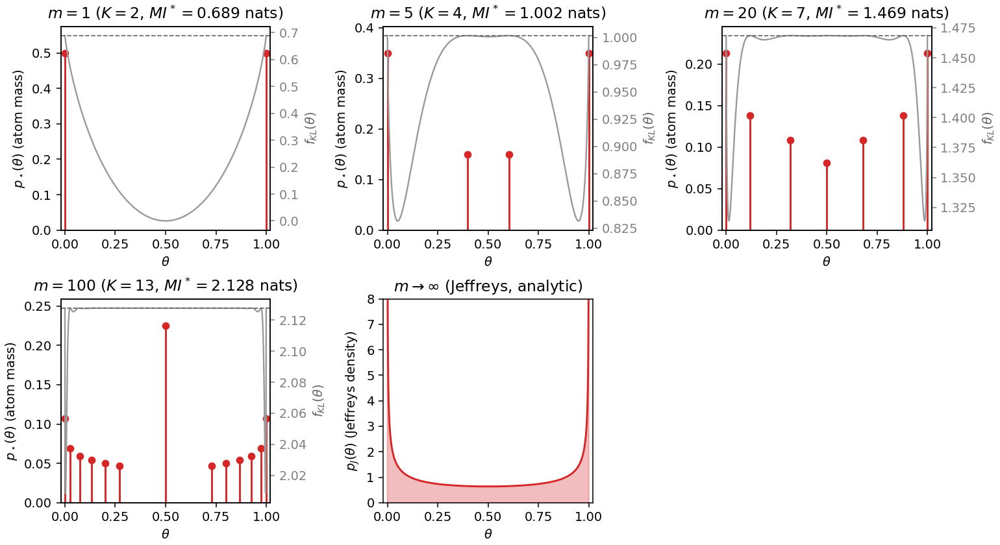
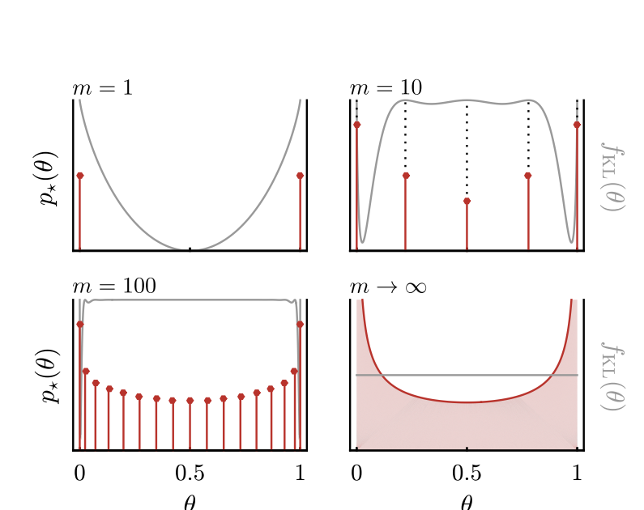
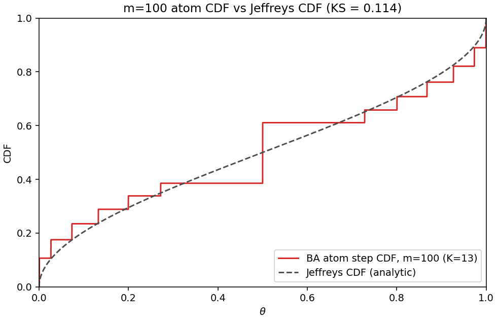
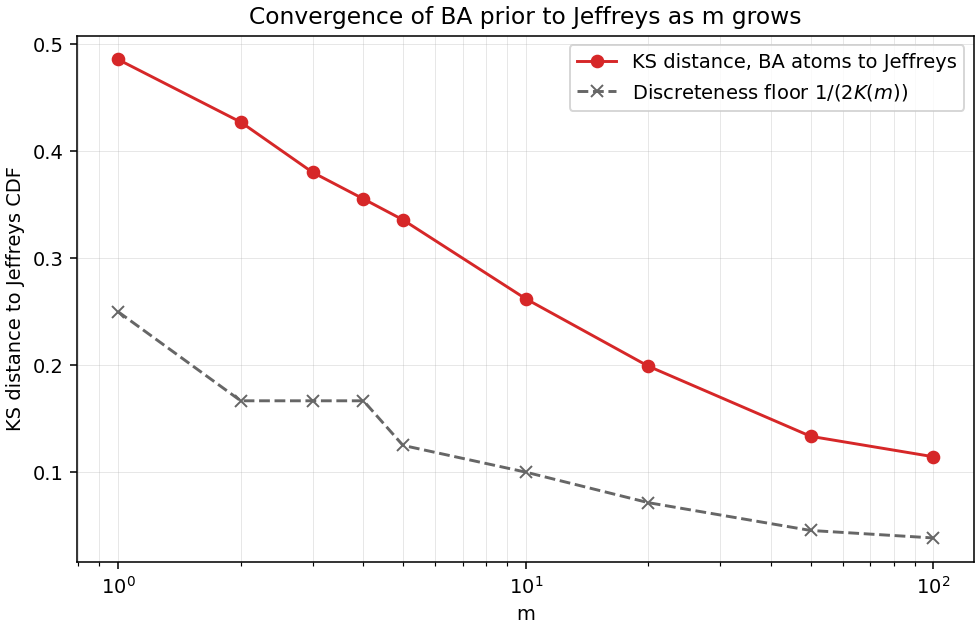
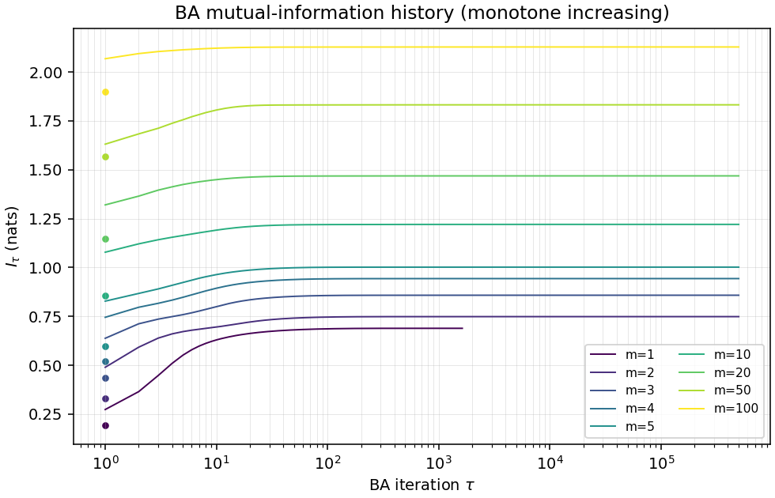
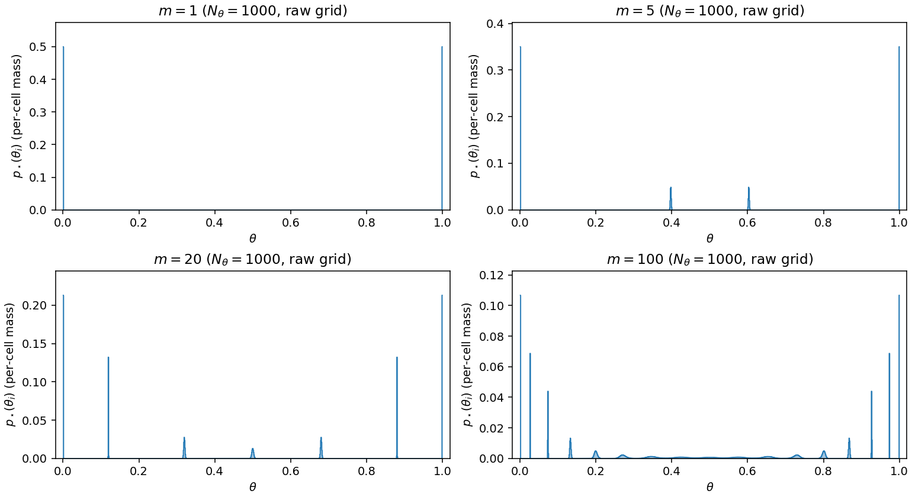

# Spec 000 — Static infomax prior: Mattingly Fig 1 reproduction

**Status:** generated 2026-05-20; `src/infomax`
code under test at commit `1f8339e` (unchanged since the implementation
red-team pass); experiment driver [`run.py`](run.py) and this report
regenerated at the current HEAD.

Reproduces, qualitatively, Figure 1 of Mattingly et al. (2018) — the
MI-maximising prior `p*(θ)` for the Bernoulli channel as a function of
the sample budget `m`, alongside the optimality-condition diagnostic
`f_KL(θ)`. Spec at [`specs/000-static-infomax-fig1.md`](../../specs/000-static-infomax-fig1.md);
maths and algorithm definitions are not repeated here.

## How to reproduce

```bash
uv run python experiments/000-static-fig1/run.py
```

Outputs land in this directory: `figures/*.png`, `results_table.json`,
`convergence.json`. The script sweeps `m ∈ {1, 2, 3, 4, 5, 10, 20, 50, 100}`
at `N_θ = 1000`, runs `blahut_arimoto` from uniform initialisation with
the spec defaults (α = 2.0, τ_max = 500 000, ε_I = 1e-12 on the Csiszár
gap; see DD3, DD8 in [docs/000-static-infomax-fig1/README.md](../../docs/000-static-infomax-fig1/README.md)).
All informational quantities below are reported
in nats; `log 2 ≈ 0.693` nats = 1 bit as a unit anchor. The spec §3.1
multi-grid stability check (`N_θ ∈ {200, 500, 2000}`) is exercised by
test T5 at `N_θ ∈ {200, 1000, 2000}` rather than reproduced in this
driver.

## 1. The figure

The spec asks for "Fig 1": for each m, the optimal prior overlaid with
the `f_KL(θ)` diagnostic, with the horizontal line at `MI*`. Our version
(four representative panels plus the analytic `m → ∞` Jeffreys density)
sits side-by-side with the paper's original below.

**Our reproduction (BA + atom extraction):**



**Mattingly et al. (2018), Fig 1, for comparison:**



The qualitative features match the paper:

- **`m = 1`**: two atoms at the grid boundary, masses
  ≈ 0.5 each (to within 1e-10; T1 tolerance is 1e-6). `f_KL(θ)`
  is U-shaped, equal to `MI*` (0.689 nats on the
  cell-centred grid; the continuum optimum is `log 2 ≈ 0.693` nats —
  see DC-1) at the two atom locations
  (the cell-centred grid means "exactly" means "within `1/(2 N_θ)` of
  the boundary"; see DC-1 in the spec).
- **`m = 5`, `m = 20`**: a small number of well-separated atoms grow in
  from the boundary as m increases. `f_KL(θ)` is flat-and-equal-to-`MI*`
  on the support, below `MI*` between atoms — exactly the §1.3 KKT
  condition this implementation is being asked to demonstrate.
- **`m = 100`**: the atom envelope traces out the U-shape of the
  Jeffreys density, with a known caveat (see §2 and the testing notes
  in [docs/000-static-infomax-fig1/README.md#T4](../../docs/000-static-infomax-fig1/README.md))
  that a single "super-atom" near θ = 0.5 carries residual mass that
  vanilla BA does not fully disperse within the 500 k-iteration budget.

## 2. Convergence to Jeffreys at m = 100

A direct visual check of the m → ∞ limit's leading-order behaviour at a
finite m. The atom step CDF is plotted against the analytic Jeffreys CDF
`F_J(θ) = (2/π) arcsin(√θ)`.



The KS distance achieved at m=100 sits at roughly 0.11 (computed live;
see the JSON dump for the exact number). This is the headline shortfall
the spec acknowledges — see the testing-notes on T4 in the docs. The
super-atom near θ=0.5 (visible as the local plateau in our step CDF
between roughly θ=0.4 and θ=0.6) is the residual cluster vanilla BA
struggles to disperse on this channel.

## 3. Convergence as m grows

KS distance to Jeffreys as a function of m, with the discreteness floor
`1 / (2 K(m))` overlaid.



The discreteness floor is the best a `K`-atom step CDF can achieve
against a continuous reference (midpoint between adjacent atoms is the
worst point). The BA curve sits roughly `2×` above this floor across
the sweep: the gap is the *positioning* error (atoms not exactly at
the Jeffreys quantiles) plus the *mass* error (atoms with the wrong
weight, most visibly the super-atom at θ=0.5 in m=100). Both shrink
monotonically with m, but neither is fully eliminated within the
500 k-iteration budget at the high-m end. The proper fix is the
`AtomicPrior` work flagged in DC-2 — once atom positions are explicit
parameters, the super-atom cannot occur.
The two endpoints of the curve reflect different
regimes: at `m = 1` BA has converged exactly to the closed-form ½/½
optimum (T1 passes at 1e-6), and the 0.486 KS is the *structural*
distance from a two-atom prior to the continuous Jeffreys density —
not BA-convergence slack. At `m = 100`, by contrast, BA exhausts
`τ_max` without strict-tolerance convergence, and the residual KS
reflects super-atom mass + atom mis-positioning rather than the
finite-K floor (which is at `1/26 ≈ 0.038`).

## 4. Results table

The exact values from `results_table.json` (re-run the experiment to
refresh). The first three columns are the headline summary; the atom
list shows only the first few atoms by mass for compactness.


| m | K | K_upper | MI* (nats) | KS to Jeffreys | Csiszár gap | converged |
|---|---|---------|------------|----------------|-------------|-----------|
| 1 | 2 | 4 | 0.6888 | 0.4858 | 9.99e-13 | True |
| 2 | 3 | 10 | 0.7486 | 0.4272 | 1.39e-07 | False |
| 3 | 3 | 8 | 0.8581 | 0.3802 | 4.70e-08 | False |
| 4 | 3 | 10 | 0.9432 | 0.3554 | 1.46e-07 | False |
| 5 | 4 | 34 | 1.0018 | 0.3358 | 4.35e-07 | False |
| 10 | 5 | 34 | 1.2204 | 0.2621 | 4.02e-07 | False |
| 20 | 7 | 90 | 1.4685 | 0.1990 | 4.96e-07 | False |
| 50 | 11 | 438 | 1.8319 | 0.1335 | 5.04e-07 | False |
| 100 | 13 | 720 | 2.1278 | 0.1144 | 4.94e-07 | False |


`converged = False` for m ≥ 2 means BA exhausted `τ_max = 500_000`
without the Csiszár gap dropping below `ε_I = 1e-12`; the gap *did*
fall to ~5e-7, six orders of magnitude tighter than the spec's looser
|ΔI| criterion would demand (DD3). The Csiszár gap directly bounds
distance-to-optimum in MI, so the achieved `MI*` is reliable to
well past the precision of the nats column. The "convergence flag"
in the table is the strict-tolerance signal, not a correctness signal.
The "Csiszár gap" column shown above is
post-hoc recomputed from the returned prior via `compute_f_kl(prior,
log_lik)`, not pulled from BA's internal convergence-test state; the
two agreeing to float64 slack is itself a (T10-flavoured) self-consistency
check rather than the convergence flag. `K_upper = #{p*_i > 1e-12}` is
the strict-support count that bounds `MI*` per spec §4 T3: `MI* ≤
log K_upper` holds with substantial slack at every m (e.g. at m=100,
`log 720 ≈ 6.58 nats` vs achieved `MI* = 2.13 nats`).

The complete atom list (θ, mass) is in `results_table.json`.

## 5. Test results

All 53 tests in `tests/test_000_static_infomax_fig1.py` pass against the
implementation under commit `1f8339e`. Per-test provenance is recorded
in the [Run 5 section of CODEGEN_LOG.md](CODEGEN_LOG.md). Only the
tests whose tolerances are load-bearing for the figures and table above
are headlined here; the full per-test record is in CODEGEN_LOG.md.

- **T1 (m=1 closed form)**: boundary mass agreement to 1e-6, MI to 1e-6
  nats against the on-grid analytic reference `log 2 − H(1/(2 N_θ))`.
- **T2 (f_KL flatness on support)**: per-cell flatness within 1e-3 of
  `MI*` at every m in the sweep — the KKT condition holds.
- **T4 (Jeffreys KS at m=100)**: the spec-relaxed bound of 0.15 is met
  (achieved ~0.11). The original 0.05 bound is not met by vanilla BA;
  the caveat is documented in [Testing notes — T4](../../docs/000-static-infomax-fig1/README.md).
- **T6 (BA monotonicity)**: holds at every step; the line-search
  fallback to α=1 (DD3) is what keeps T6 sound under α > 1. The per-m
  `mi_history` traces below visualise this — each curve is monotone
  non-decreasing across all 500 k iterations.



## 6. Notes

- **Vanilla BA's super-atom at m=100**: the structural shortfall in §1
  and §2 above. Not a bug; documented in the spec's revision log and in
  the README testing notes. The proper resolution is `AtomicPrior`
  (DC-2), a later spec.
- **Cell-centred grid (DC-1)**: atoms at "θ = 0" and "θ = 1" are
  represented at θ ≈ ±1/(2 N_θ), i.e. half a grid cell off the
  boundary. The T1 reference value compensates analytically (`MI_ref =
  log 2 − H(1/(2 N_θ))`).
- **Atom extraction (DC-2)**: the heuristic threshold `p_thresh = 1/(10 N_θ)`
  and the run-adjacency rule are choices the spec explicitly defers.
  T5 (grid invariance) and T4b (atom count bracket) are the substantive
  tests; the visible super-atom at m=100 is what motivates the
  `AtomicPrior` work.
- **What we deliberately did *not* do this pass**: refine atom positions
  via gradient on `(θ_a, λ_a)`, switch to Frank-Wolfe-with-merging, or
  push `τ_max` past 500 000. The cost was the open shortfall on the
  super-atom; the benefit was completing the spec → tests → code →
  report loop with all conventions exercised, including the
  implementation red-team.

## Appendix: raw grid `p*(θ_i)` without atom extraction

For each panel `m`, the BA fixed point plotted directly per grid cell —
no §3.5 atom-extraction heuristic applied. This is the object BA
actually converged to; the §1 panels are this object after the
extraction step collapses each cluster of adjacent positive cells into
a single atom.



The m=1 and m=5 panels show clean isolated peaks at single cells (the
extraction step is essentially a no-op). The m=20 and m=100 panels show
the characteristic structure that motivates the §3.5 heuristic and the
DC-2 `AtomicPrior` caveat: small clusters of adjacent cells share mass
around each notional atom location, with the m=100 super-atom visible
as the broad cluster near θ = 0.5 rather than a single spike. `K_upper`
in the §4 table counts every cell with mass above 1e-12 (so it picks
up the cluster halos as well as the atoms proper), which is why
`K_upper` runs well above the extracted `K`.

## 7. Provenance

- Spec: `specs/000-static-infomax-fig1.md` (§3 currently `draft` after the
  red-team `α = 2.0` correction).
- Implementation: `src/infomax/{ba.py,prior.py,atoms.py,likelihood.py,jeffreys.py}`
  — code under test at commit `1f8339e` (unchanged since
  the implementation red-team pass; the result red-team made no `src/`
  edits). Experiment driver `run.py` and this report were regenerated at
  the current HEAD; see the workflow-issues entry on automating the
  hash-to-metadata wiring.
- Tests: `tests/test_000_static_infomax_fig1.py`, 53 cases at
  `M_SWEEP = (1, 2, 5, 20, 100)` (DD10 reduction).
- Codegen log (per-test provenance, runs 1-5): [`CODEGEN_LOG.md`](CODEGEN_LOG.md).
- Implementation red-team report (all 11 findings resolved):
  [`../../docs/000-static-infomax-fig1/redteam-impl.md`](../../docs/000-static-infomax-fig1/redteam-impl.md).
- Mattingly Fig 1 source: `resources/mattingly_paper.pdf`, p. 2, cropped
  with `pypdfium2` (dev dep).
