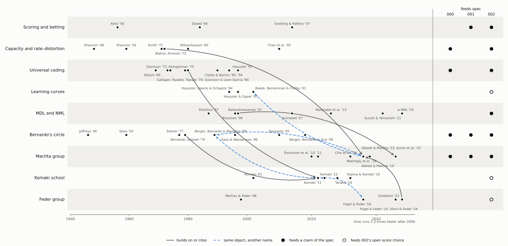

# Map of the field

What feeds the project's claims: who asked which question, which objects they defined,
what they found, how the clusters relate, and which of our claims rest on them. One file
per cluster; this page holds the views across clusters.

*Drafted by Claude on 2026-10-05; not yet reviewed by MB.*

## How to read and extend it

- **Clusters are by concept, not by group.** A cluster gathers the work on one question,
  whoever did it; some are named after the people who carry them.
- **Inclusion.** A work is in if a claim of ours cites it, it defines or computes an
  object we use, it answers or competes with one of our questions, or it is the origin
  of one of these. Everything else we looked at goes under [Exclusions](#exclusions),
  with the reason, so nobody searches it again.
- **Upkeep.** A session that reads a source updates that work's row in the same commit.
- **Our status** (works tables) is the provenance of the row's finding: `unread`,
  `abstract`, `summary` (a fetch tool's summary of the full text), `read §X`,
  `read in full`.
- **You read?** ★ read it yourself: a load-bearing claim rests on it and our summary
  cannot settle it, or the maths is worth commanding. ☆ the named part only. – reference
  only. Add ✓ when done.
- **Cluster files** share one shape: question and central object, findings we use,
  works, links to other clusters, open questions.

## Clusters

| Cluster | Central object | File |
|---|---|---|
| Capacity and rate–distortion | capacity-achieving input; Blahut–Arimoto | [capacity-rate-distortion.md](capacity-rate-distortion.md) |
| Universal coding and minimax redundancy | minimax redundancy = capacity | [universal-coding.md](universal-coding.md) |
| Bernardo's circle | reference prior | [bernardo-reference-priors.md](bernardo-reference-priors.md) |
| MDL and NML | NML; parametric complexity | [mdl-nml.md](mdl-nml.md) |
| Machta group | `p⋆` in sloppy models | [machta-sloppy-models.md](machta-sloppy-models.md) |
| Komaki school | latent information prior | [komaki-school.md](komaki-school.md) |
| Feder group | capacity of batch learning | [feder-group.md](feder-group.md) |
| Learning curves and predictive information | per-step risk; `I_pred` | [learning-curves.md](learning-curves.md) |
| Scoring and betting | log score; Kelly growth | [scoring-betting.md](scoring-betting.md) |

Adjacent areas that connect to the project but feed no claim (rate–distortion agents,
behavioural evidence on priors, and more) are left out on purpose; a separate map of
them is to do, seeded under [Exclusions](#exclusions).

## One object, many names

Each cell is the name the cluster's own papers use; a dash means we know of none. Sources
per row are listed under the table.

| Object | Information theory | Bernardo's circle | MDL | Machta group | Komaki school | Feder group | Spec 002 |
|---|---|---|---|---|---|---|---|
| (a) `argmax_π I_π(Θ;X_{1:N})` | capacity-achieving input distribution | `k`-reference prior, `k = N` | — | `p⋆` | latent information prior at `(0, N)` | capacity-achieving prior `w*_online` | `p*` |
| (b) `argmax_π I_π(Θ;X_{N+1:N+L}\|X_{1:N})` | — | — | — | — | latent information prior at `(N, L)` | capacity-achieving prior of batch learning | not used; candidate |
| (c) the [Bayes mixture](../GLOSSARY.md#bayes-mixture) of (a) | minimax Bayes code | — | — | `p(x)` | minimax predictive density | min-max optimal assignment `q*` | `m_{p*}` |
| (d) `Σ_{i<N} r_i = 𝔼_θ D_KL(p(X_{1:N}\|θ)‖Q)` | redundancy; cumulative relative-entropy risk | — | — | — | — | `L · R*_online` | `R_N` |
| (e) `r_N`, one step after `N` observations | — | — | — | — | risk `R(θ, q)` with `x = X_{1:N}` | batch regret `R*_batch` | `r_N`, candidate |
| (f) the `N → ∞` limit of (a) | [Jeffreys](../GLOSSARY.md#jeffreys-prior), asymptotically least favourable | [reference prior](../GLOSSARY.md#reference-prior) | — | the infinite-data limit A&M reject | latent information prior at `(0, M → ∞)` | — | `p_J` |
| (g) `argmin_Q max_x log[max_θ p(x\|θ)/Q(x)]` | — | — | NML; `log Z` is the parametric complexity | the code behind `p_proj` | conditional NML ≈ latent-information predictive | — | `p_NML`, pushed forward to `p_proj` |

Sources. (a) Komaki 2011 §4 (`k`-reference prior of Berger, Bernardo & Mendoza 1989);
A&M Eq. 3; Fogel & Feder 2024 §II.A. (b) Komaki 2011 §3; Fogel & Feder 2024 Thm 1.
(c) Komaki 2011 §1 (citing Gallager 1979; Davisson & Leon-Garcia 1980); A&M Eq. 4;
Komaki 2011 Thm 2; Fogel & Feder 2024 Thm 1. (d) Haussler 1996 preprint §1; Fogel & Feder
2024 Eq. (1), whose regret is per symbol; spec 002 eq. (2.1.4). (e) Komaki 2011 Eq. (1); Fogel & Feder 2024 §II.B. (f) Komaki 2011 §1
(citing Clarke & Barron 1994) and §4; A&M §2.1. (g) Rissanen 1996 Thm 1; A&M App. A.3;
Kojima & Komaki 2016 (abstract). All `[read]`.

## Reading queue

Worth reading in full or in long stretches (★):

1. Fogel & Feder 2024 ([pdf](../resources/8_Combining_Batch_and_Online_P.pdf)): five
   pages; it solves our cumulative-versus-endpoint question for finite alphabets.
2. Komaki 2011 ([pdf](../resources/komaki.pdf)): §1, §3 up to Theorem 2, and §4.
3. Abbott & Machta 2023 ([pdf](../resources/abbott_machta.pdf)), if not already: spec
   002's anchor.
4. Bernardo 2005, preprint pp. 15–17: why reference analysis takes the limit that `p*`
   refuses.
5. Bialek, Nemenman & Tishby 2001: predictive information, which `p*` maximises
   ([learning-curves.md](learning-curves.md)).

Short parts (☆), roughly in order of use:

6. Haussler 1997, abstract and §1 of the preprint: the cumulative game and its gambling
   reading.
7. Clarke & Barron 1994, the main theorem: settles spec 002's footnote on asymptotics.
8. Abbott & Machta 2019: how `p*`'s atoms become a continuum as noise falls.
9. Quinn et al. 2023 §5 ([pdf](../resources/quinn.pdf)): `p_proj` and `p*` side by side.
10. Rissanen 1996, Theorem 1 ([pdf](../resources/rissanen.pdf)).
11. Tanaka 2014: a short, analytic, discrete latent information prior.
12. Smith 1971, the main theorem: the discreteness of `p*`'s ancestor.
13. Kass & Wasserman 1996 §3.5.2: ranked reference priors, behind `p_ref`.
14. Vituri & Feder 2024, the algorithm section.
15. Haussler, Kearns & Schapire 1994, if the per-step view becomes central.

## Exclusions

- **Quantum versions:** Koyama, Matsuda & Komaki 2017; Tanaka 2014, "Quantum minimax
  theorem"; Quadeer, Tomamichel & Ferrie 2019.
- **Other goals within the Komaki school:** Komaki 2013 (testing a point null hypothesis);
  Yano & Komaki 2014 (data and target from different distributions; title only); Tanaka
  2023 (priors from the chi-square divergence); Hamura 2020–2023 (shrinkage for count
  data).
- **Other settings within the Feder group:** Fogel & Feder 2023 and 2025 (individual
  sequences; ours are random); Vituri & Feder 2025 and 2026 (nature outside the model;
  Vituri & Feder 2024 is kept for its algorithm); Bondaschi & Gastpar 2024, "Batch
  universal prediction" (add-constant predictors); Krichevskiy 1998 and Braess & Sauer
  2004 (minimax constants for add-β rules in multinomials).
- **Predictive density estimation as a cluster** (MB, 2026-10-05: clutter for now; Komaki
  2001 kept as its representative in the Komaki school): Aitchison 1975; Kuboki 1998;
  Liang & Barron 2004; Aslan 2006; George, Liang & Xu 2006; Sweeting, Datta & Ghosh 2006.
  Entry point if revived: George, Liang & Xu 2012, "From minimax shrinkage estimation to
  minimax shrinkage prediction", *Statistical Science*.
- **Unrelated citers of Komaki 2011:** Miura 2011 (introduction to maximum likelihood and
  information geometry); Ozkan 2025 (an applied Bayesian lasso study).
- **Adjacent areas, for the future map** (cited in `notes/` or `empirics/`, feeding no
  spec claim): Tishby & Polani ([pdf](../resources/tishby_polani.pdf)); Arumugam & Van
  Roy 2021 and 2022 ([pdf](../resources/arumugam_vanroy.pdf),
  [pdf](../resources/arumugam_vanroy_model.pdf)); Tishby, Pereira & Bialek 1999
  (information bottleneck); Sims 2016 and 2018; Wei & Stocker 2015; Heald et al. 2021;
  Reizinger et al. 2024; Watanabe's singular learning theory; the works cited in
  `empirics/`.
