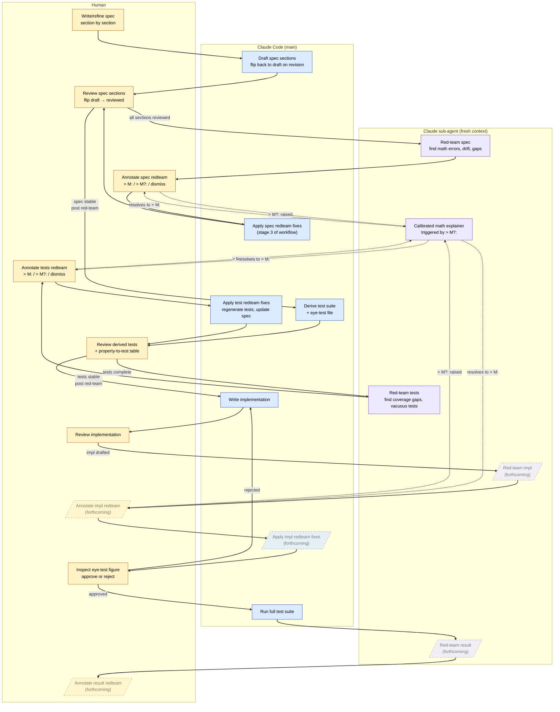

# Workflow overview

> Bird's-eye view of how artifacts flow through this project, and
> which agent (human, Claude Code, sub-agent) is responsible at each
> stage. Read this if you're new to the project, returning after a
> break, or wondering where a given task fits in the larger shape.

The workflow is **under construction.** Sections shown with dashed
borders below are forthcoming; they reflect structural intent, not
implemented procedure.

## The diagram

## How to read it

Three lanes for the three agents: **human** (amber), **Claude Code
main agent** (blue), **Claude sub-agent with fresh context**
(purple). An artifact's home lane is the agent responsible for it
at that stage; arrows cross lanes when responsibility shifts.

Solid arrows are the primary flow. Dashed arrows show the
math-explainer side-cycle: when the human raises a `> M?:`
annotation on a red-team finding (meaning "I don't yet command this
math well enough to evaluate the finding"), the sub-agent produces
a calibrated explanation, and the cycle resolves when the human can
annotate `> M:` (a substantive decision) in good conscience.

Dashed-bordered nodes are forthcoming. The implementation and
result red-team passes follow the same structural pattern as the
spec and test red-teams but haven't been exercised yet.

## What's load-bearing

Three structural choices worth naming, since they're not obvious
from the diagram alone:

**Status flows asymmetrically.** Only Claude Code flips section
status *backwards* (`reviewed → draft`) on revision; only the human
flips it *forwards* (`draft → reviewed`) on re-review. This
prevents the obvious failure mode where Code self-certifies that
its own edits are reviewed.

**Sub-agent context isolation is the point.** The red-team passes
exist because a fresh sub-agent without the main agent's anchoring
will see things the main agent won't. Collapsing the sub-agent
lane into the Code lane would erase the reason red-team works.

**The human is on every closure.** Every loop in the diagram routes
through the human lane. This is intentional, not vestigial: the
project's value proposition is auditable scientific work, and
auditability requires that judgement-bearing transitions are made
by a person who can be questioned about them.

## What's not in the diagram

- **Chat-Claude.** Design conversations (including the one that
  produced this document) happen alongside the workflow but aren't
  part of the artifact flow. The audit trail of those conversations
  lives in `transcripts/`.
- **Git operations.** Commits happen at sensible boundaries; the
  diagram is silent on this because git is everywhere and showing
  it would dilute the workflow-specific content.
- **The eye test specification step.** The eye test is *specified*
  in the spec (where it lives as a subsection) and *executed* in
  the diagram (the `Inspect eye-test figure` node). The specifying
  is folded into "Draft spec sections" rather than getting its own
  node.

## Related documents

- `AGENTS.md` — the project handbook, including the test-gates
  convention this diagram visualises.
- `skills/` — the procedures the agents follow at each stage.
- `workflows/` — the orchestration prompts that trigger sessions
  of the workflow.
- `meta/workflow-issues.md` — the open and resolved questions
  about how the workflow itself should evolve.

## Maintenance

The diagram is revised when the workflow changes structurally —
new artifact type, new gate, new lane, removed step. Stylistic
edits to skill files don't trigger a diagram revision. The trigger
is "the diagram now misrepresents the workflow," judged by reading
it cold.
