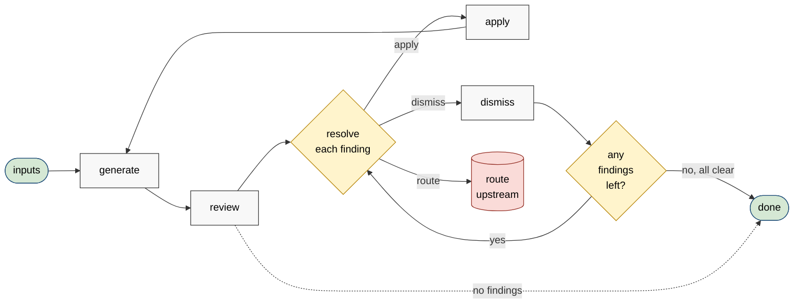
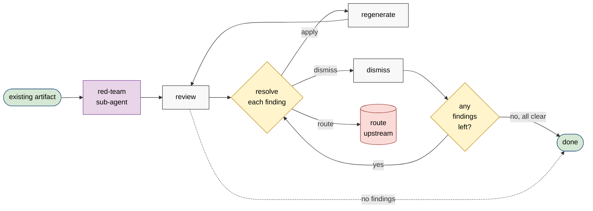

# Workflow structure

> Abstract diagrams of the project's workflow patterns. Companion to
> `meta/workflow-overview.md`, which shows the concrete impl phase in
> full detail. This file answers the prior question — "what *kind* of
> process is this?" — at the level that generalises across all four
> phases.

The project's work happens in four phases (spec, tests,
implementation, result). Each phase runs a variant of a single
cycle: **inputs → generate → review → resolve**, repeated until no
further changes are needed. The red-team is a structurally similar
cycle that enters at *review* rather than *generate*. The four
diagrams below show, in order: the phases, the cycle, the red-team
variant, and the table that maps the abstract cycle onto each
phase's concrete artifacts.

## 1. The four phases

The project as a whole is a pipeline from notes to results, with
each phase consuming the previous phase's stable output and
producing its own.

```mermaid
flowchart LR
    classDef phase fill:#f8f8f8,stroke:#333,color:#000
    classDef future fill:#f8f8f8,stroke:#999,color:#666,stroke-dasharray: 4 2
    classDef artifact fill:none,stroke:none,color:#555,font-style:italic

    P1[Spec phase]
    P2[Tests phase]
    P3[Impl phase]
    P4[Result phase]

    A1[/spec/]
    A2[/spec + tests/]
    A3[/spec + tests + code + docs/]
    A4[/spec + tests + code + docs + result/]

    P1 --> A1 --> P2 --> A2 --> P3 --> A3 --> P4 --> A4

    class P1,P2,P3 phase
    class P4 future
    class A1,A2,A3,A4 artifact
```

Each phase's output is the *cumulative* state of the repository
after that phase, not just the new artifact. This is the
accumulation property that `workflow-overview.md` makes concrete
for the impl phase: nothing is intermediate, every phase adds to
the durable record. The result phase is dashed because it doesn't
yet have a workflow file — its design space is anchored by
diagram 4 below.

## 2. The generic cycle

Every phase instantiates this cycle. The verbs are deliberately
abstract; diagram 4 shows what each one becomes in each phase.

The three structural features worth seeing here:

- **The loop.** `apply → generate` is the cycle's heartbeat. The
  cycle ends when a review pass surfaces no findings.
- **Three resolutions per finding.** Apply (re-enter the cycle),
  dismiss (record reason, finding closed), or route upstream
  (this phase can't fix it; the relevant earlier-phase workflow
  picks it up). The routing arrow is what keeps the cycle
  honest — without it, a finding that doesn't belong here would
  either be force-fixed (wrong) or silently dropped (worse).
- **No "always proceed" arrow.** The cycle continues until no
  findings remain. Exiting the cycle prematurely is not a
  shortcut available in the abstract pattern, even though
  individual phases may have additional gates (eye-test approval,
  human re-review) layered on top.

## 3. The red-team cycle

A red-team is the same cycle with a different entry point: an
artifact already exists, and a fresh-context reviewer enters
the cycle directly at *review*. The first generate step is
skipped; everything downstream is identical.

The differences from the generic cycle:

- **Entry at review, not generate.** The red-team is invoked
  *because* an artifact is finished; its job is to find what's
  wrong with it. There is no initial generate step.
- **The reviewer is a sub-agent**, not the human. This is the
  load-bearing design feature: a fresh-context reviewer breaks
  the anchoring bias the author's context carries. The human's
  role moves to triage — annotating findings, deciding apply /
  dismiss / route. Diagram 2's "review" step is human-led;
  diagram 3's is sub-agent-led.
- **Routing upstream is more common.** A red-team finding can
  reveal that the *previous* phase's artifact was wrong, not
  this one's. The impl red-team can route findings to the test
  or spec red-team queue; the test red-team can route findings
  to the spec red-team. The generic cycle has the routing arrow
  too, but in the red-team it carries more traffic.

## 4. How each phase specialises the cycle

The table below maps the abstract verbs onto each phase's
concrete artifacts and actions. Reading across a row gives the
phase's full cycle; reading down a column shows what each
abstract step looks like across phases.

| Phase | Inputs | Generate | Review | Resolve |
|---|---|---|---|---|
| **Spec** | Project notes, references, prior specs | Write spec section-by-section, status `draft` | Human reads each section, flips status to `reviewed` or `needs-revision` | Revise section, re-flip to `draft`, log revision; or accept |
| **Tests** | Reviewed spec | Write test file covering each "Properties to verify" entry | Human reviews tests against spec; property-to-test table is the checklist | Add / sharpen / drop tests; update property-to-test table |
| **Impl** | Reviewed spec, red-teamed tests | Codegen file-by-file → eye-test figure → full suite → docs | Human approves eye-test figure; walks per-test results; reads docs | Edit code / spec / tests / eye-test definition / docs case by case; flip codegen log statuses; record decisions in testing notes |
| **Result** | Reviewed spec + tests + code + docs (post-red-team) | *(forthcoming — likely: run experiment, produce figures, write result notes)* | *(likely: human inspects figures and conclusions against spec's claimed properties)* | *(likely: edit experiment config / re-run / revise result notes / route upstream if a claim doesn't hold)* |
| **Spec red-team** | Reviewed spec | *(entry at review — no initial generate)* | Sub-agent reviews spec; produces redteam file | Annotate `> M:` / decide `> C:` / edit spec with red text + revision log + status flip back to draft |
| **Tests red-team** | Reviewed spec + complete test file | *(entry at review)* | Sub-agent reviews tests against spec; produces redteam file | Annotate / decide; edit spec or tests or both; regenerate test file |
| **Impl red-team** | Reviewed spec + passing tests + code + docs | *(entry at review)* | Sub-agent reviews code + docs against spec; produces redteam file | Annotate / decide; edit spec or code or docs or helper scripts; flip codegen-log files to pending-tests; re-run eye test + full suite; flip back to done |

Three things this table makes visible that the diagrams alone
don't:

- **The result phase's missing rows are a design surface, not a
  gap.** The italicised entries are best guesses; the actual
  result workflow will refine them. Anchoring them here means
  the design conversation has a starting point ("does 'review'
  in the result phase really mean inspecting figures, or
  something else?").
- **Resolution always touches at least two artifacts.** The
  resolve column never lists a single edit — it's always
  "edit X and update Y," where Y is typically a log or status
  table or revision entry. This is the accumulation property
  showing up at the per-cycle level: every change leaves a
  trace.
- **Red-team phases are not extra phases; they're variants of
  their parent phase's cycle.** The bottom three rows are
  indented under their parents conceptually — the spec red-team
  is the spec phase's cycle re-entered at review with a
  sub-agent reviewer. Treating red-teams as separate phases
  would suggest the project has seven phases, which is the
  wrong mental model. It has four phases and three red-team
  cycles, all instantiating the same abstract pattern.

## Related

- `meta/workflow-overview.md` — concrete detail diagram for the
  impl phase. Where this file is a Rosetta stone, that one is a
  reference manual for a single phase.
- `workflows/implement-spec.md`,
  `workflows/invoke-red-team-on-spec.md`,
  `workflows/invoke-red-team-on-tests.md`,
  `workflows/invoke-red-team-on-impl.md` — the concrete
  workflows that instantiate the abstract cycles above.
- `AGENTS.md` — the section that names the four phases and the
  red-teaming convention this file abstracts.

# The implementation and documentation phase

> Visual summary of how the implementation and documentation
> workflows fit together, from a spec at `reviewed` through to an
> approved, red-teamed implementation. Two workflows are involved:
> `workflows/implement-spec.md` and
> `workflows/invoke-red-team-on-impl.md`. The diagram shows the
> artifacts that exist at each point in the pipeline;
> transformations are labelled with the workflow stage that
> performs them.

The structural logic of this pipeline is *accumulation*: every
stage adds artifacts to the project's durable record without
throwing earlier ones away. The codegen log, the design
decisions, the testing notes, the red-team file — none of these
are intermediate. They are the audit trail, and they survive the
workflow. The diagram is organised to make this visible at a
glance.

```mermaid
flowchart TD
    classDef stage fill:#f8f8f8,stroke:#333,color:#000
    classDef gate fill:#fff4cc,stroke:#b8860b,color:#000
    classDef terminal fill:#d5e8d4,stroke:#1f4e79,color:#000
    classDef offramp fill:#fadbd8,stroke:#922b21,color:#000

    S0["<b>Entry</b><br/>━━━━━━━━━<br/>spec ✓<br/>tests ✓"]
    S1["<b>After codegen</b><br/>━━━━━━━━━<br/>spec ✓<br/>tests ✓<br/>code (new)<br/>CODEGEN_LOG (new)<br/>doc · design decisions (new)"]
    S2["<b>After eye test</b><br/>━━━━━━━━━<br/>spec ✓<br/>tests ✓<br/>code<br/>CODEGEN_LOG · eye row ✓<br/>doc · design decisions<br/>eye-test file (new)<br/>eye-test figure (new)"]
    S3["<b>After full suite</b><br/>━━━━━━━━━<br/>spec ✓<br/>tests ✓<br/>code · all files done<br/>CODEGEN_LOG · per-test hashes<br/>doc · design decisions<br/>doc · testing notes (if any)<br/>eye-test file, figure"]
    S4["<b>After doc finalisation</b><br/>━━━━━━━━━<br/>everything above<br/>doc · call graph (new)<br/>doc · data flow (new)<br/>pyproject.toml, uv.lock updated"]
    S5["<b>After red-team review</b><br/>━━━━━━━━━<br/>everything above<br/>redteam-impl.md (new)"]
    S6["<b>After triage</b><br/>━━━━━━━━━<br/>spec (possibly revised)<br/>code (revised)<br/>doc (revised)<br/>CODEGEN_LOG · files pending-tests<br/>redteam-impl.md · M:/C: annotations"]
    S7["<b>Approved</b><br/>━━━━━━━━━<br/>everything stable<br/>all files done<br/>per-test hashes refreshed<br/>redteam-impl.md committed"]

    T1{{"<b>implement-spec</b> · stage 1<br/>code generation,<br/>file-by-file commits"}}
    T2{{"<b>implement-spec</b> · stage 2<br/>eye test<br/><i>human approves figure</i>"}}
    T3{{"<b>implement-spec</b> · stage 3<br/>full suite, one-by-one<br/><i>human triages failures</i>"}}
    T4{{"<b>implement-spec</b> · stage 4<br/>generate call graph,<br/>data flow diagram"}}
    T5{{"<b>red-team-impl</b> · stage 1<br/>sub-agent reviews<br/>spec → docs → code"}}
    T6{{"<b>red-team-impl</b> · stages 2 to 3c<br/>annotate M:, decide C:,<br/>edit spec/code/docs"}}
    T7{{"<b>red-team-impl</b> · stage 3d<br/>re-run eye test + suite<br/><i>human approves figure</i>"}}

    UP[("upstream<br/>red-team queue")]

    S0 --> T1 --> S1
    S1 --> T2 --> S2
    S2 --> T3 --> S3
    S3 --> T4 --> S4
    S4 --> T5 --> S5
    S5 --> T6 --> S6
    S6 --> T7 --> S7

    S2 -. eye test rejected .-> T1
    S6 -. test-gap / spec-implication .-> UP

    class S0,S1,S2,S3,S4,S5,S6 stage
    class S7 terminal
    class T1,T2,T3,T4,T5,T6,T7 gate
    class UP offramp
```

## Reading the diagram

**Boxes are states, not events.** Each rectangle describes the
set of artifacts that exist and are current at that point in the
pipeline. New artifacts (relative to the previous state) are
marked `(new)`. Modified or progressed artifacts are noted with
their new condition (e.g. "code · all files done"). This is the
load-bearing structural feature: the pipeline produces a *growing*
record, and the diagram lets you read off, at any stage, what the
project repository contains.

**Diamonds are transformations, labelled with the workflow stage
that performs them.** Italicised lines inside a diamond mark where
the human has a substantive decision to make (approving an
eye-test figure, triaging test failures, approving a re-run
figure). All other transformations are mechanical from the
human's perspective — they're invoked, but the human isn't the
bottleneck.

**The one looping back-edge.** Eye-test rejection (`S2 → T1`)
sends the workflow back to codegen. In practice the rejection
might touch just the code, or it might touch the spec or the
eye-test definition — but from the diagram's perspective those
are all "edit something and re-run from codegen," so they
collapse into a single dashed back-arrow.
`implement-spec.md` describes the branching options in prose.

**The one off-ramp.** Findings tagged `[test-gap]` or
`[spec-implication]` during triage route to the corresponding
upstream red-team queue rather than being acted on in place.
This is the structural feature that distinguishes the
implementation red-team from a linear pipeline — some of its
output goes sideways, not forward. `invoke-red-team-on-impl.md`
describes the routing mechanics.

## What the diagram hides

A few things are deliberately collapsed into single
transformations to keep the overview readable. They live in the
workflow files at full detail:

- **Test-failure debugging inside `T3`.** Decisions to edit the
  code, edit the test, edit the spec, or edit the eye-test
  definition happen here, case by case. See `implement-spec.md`
  stage 3 ("test-failure branch").
- **Red-team triage inside `T6`.** The full
  `> M:` / `> M?:` / `> C:` annotation cycle, the chat-discussion
  resolution of uncertain findings, the
  spec-edit-and-re-review sub-step. See
  `invoke-red-team-on-impl.md` stages 2 through 3c.
- **Per-file and per-test commit cadence.** The codegen log
  accumulates row by row; `T1` and `T3` are not single commits
  but many. See `implement-spec.md` stage 1 ("Codegen log
  structure") and stage 3.

If the diagram were to expand these, it would lose the property
that makes it useful — a labmate reading it cold can see the
shape of the whole process in one screen.

## Related

- `workflows/implement-spec.md` — transformations `T1` through
  `T4` and states `S0` through `S4`.
- `workflows/invoke-red-team-on-impl.md` — transformations `T5`
  through `T7` and states `S4` through `S7`.
- `workflows/invoke-red-team-on-spec.md` and
  `workflows/invoke-red-team-on-tests.md` — the workflows the
  `UP` node routes to.
- `AGENTS.md` — the section that names this pipeline.