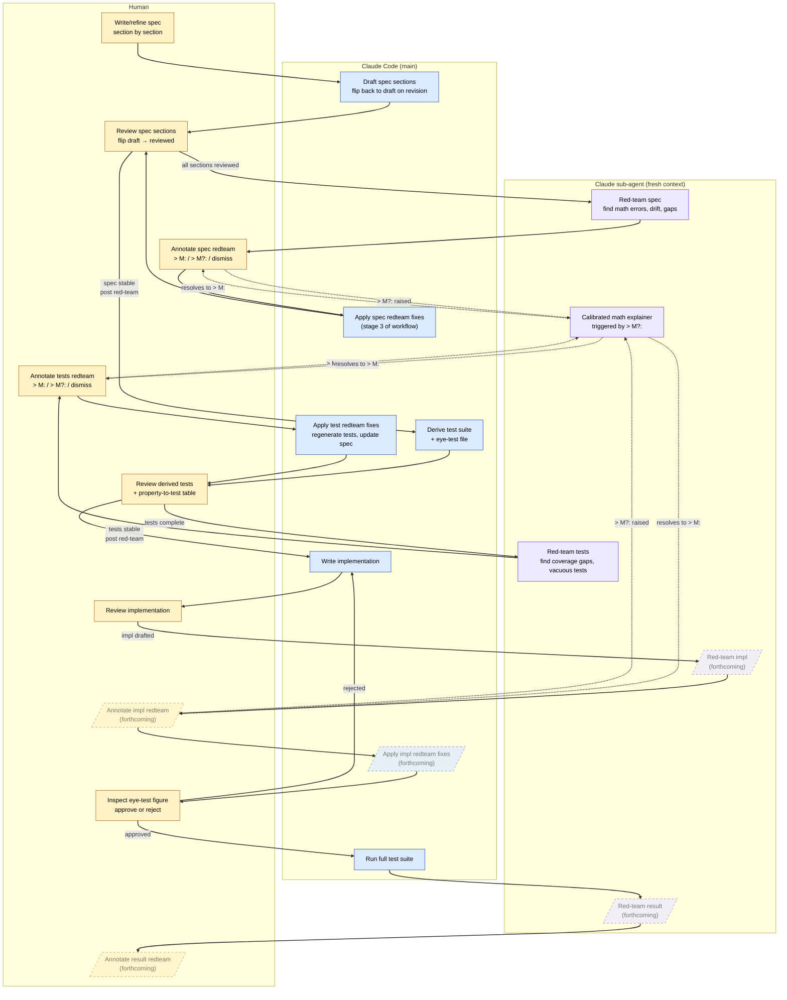

# Workflow overview

> Bird's-eye view of how artifacts flow through this project, and
> which agent (human, Claude Code, sub-agent) is responsible at each
> stage. Read this if you're new to the project, returning after a
> break, or wondering where a given task fits in the larger shape.

The workflow is **under construction.** Sections shown with dashed
borders below are forthcoming; they reflect structural intent, not
implemented procedure.

## The diagram

## How to read it

Three lanes for the three agents: **human** (amber), **Claude Code
main agent** (blue), **Claude sub-agent with fresh context**
(purple). An artifact's home lane is the agent responsible for it
at that stage; arrows cross lanes when responsibility shifts.

Solid arrows are the primary flow. Dashed arrows show the
math-explainer side-cycle: when the human raises a `> M?:`
annotation on a red-team finding (meaning "I don't yet command this
math well enough to evaluate the finding"), the sub-agent produces
a calibrated explanation, and the cycle resolves when the human can
annotate `> M:` (a substantive decision) in good conscience.

Dashed-bordered nodes are forthcoming. The implementation and
result red-team passes follow the same structural pattern as the
spec and test red-teams but haven't been exercised yet.

## What's load-bearing

Three structural choices worth naming, since they're not obvious
from the diagram alone:

**Status flows asymmetrically.** Only Claude Code flips section
status *backwards* (`reviewed → draft`) on revision; only the human
flips it *forwards* (`draft → reviewed`) on re-review. This
prevents the obvious failure mode where Code self-certifies that
its own edits are reviewed.

**Sub-agent context isolation is the point.** The red-team passes
exist because a fresh sub-agent without the main agent's anchoring
will see things the main agent won't. Collapsing the sub-agent
lane into the Code lane would erase the reason red-team works.

**The human is on every closure.** Every loop in the diagram routes
through the human lane. This is intentional, not vestigial: the
project's value proposition is auditable scientific work, and
auditability requires that judgement-bearing transitions are made
by a person who can be questioned about them.

## What's not in the diagram

- **Chat-Claude.** Design conversations (including the one that
  produced this document) happen alongside the workflow but aren't
  part of the artifact flow. The audit trail of those conversations
  lives in `transcripts/`.
- **Git operations.** Commits happen at sensible boundaries; the
  diagram is silent on this because git is everywhere and showing
  it would dilute the workflow-specific content.
- **The eye test specification step.** The eye test is *specified*
  in the spec (where it lives as a subsection) and *executed* in
  the diagram (the `Inspect eye-test figure` node). The specifying
  is folded into "Draft spec sections" rather than getting its own
  node.

## Related documents

- `AGENTS.md` — the project handbook, including the test-gates
  convention this diagram visualises.
- `skills/` — the procedures the agents follow at each stage.
- `workflows/` — the orchestration prompts that trigger sessions
  of the workflow.
- `meta/workflow-issues.md` — the open and resolved questions
  about how the workflow itself should evolve.

## Maintenance

The diagram is revised when the workflow changes structurally —
new artifact type, new gate, new lane, removed step. Stylistic
edits to skill files don't trigger a diagram revision. The trigger
is "the diagram now misrepresents the workflow," judged by reading
it cold.

# The implementation and documentation phase

> Visual summary of how the implementation and documentation
> workflows fit together, from a spec at `reviewed` through to an
> approved, red-teamed implementation. Two workflows are involved:
> `workflows/implement-spec.md` and
> `workflows/invoke-red-team-on-impl.md`. The diagram shows the
> artifacts that exist at each point in the pipeline;
> transformations are labelled with the workflow stage that
> performs them.

The structural logic of this pipeline is *accumulation*: every
stage adds artifacts to the project's durable record without
throwing earlier ones away. The codegen log, the design
decisions, the testing notes, the red-team file — none of these
are intermediate. They are the audit trail, and they survive the
workflow. The diagram is organised to make this visible at a
glance.

```mermaid
flowchart TD
    classDef stage fill:#f8f8f8,stroke:#333,color:#000
    classDef gate fill:#fff4cc,stroke:#b8860b,color:#000
    classDef terminal fill:#d5e8d4,stroke:#1f4e79,color:#000
    classDef offramp fill:#fadbd8,stroke:#922b21,color:#000

    S0["<b>Entry</b><br/>━━━━━━━━━<br/>spec ✓<br/>tests ✓"]
    S1["<b>After codegen</b><br/>━━━━━━━━━<br/>spec ✓<br/>tests ✓<br/>code (new)<br/>CODEGEN_LOG (new)<br/>doc · design decisions (new)"]
    S2["<b>After eye test</b><br/>━━━━━━━━━<br/>spec ✓<br/>tests ✓<br/>code<br/>CODEGEN_LOG · eye row ✓<br/>doc · design decisions<br/>eye-test file (new)<br/>eye-test figure (new)"]
    S3["<b>After full suite</b><br/>━━━━━━━━━<br/>spec ✓<br/>tests ✓<br/>code · all files done<br/>CODEGEN_LOG · per-test hashes<br/>doc · design decisions<br/>doc · testing notes (if any)<br/>eye-test file, figure"]
    S4["<b>After doc finalisation</b><br/>━━━━━━━━━<br/>everything above<br/>doc · call graph (new)<br/>doc · data flow (new)<br/>pyproject.toml, uv.lock updated"]
    S5["<b>After red-team review</b><br/>━━━━━━━━━<br/>everything above<br/>redteam-impl.md (new)"]
    S6["<b>After triage</b><br/>━━━━━━━━━<br/>spec (possibly revised)<br/>code (revised)<br/>doc (revised)<br/>CODEGEN_LOG · files pending-tests<br/>redteam-impl.md · M:/C: annotations"]
    S7["<b>Approved</b><br/>━━━━━━━━━<br/>everything stable<br/>all files done<br/>per-test hashes refreshed<br/>redteam-impl.md committed"]

    T1{{"<b>implement-spec</b> · stage 1<br/>code generation,<br/>file-by-file commits"}}
    T2{{"<b>implement-spec</b> · stage 2<br/>eye test<br/><i>human approves figure</i>"}}
    T3{{"<b>implement-spec</b> · stage 3<br/>full suite, one-by-one<br/><i>human triages failures</i>"}}
    T4{{"<b>implement-spec</b> · stage 4<br/>generate call graph,<br/>data flow diagram"}}
    T5{{"<b>red-team-impl</b> · stage 1<br/>sub-agent reviews<br/>spec → docs → code"}}
    T6{{"<b>red-team-impl</b> · stages 2 to 3c<br/>annotate M:, decide C:,<br/>edit spec/code/docs"}}
    T7{{"<b>red-team-impl</b> · stage 3d<br/>re-run eye test + suite<br/><i>human approves figure</i>"}}

    UP[("upstream<br/>red-team queue")]

    S0 --> T1 --> S1
    S1 --> T2 --> S2
    S2 --> T3 --> S3
    S3 --> T4 --> S4
    S4 --> T5 --> S5
    S5 --> T6 --> S6
    S6 --> T7 --> S7

    S2 -. eye test rejected .-> T1
    S6 -. test-gap / spec-implication .-> UP

    class S0,S1,S2,S3,S4,S5,S6 stage
    class S7 terminal
    class T1,T2,T3,T4,T5,T6,T7 gate
    class UP offramp
```

## Reading the diagram

**Boxes are states, not events.** Each rectangle describes the
set of artifacts that exist and are current at that point in the
pipeline. New artifacts (relative to the previous state) are
marked `(new)`. Modified or progressed artifacts are noted with
their new condition (e.g. "code · all files done"). This is the
load-bearing structural feature: the pipeline produces a *growing*
record, and the diagram lets you read off, at any stage, what the
project repository contains.

**Diamonds are transformations, labelled with the workflow stage
that performs them.** Italicised lines inside a diamond mark where
the human has a substantive decision to make (approving an
eye-test figure, triaging test failures, approving a re-run
figure). All other transformations are mechanical from the
human's perspective — they're invoked, but the human isn't the
bottleneck.

**The one looping back-edge.** Eye-test rejection (`S2 → T1`)
sends the workflow back to codegen. In practice the rejection
might touch just the code, or it might touch the spec or the
eye-test definition — but from the diagram's perspective those
are all "edit something and re-run from codegen," so they
collapse into a single dashed back-arrow.
`implement-spec.md` describes the branching options in prose.

**The one off-ramp.** Findings tagged `[test-gap]` or
`[spec-implication]` during triage route to the corresponding
upstream red-team queue rather than being acted on in place.
This is the structural feature that distinguishes the
implementation red-team from a linear pipeline — some of its
output goes sideways, not forward. `invoke-red-team-on-impl.md`
describes the routing mechanics.

## What the diagram hides

A few things are deliberately collapsed into single
transformations to keep the overview readable. They live in the
workflow files at full detail:

- **Test-failure debugging inside `T3`.** Decisions to edit the
  code, edit the test, edit the spec, or edit the eye-test
  definition happen here, case by case. See `implement-spec.md`
  stage 3 ("test-failure branch").
- **Red-team triage inside `T6`.** The full
  `> M:` / `> M?:` / `> C:` annotation cycle, the chat-discussion
  resolution of uncertain findings, the
  spec-edit-and-re-review sub-step. See
  `invoke-red-team-on-impl.md` stages 2 through 3c.
- **Per-file and per-test commit cadence.** The codegen log
  accumulates row by row; `T1` and `T3` are not single commits
  but many. See `implement-spec.md` stage 1 ("Codegen log
  structure") and stage 3.

If the diagram were to expand these, it would lose the property
that makes it useful — a labmate reading it cold can see the
shape of the whole process in one screen.

## Related

- `workflows/implement-spec.md` — transformations `T1` through
  `T4` and states `S0` through `S4`.
- `workflows/invoke-red-team-on-impl.md` — transformations `T5`
  through `T7` and states `S4` through `S7`.
- `workflows/invoke-red-team-on-spec.md` and
  `workflows/invoke-red-team-on-tests.md` — the workflows the
  `UP` node routes to.
- `AGENTS.md` — the section that names this pipeline.