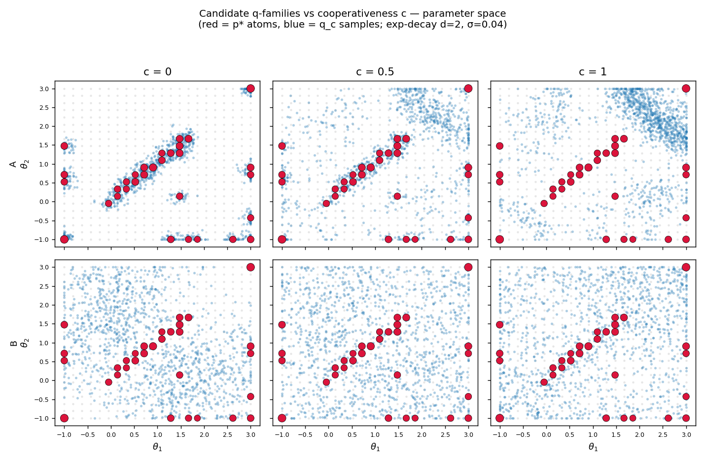
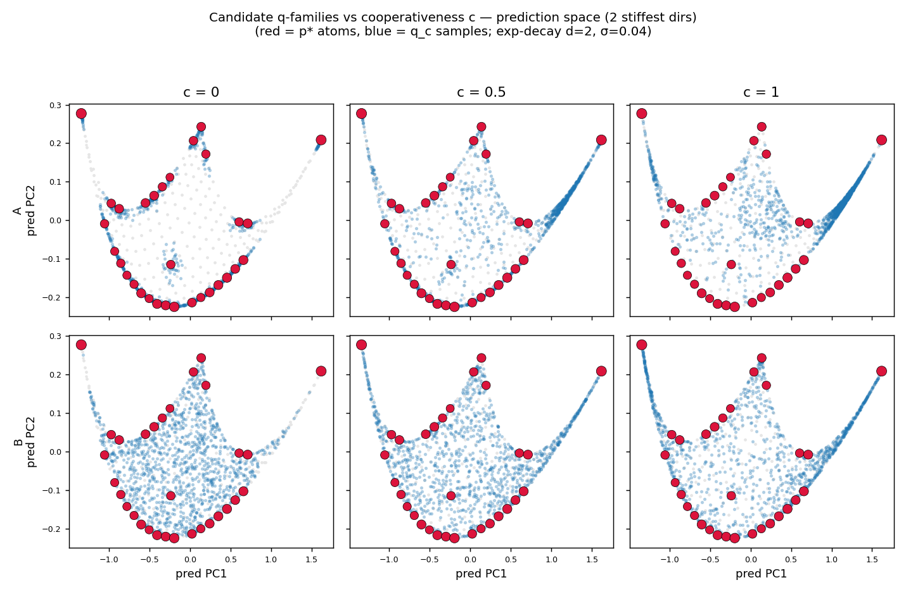

# Visualising candidate `q`-families (spec 002, OQ-2)

> **Status: exploratory note, not spec.** The figures below come from
> `notes/q-family-viz/q_family_viz.py` — an *untrusted* standalone script (quick exp-decay
> model + rough grid-BA `p*` at `d=2`) written only to *picture* the design choices for the
> foreign-`q` family. Nothing here is a trusted implementation of any spec component. Once we
> pick, the chosen family gets specified properly and merged into spec 002 §4.3 / OQ-2.

## The question (OQ-2)

Nature's distribution `q` over `θ` is parameterised by a **cooperativeness** knob `c ∈ [0,1]`,
defined in *prediction space* then pulled back to `Θ`:

- `c=0` **cooperative** — `y(θ)` spread over the *distinguishable* predictions, so `m_q ≈ m_{p*}`
  (nature lives where `p*` expects);
- `c=1` **non-cooperative** — mass on the thin end and in the *gaps between `p*`'s atoms*
  (nature lives where `p*` does not expect).

Two things are under-determined: (i) the concrete anchor distributions `q_coop`/`q_non`, and
(ii) whether the **interior↔boundary** axis that separates `p*` from `p_proj` (§3.4) folds into
`c` or needs a second knob. This note shows two reasonably-different ways to do (i) and argues
(ii) wants a second knob.

## Three candidate families

They differ in **what the anchors are tied to**:

- **(A) atom-anchored (`p*`-relative).** `q_coop` = blobs *on* `p*`'s atoms (→ `m_q ≈ m_{p*}`
  by construction); `q_non` = the Fisher-Voronoi *gaps* between atoms. The most direct
  operationalisation of "where `p*` (doesn't) expect" — but mildly **circular** (nature defined
  via the agent's prior) and specifically **anti-`p*`** (its non end targets discreteness, not
  `p_proj`'s halo).
- **(B) geometry-relative (Fisher).** `q_coop` = uniform in Fisher arc-length (∝ `√det g`, the
  Jeffreys pullback — "spread over distinguishable predictions"); `q_non` = the low-Fisher
  boundary / thin end. **`p*`-independent** (cleaner, not circular), but "cooperative" here is
  *broad* — it cooperates with the whole resolution-adapted class (`p*`, `p_proj`, Jeffreys
  alike), not `p*` specifically.
- **(C) prediction-space targeted.** Anchors defined directly over `y`-space and pulled back via
  the MLE: `q_coop` uniform over the data-image; `q_non` aimed at a **convex-vertex halo**
  (anti-`p_proj`) *or* the **interior bulk finer than the atom spacing** (anti-`p*`). The
  cleanest way to hit the interior↔boundary axis. (Not drawn below — it is a `y`-space variant
  of B with a directional non end; sketched here, prototyped if we go this way.)

## The pictures

`A` and `B` are drawn across `c ∈ {0, 0.5, 1}`; red = `p*` atoms (size ∝ weight), blue = `q_c`
samples. Exp-decay `d=2`, `σ=0.04`; `p*` from a rough grid-BA (~31 atoms — denser than a
"clean" `p*`, but enough to read the geometry; the atoms sit along the symmetric `θ_1≈θ_2`
ridge, which is the single stiff direction of the 2-exponential model).

**Parameter space `(θ_1, θ_2)`:**

**Prediction space (2 stiffest Fisher directions):**

## What they show

- **Both families move `c` in the right direction.** At `c=0` the blue cloud sits on the red
  atoms (A: tightly; B: along the whole Fisher ridge); at `c=1` it pulls away — A into the
  *inter-atom gaps along the ridge*, B out to the *low-Fisher corners/edges*.
- **The prediction-space view is the more telling one.** The manifold is the thin curved
  ribbon; `p*`'s atoms tile its boundary. Cooperative-`q` data land **on** the boundary (on
  atoms); non-cooperative data land in the **interior** of the image (A) or at the **cusps**
  (B). That interior-vs-cusp split is exactly the `p*`-vs-`p_proj` separator — and it is *two
  different non-cooperative directions*, which is the case for a second knob.
- **A is sharper for the `p*`-vs-discreteness contest** (its non end is precisely "in the
  gaps"); **B is cleaner and less circular** but its cooperative end is shared by the whole
  resolution-adapted class, so it tests `p*` less specifically.

## My read / recommendation (for you to pick)

I'd lean toward **two knobs**, combining B and C:

1. **Cooperativeness `c`** done **geometry-relative (B)** — principled, `p*`-independent, and it
   avoids defining nature through the agent's prior (which would make a `p*` "win" look
   self-fulfilling). `q_coop` ∝ `√det g`, `q_non` on the low-Fisher boundary.
2. **A separate interior↔boundary selector (C-style)** for the non end: a *vertex-halo* `q`
   (stresses `p_proj`) vs an *interior-smooth, finer-than-atom* `q` (stresses `p*`). This is the
   only way to map the `p*`-vs-`p_proj` corner cleanly; folding it into `c` conflates two
   distinct adversarial directions.

The **atom-anchored (A)** family is worth keeping as a *diagnostic* overlay — it is the most
direct "data in `p*`'s gaps" stressor — but I'd not make it the primary axis, precisely because
its circularity (nature ≔ smoothed/​gapped `p*`) is the kind of thing a referee would flag as
rigging the cooperative end.

If you agree, the spec edit is: §4.3 gets the B-cooperativeness scaffold + a C-style
interior↔boundary knob, OQ-2 resolves to that, and A becomes a named diagnostic. Tell me which
way you want and I'll write it in (no red — as new, per the §4–§7 convention) — or, if you want
to *see* family C first, I'll prototype its vertex-halo / interior-smooth `q_non` and add a
third row to the figures.

## Caveats

- Untrusted exploratory code; the `p*` here is a rough BA at one cheap cell, not the spec's
  solver. Atom count/positions are illustrative.
- `d=2` only (so it projects to 2D cleanly); the real contest lives at higher `d` where the
  ribbon is far thinner and the gap/edge structure more extreme.
- The prediction-space projection is the top-2 PCA of the manifold image — a faithful 2D shadow
  of "distinguishable predictions" but still a shadow.
