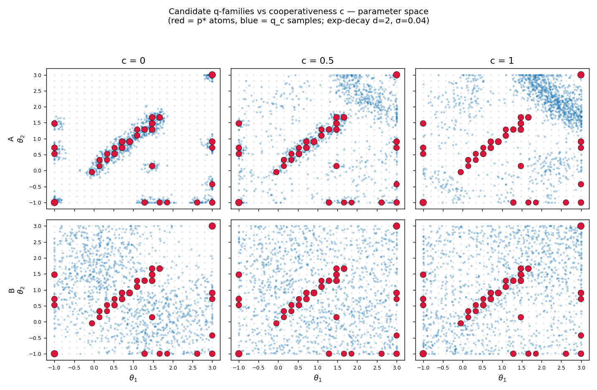
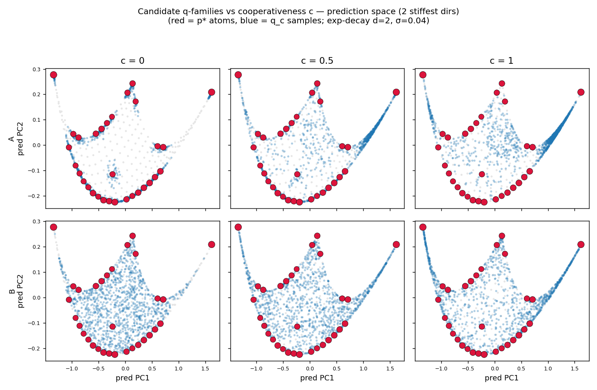
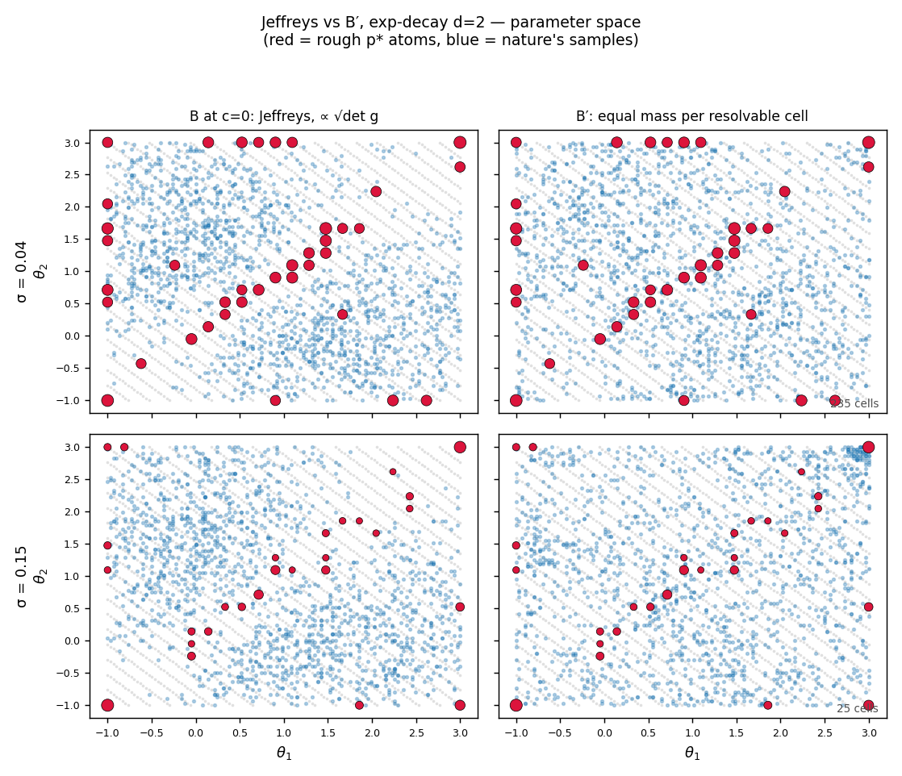
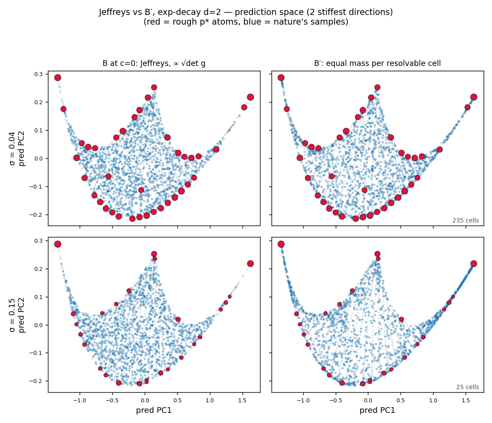
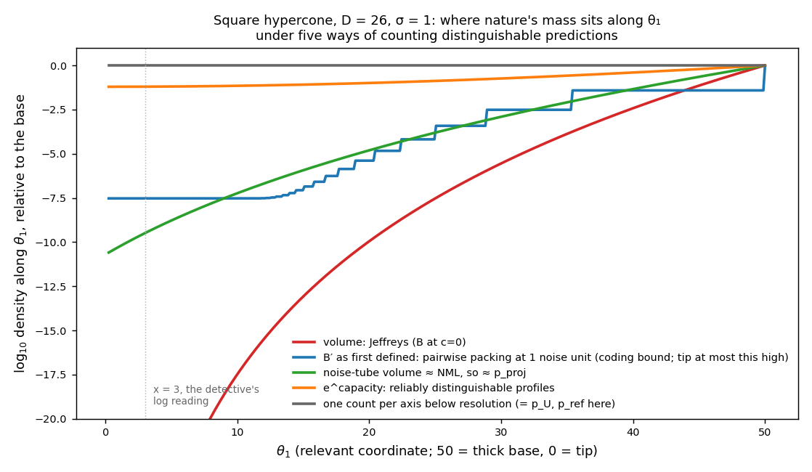

# Visualising candidate `q`-families (spec 002, OQ-2)

> **Status: exploratory note, not spec.** The figures come from
> `notes/q-family-viz/q_family_viz.py`, an *untrusted* standalone script (a quick exp-decay
> model and a rough grid Blahut–Arimoto `p*` at `d=2`) written only to *picture* the design
> choices. Drafted by Claude on 2026-06-05; revised on 2026-10-05 for the three-protagonist
> cast and the two scores, which corrected the description of family B. Not yet reviewed by
> MB.

**Claim.** With three protagonists scored on two scores, no single cooperativeness axis is
neutral: every anchor is some prior's own world. Recommendation: a panel of natures, with
four geometric stress directions and each prior's own world as a control. Its neutral end
was to be set by the budget's resolution (B′), but the drawing shows that B′ depends on how
distinguishability is counted, and each count is close to some prior's world ([B′
drawn](#b-drawn)). **MB decides:** the panel and its declared centre; then the verdict rule
per direction.

## The question (OQ-2)

[Nature](../GLOSSARY.md#nature)'s distribution `q` over `θ` is chosen independently of the agent's prior and
parameterised by a cooperativeness knob `c ∈ [0,1]`. Spec 002 §4.3 defines it relative to
`p*`: at `c=0` nature lives where `p*` expects (`m_q ≈ m_{p*}`), at `c=1` on the thin end
and in the gaps between `p*`'s [atoms](../GLOSSARY.md#atom). Two things are open: (i) the anchor distributions
`q_coop` and `q_non`, and (ii) how the family maps the contrasts between protagonists.

The cast is changing. Besides `p*` and `p_proj` (the pushforward of NML), spec 002 is
taking on `p_lat`, Komaki's latent information prior at `(N, 1)`: the minimax prior for
predicting observation `N+1` after `N`, of which `p*` is the `(0, N)` member
([`literature/komaki-school.md`](../literature/komaki-school.md)). Each protagonist is scored
on two scores: the cumulative `R_N` (the current mainline) and the one-step `r_N`, the
excess log-loss on observation `N+1` given the first `N`. "Where the protagonist expects"
now differs per protagonist.

## Three candidate families

They differ in what the anchors are tied to.

- **(A) Atom-anchored (`p*`-relative).** `q_coop` = blobs on `p*`'s atoms, so `m_q ≈ m_{p*}`
  by construction; `q_non` = the gaps between atoms (Fisher-Voronoi cells). The most direct
  version of "where `p*` does or does not expect", and circular: nature is defined through
  the agent's prior.
- **(B) Fisher-weighted.** `q_coop ∝ √det g`; `q_non ∝ 1/√det g` (the code uses
  `1/(√det g + mean)` to avoid a divergence). Defined by the likelihood alone. Note that
  `q_coop` is [Jeffreys](../GLOSSARY.md#jeffreys-prior)' prior itself, and `q_non` is concentrated where the Fisher
  information is degenerate or small: the ridge where the two rates coincide, the box
  edges, the thin end.
- **(C) Prediction-space targeted.** Anchors defined over `y`-space and pulled back:
  `q_coop` uniform over the data image; `q_non` aimed either at a **convex-vertex halo**
  (against `p_proj`) or at the **interior bulk finer than the atom spacing** (against `p*`).
  Not drawn. Its `q_coop` is Jeffreys again: for Gaussian noise the image's volume element is
  `√det(JᵀJ) dθ ∝ √det g dθ`, with `J` the Jacobian of `y(θ)`, so uniform over the image
  pulls back to `√det g`.

## The pictures

`A` and `B` across `c ∈ {0, 0.5, 1}`; red = `p*` atoms (size ∝ weight), blue = `q_c` samples.
Exp-decay `d=2`, `σ=0.04`; `p*` from a rough grid Blahut–Arimoto (about 31 atoms, denser than a
clean `p*`). The atoms sit along the symmetric `θ_1≈θ_2` ridge and on the box edges.

**Parameter space `(θ_1, θ_2)`:**

**Prediction space (2 stiffest Fisher directions):**

## What they show

- **A moves as labelled.** At `c=0` nature sits on the atoms; at `c=1` it fills the gaps,
  which in prediction space is the interior of the image.
- **B moves the other way.** At `c=0` nature avoids the ridge where the atoms sit (this
  note first said the opposite); at `c=1` it lands on the ridge and the box edges, close to
  the atoms. In prediction space, `c=0` fills the interior of the image and `c=1` sits on
  its boundary and cusps. So B runs from Jeffreys' own world toward `p*`'s.
- **In high dimension the same holds.** In the hypercone `√det g ∝ θ_1^{D−1}`, so B's
  `c=0` is the thick base, where Jeffreys puts nearly all its mass, and `c=1` is the tip.
  Not drawn.

## With three protagonists and two scores: pros and cons

### A: anchored on `p*`'s atoms

- **For.** The sharpest test of discreteness. On `r_N` it pits `p*` directly against
  `p_lat`, which may fill the gaps: Fogel & Feder 2024 find conditional-capacity priors with
  near-full support for some budgets [read: Fogel & Feder 2024 §VII], so `p_lat` would gain
  there [guess].
- **Against.** Circular for `p*`, and now lopsided: `c=0` is `p*`'s world but foreign to
  `p_lat` and `p_proj`. A fair version needs one family per protagonist: three sweeps with
  no shared nature.
- **Use.** Only as a [self-sampling](../GLOSSARY.md#self-sampling) control.

### B: Fisher-weighted

- **For.** Defined by the likelihood alone; one shared nature for all six priors.
- **For.** Conservative where it starts: a competitor, Jeffreys, is matched at `c=0`, so no
  protagonist can win there by self-sampling.
- **Against.** Not neutral: Jeffreys' world at `c=0`, close to the protagonists' edges and
  tip at `c=1`. A protagonist win near `c=1` is partly self-served, the pattern the
  falsification screen of spec 002 §2.4 is meant to catch, with the labels reversed.
- **Against.** On `r_N`, the edges at `c=1` favour edge-heavy priors (`p*`, and `p_proj`
  with its halo) over a `p_lat` that fills the interior [guess], tilting that contrast.
- **Against.** As a mixture, intermediate `c` is two separate populations, not one
  intermediate world.

### C: targeted stress directions

- **For.** With three protagonists its directed ends become the contrasts we want: a smooth
  interior nature finer than the resolution (against `p*`, likely for `p_lat`), a
  vertex-halo nature (against `p_proj`), and the thin end (against Jeffreys).
- **Against.** Its cooperative end is Jeffreys (above).
- **Against.** "Finer than the atom spacing" refers to `p*`; "finer than one [Fisher
  length](../GLOSSARY.md#fisher-length) at budget `N`" keeps it free of any prior.
- **Against.** Two knobs and several directions: more cells and more forking paths.

### B′: B at the budget's resolution

"Spread over the distinguishable predictions" should mean equal mass per cell that budget
`N` can resolve: a packing of the image at about one Fisher length, each cell weighted
equally. `√det g` instead also counts the volume of sub-resolution directions, the
[co-volume](../GLOSSARY.md#co-volume) behind Jeffreys' bias.

- **For.** In [hyperribbons](../GLOSSARY.md#hyperribbon) it is flat along the relevant direction, because each cell
  spans a whole thin cross-section; it is no prior's own world. (Not so in the square
  hypercone: see [B′ drawn](#b-drawn).)
- **Against.** NML weights the noise tube around the image, so B′ is probably close to
  `p_proj`'s world without its edge halo, and leans its way [guess].
- **Against.** A construction choice (the cell size, how mass spreads inside a cell) and a
  packing of the image to compute, feasible because the image is effectively
  low-dimensional [guess].

## B′ drawn

Script: `notes/q-family-viz/q_family_bprime.py`, untrusted like the first.

- **Exp-decay, `d=2`.** B′ here is a greedy packing of the image at one noise unit, with
  equal mass per cell (235 cells at `σ = 0.04`, 25 at `σ = 0.15`). It matches Jeffreys in
  the bulk and moves mass onto the thin arms of the image, which Jeffreys starves; at
  `σ = 0.15` most of its mass is on the arms, near `p*`'s outer atoms. In low dimension B′
  sits between Jeffreys' world and `p*`'s.
- **Square hypercone, `D = 26`, `σ = 1`.** The 25 sub-resolution directions each span at most
  one noise unit, but jointly they separate many patterns: at the thick base all `2^25`
  corners of the cross-section are pairwise one noise unit apart. So "equal mass per
  distinguishable prediction" depends on how distinguishability is counted, and each count
  is close to some prior's world:

  | Count per cross-section | Tilt toward the thick base, in orders of 10 | Close to the world of |
  |---|---|---|
  | volume, `√det g` | about 20 already at `θ_1 ≈ 8` | Jeffreys |
  | pairwise packing at one noise unit (B′ as first defined) | at least 7.5 at the tip | between NML and Jeffreys |
  | noise-tube volume | about 10.6 at the tip | NML, so `p_proj` [guess] |
  | `e^capacity`: reliably distinguishable profiles | about 1.2 at the tip | `p*` [guess] |
  | one count per sub-resolution axis | 0 | `p_U` and `p_ref` |

- **What this means for the recommendation.** B′ as first defined puts nature at the thick
  base of the hypercone, close to Jeffreys' world, so it is not a neutral end. The claim
  above that B′ is flat along the relevant direction holds only for the per-axis count, or
  in true hyperribbons, whose widths shrink fast enough that each cross-section stays below
  resolution as a whole [guess]. The centre of the panel has to be a declared choice among
  these counts.
- **A side finding for spec 002 §3.4.** If `p_proj` follows the noise-tube volume, it tilts
  toward the thick base by about ten orders in the `D = 26` hypercone: a pull of roughly one
  noise unit at the detective's reading `x = 3`, against Jeffreys' eight [guess: the
  approximation ignores the cone's slanted surface; settled by computing `p_proj` in the
  hypercone]. §3.4's claim that `p*` and `p_proj` nearly coincide rests on exp-decay [read:
  Quinn §5.1]. The square hypercone, whose sub-resolution widths are all equal rather than
  shrinking, may be where the two part.

## Recommendation

*Step 1 is undercut by the drawing above; the rest stands, pending MB's decision.*

No anchor is neutral, so make every lean visible rather than pick an axis that hides one.

1. **Neutral end: B′.**
2. **Four stress directions**, each mixed with the neutral end by `c` and named by geometry
   only: the thick base (Jeffreys' world), the thin end, the vertex halo, and the
   interior finer than one Fisher length.
3. **Self-sampling controls:** nature equal to each of the six priors in turn (A's role,
   generalised).

Every nature is scored on both `R_N` and `r_N`. The verdict rule (a protagonist shows
transfer only by beating the best deployable prior on its home score) must then be stated per
direction; that is the next decision. Cost: about four directions times the `c` grid, instead
of one axis.

This supersedes this note's earlier recommendation (B for `c` plus a C-style second knob),
which rested on the misdescription of B.

## Caveats

- Untrusted exploratory code; the `p*` is a rough Blahut–Arimoto at one cheap cell. Atom
  count and positions are illustrative.
- `d=2` only; the real contest lives at higher `d`, where the ribbon is far thinner.
- The prediction-space view is the top-2 PCA of the manifold image: a faithful 2D shadow,
  but a shadow.
- The four stress directions are not yet drawn.
