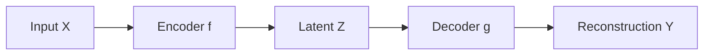

# Skill: write-math-spec

> Use this skill when turning an idea or a paper concept into a formal
> specification in `specs/`, before any code is written.

## Goal

A math spec is a self-contained document that defines:

1. The objects involved (variables, spaces, distributions)
2. The relationships between them (equations, constraints)
3. The procedure or algorithm in pseudocode
4. The properties the implementation should satisfy

A spec is **framework-agnostic** — it does not commit to PyTorch vs JAX, or
to any particular tensor shape convention. It describes the math.

## Procedure

1. **Find the source.** Locate the idea — usually a file in `notes/` or
   `resources/`. If the idea exists only in conversation, write a one-page
   note in `notes/` first and link to it.

2. **Name the spec.** `specs/NNN-short-name.md`, where NNN is a zero-padded
   sequence number. Look at the existing files to pick the next number.

3. **Open with a status table.** Every spec begins with a status table
   immediately after the title. The table is the single source of truth
   for which sections have been reviewed and what downstream work is
   permitted. See "Status table" below.

4. **Structure the spec with these sections, in order.** Number the
   top-level content sections from `0` (`## 0. Context`, `## 1. Setup`,
   …); subsections are `### X.Y` and subsubsections `#### X.Y.Z` (see
   "Numbering and links"). A spec needs at least:

   - **Context** — one paragraph: what problem this solves, what came before.
   - **Setup** — definitions of all symbols. Use a notation table if there are
     more than 5 symbols.
   - **Generative model** (if applicable) — a plate-notation diagram for any
     probabilistic content. See "Visuals" below. (Conventionally left
     unnumbered, between Context and Setup.)
   - **Objective** — the formal objective function or property of interest.
   - **Derivation** — the math, with steps a reader can verify. Format
     equations per "Math typesetting" below. Long, mechanical algebra that
     would clutter the main statement is moved to the **Derivations
     appendix** (see below); the main Derivation keeps only the
     load-bearing steps.
   - **Algorithm** — pseudocode. Use plain numbered steps with mathematical
     notation. If a data-flow or control-flow diagram would clarify the
     algorithm, include one (see "Visuals").
   - **Properties to verify** — what an implementation should satisfy. These
     become the test suite. Be specific: "the loss is invariant under
     permutation of the batch dimension" is good; "it should work" is not.
     Lay them out as a **property-to-tests table** *and* a **per-test
     descriptions** subsection (see "Test suite" below).
     - **Eye test** — a figure (or small set) anchored to a *specific
       published external figure* whose qualitative shape is known, so a
       human can confirm the implementation is roughly right before the
       full suite. Its run/file structure goes in a numbered subsubsection.
       See "Eye test" below.
     - **Sweep design** — every choice the test code will need to make
       about *what values are tested* is pinned here, not in the test
       file. See "Sweep design" below.
   - **Report** — what the experiment script (`experiments/NNN-*/run.py`)
     will produce: figures, tables, files. The Report section is the
     spec's contract with the experiment script: every choice the
     script will make about *what to plot, at what density, with what
     formatting* is pinned here. See "Report" below.
   - **Open questions** — anything you're unsure about. Mark with `[?]`.
   - **References** — papers, prior work, each with a DOI/URL link where
     one exists (see "Numbering and links"). Use `[CITATION NEEDED]` if
     unsure.
   - **Derivations appendix** — the full step-by-step algebra behind the
     closed forms stated in the main sections. Placed near the end (after
     References). See "Derivations appendix" below.
   - **Revision log** — appended below as the spec is revised. See
     "Revision log" below.

5. **Ask before guessing.** If the source is ambiguous on a definition or
   choice, ask the human collaborator. Do not silently pick a convention.

## Status table

Every spec opens with a table that tracks per-section review status:

```markdown
| Section | Status | Date |
|---|---|---|
| [0. Context](#0-context) | draft | — |
| [Generative model](#generative-model) | draft | — |
| [1. Setup](#1-setup) | draft | — |
| [2. Objective](#2-objective) | draft | — |
| [3. Derivation](#3-derivation) | draft | — |
| [4. Algorithm](#4-algorithm) | draft | — |
| [5. Properties to verify](#5-properties-to-verify) | draft | — |
```

Each section name links to its own heading anchor (see "Numbering and
links"), so the table doubles as a clickable table of contents.

### Status values

- `draft` — written, not yet human-reviewed.
- `reviewed` — read carefully by the human collaborator and accepted.
- `needs-revision` — read and not accepted; specific concerns documented
  in the section itself (e.g., a `> [!note]` callout) or in
  `meta/what-didnt.md` with a `[spec-format]` tag.

Sections move from `draft` to `reviewed` (or `needs-revision`) only by
direct edit to the table. No justification line is required — the
deliberate edit *is* the act of review. If the human cannot bring
themselves to type the change, that itself indicates the section is not
actually reviewed.

The status table is also where omissions show up: if the spec doesn't
have a "Generative model" section because the math isn't probabilistic,
remove that row rather than leaving it as `draft`. An honest table is
small.

### Status transitions on revision

A `reviewed` section is not permanent. Any non-trivial edit to a
`reviewed` section drops it back to `draft`. This is not a punishment;
it is the recognition that the review was performed against a version
of the section that no longer exists. The downstream-approval rules
(below) then apply again: tests written against the old version may be
stale, implementation against the old version may be wrong, experiments
run against the old version may need to be rerun.

When Claude Code does a revision round, do them according to the > M: comments inline and add a Revision log entry categorising it as Correction/Clarification/Refinement. Then flip back the corresponding status entry to `draft`.

When you flip a section back to `draft` because of a revision, add an
entry to the revision log (see below) describing what changed and why.

### Who flips the status

The asymmetry is deliberate.

- **Forward transitions** (`draft → reviewed`) require a direct edit by
  the human collaborator. Claude does not flip a section to `reviewed`
  under any circumstance, even if asked to. The deliberate edit is the
  act of review.

- **Backward transitions** (`needs-revision → draft`) on revision are performed by whoever makes the
  revision — usually Claude Code, sometimes the human. When Claude
  applies a non-trivial edit to a `reviewed` section, Claude flips that
  section's status row back to `draft` as part of the same edit.
  This is automatic; the human does not have to ask.

  The rationale: forgetting to flip a section back to `draft` after a
  revision is a silent failure that would let downstream work proceed
  against an unreviewed section. The cost of that failure is much higher
  than the cost of a redundant flip.

### What each approval unlocks

The status table gates downstream work to prevent building on
unexamined foundations:

- **Setup + Objective both `reviewed`** → Claude may sketch the test
  scaffolding in `tests/test_NNN_*.py`: file structure, fixtures,
  imports, naming conventions. No actual property tests yet.
- **Derivation `reviewed`** → Claude may write the mathematical-property
  tests against the spec's "Properties to verify" section.
- **Algorithm `reviewed`** → Claude may write the implementation in
  `src/`.
- **All sections `reviewed`** → the spec is approved for red-team review
  (see `skills/red-team-spec.md`) and then for the experiment phase.

Downstream work is permitted but not automatic. Always confirm with the
human before starting the next stage.

## Numbering and links

### Section and subsection numbering

Number every content heading so cross-references are stable and
unambiguous:

- Top-level content sections are numbered from `0` (`## 0. Context`,
  `## 1. Setup`, `## 2. …`); the Purpose/Context section is `0`. A
  Generative-model section, if present, conventionally sits *unnumbered*
  between `0` and `1`.
- Subsections are `### X.Y` (`### 1.3 Kelly fraction …`); subsubsections
  are `#### X.Y.Z` (`#### 3.1.1 Eye-test file structure`).
- Do **not** leave a content subsubsection as a bare unnumbered heading
  (`#### Eye test file structure`). If it earns its own heading it earns
  a number — the number is what a `> M:` review comment, a status-table
  link, and an equation `\tag` all point at.
- Section-scoped equation numbering (`\tag{X.Y.Z}`, see "Math
  typesetting") keys off these heading numbers, so keep the two
  consistent when a subsection is inserted or moved.

### Links

Make the spec navigable; links cost nothing and save a reviewer hunting
through a long file or chasing a citation.

- **Status table** — every section name links to its own anchor:
  `| [3. Test suite](#3-test-suite) | reviewed | … |`. (GitHub, Obsidian,
  and VSCode all derive the anchor by lower-casing the heading, dropping
  punctuation, and replacing spaces with hyphens.) The table then doubles
  as a table of contents.
- **References** — every entry carries a DOI or stable URL as a markdown
  link, so the source opens in one click. When a figure is the eye-test
  anchor (see "Eye test"), prefer a freely-available copy and link it.
  (Early references may predate this rule; apply it from here on and
  backfill the next time a reference list is revised.)
- **External URLs** anywhere in the spec (a PDF of a cited figure, a
  dataset, a tool) are markdown links, never bare or backticked URLs.
- **Internal cross-references** use the `§X.Y` notation and may also
  link the anchor. Once a subsection or equation is numbered, refer to it
  by number — never "the section/equation above/below".

## Math typesetting

A math spec's equations are its core content, so their formatting is a
convention, not a free choice. The rules below apply from spec 001
onward; spec 000 predates them and uses plain code-fence ASCII math, so
do not take it as the model.

### Displayed equations use LaTeX, not code fences

Every *displayed* equation goes in a `$$…$$` LaTeX block so it renders
as real math in Obsidian, VSCode preview, and GitHub/MathJax:

```markdown
$$
f(\hat\pi) \;=\; 2\,\hat\pi - 1. \tag{1.3.1}
$$
```

Do **not** put displayed equations in fenced code blocks. Code fences
are reserved for things that are actually code: pseudocode in the
Algorithm section, and API signatures / type stubs in the Computational
specification. The "no code fences" rule is scoped to the mathematical
sections (Setup, Objective, Derivation) — it does not turn
implementation pseudocode into LaTeX.

Inline symbols in prose and in the Setup notation table may stay as
backticked code (`θ`, `μ̂_n`, `k₊`). That keeps prose readable and is
accepted style; the LaTeX rule is about *displayed* equations. Don't
mix within one displayed block — a `$$…$$` equation is always full
LaTeX, never half-backtick.

Render named distributions and operators upright with `\mathrm{}`
(`\mathrm{Bernoulli}`, `\mathrm{Beta}`, `\mathrm{Binomial}`,
`D_{\mathrm{KL}}`) rather than as italic juxtaposed letters, and use
`\hat{}` / `\bar{}` for estimates and expectations (`\hat\mu_n`,
`\bar V_1`). Spell names out — write `\mathrm{Bernoulli}`, not `Bern` —
so the displayed math reads the same as the prose.

### Equation numbering is section-scoped

Every displayed equation carries a `\tag{X.Y.Z}`:

- `X.Y` is the subsection number (e.g. `1.3`).
- `Z` counts equations within that subsection, from 1.

So the first three equations in §1.3 are `(1.3.1)`, `(1.3.2)`,
`(1.3.3)`; the first in §1.4 is `(1.4.1)`.

Section-scoped numbering is deliberate, not cosmetic: inserting or
deleting an equation in one subsection during a review round does not
renumber equations in every later subsection. Global sequential
numbering (`(1)`, `(2)`, …) is rejected for exactly this reason — it
makes every cross-reference fragile under the section-by-section review
cycle. A multi-line equation gets **one** tag for the whole block,
placed after `\end{aligned}`, not one tag per line.

### Referencing equations

Refer to an equation by its number in parentheses: "the second equality
substitutes the Kelly fraction (1.3.1)", or "eq. (1.5.2)". Once an
equation is numbered, do not call it "the equation above/below" — the
number survives reordering and is unambiguous in a `> M:` review
comment.

### Breaking long equations across lines

An equation that overflows one rendered line is broken with an
`aligned` environment inside the `$$…$$`, aligned on the relational
operator (`&=`) and broken with `\\`. One `\tag` for the whole block.
Break at natural points rather than mid-term.

Chained equalities — one `=` per line:

```markdown
$$
\begin{aligned}
\hat r_n(\dots)
  &= \prod_{j=0}^{k_+ - 1} \frac{\alpha + h + j}{\alpha + \beta + n + j} \\
  &= \frac{B(\alpha + h + k_+,\; \beta + n - h)}{B(\alpha + h,\; \beta + n - h)}.
\end{aligned}
\tag{1.6.2}
$$
```

A sum split from a long summand — continuation led by `&\qquad \times`:

```markdown
$$
\begin{aligned}
V_1(\theta, p, n)
  &= \log 2 + \sum_{h=0}^{n} \binom{n}{h}\, \theta^h (1-\theta)^{n-h} \\
  &\qquad \times \Big[\, \theta \log \hat\mu_n(p,h) + (1-\theta)\log\big(1 - \hat\mu_n(p,h)\big) \Big].
\end{aligned}
\tag{1.4.3}
$$
```

A two-term bracketed sum — split the inner `+` onto a continuation line,
indented under the opening bracket with `&\qquad\qquad +`. Equations
that fit comfortably on one line stay on one line; don't wrap a short
equation in `aligned` for uniformity.

### Renderer compatibility

These render in MathJax (Obsidian's default) and on GitHub/VSCode, where
`\tag` is supported. For maximum portability prefer one `$$…$$` block
with a single `\tag` per equation over an `align` environment with
per-line `\tag`s, which KaTeX and MathJax handle differently. When a
spec first adopts these conventions, sanity-check that `\tag` renders in
the target viewer — it diverges from spec 000's code-fence style, so a
reviewer may be seeing it for the first time.

## Visuals

Visual elements belong in specs when they clarify something prose
cannot. The default conventions:

### Generative models and probabilistic structure

Use **daft** (Python plate-notation package). Install with `pip install
daft`. The source script and the rendered SVG both live in `diagrams/`,
named to match the spec: a script at `diagrams/NNN-short-name-pgm.py`
producing `diagrams/NNN-short-name-pgm.svg`. The spec embeds the SVG:

```markdown

```

A minimal daft script template:

```python
"""Plate-notation diagram for spec NNN-short-name.

Run: python diagrams/NNN-short-name-pgm.py
Output: diagrams/NNN-short-name-pgm.svg
"""
import daft

pgm = daft.PGM()
# pgm.add_node("z", r"$z$", x=1, y=2)
# pgm.add_node("x", r"$x$", x=1, y=1, observed=True)
# pgm.add_edge("z", "x")
pgm.render()
pgm.savefig("diagrams/NNN-short-name-pgm.svg")
```

Both the script and the SVG are committed. The script is the source of
truth; the SVG is for rendering inside markdown.

Use daft for plate notation with simple node labels (single symbols,
basic subscripts, Greek letters). If a diagram needs richer math inside
nodes — long expressions, multi-line content, complex alignment —
escalate to TikZ (`tikz-bayesnet` LaTeX library). Note the escalation
in `meta/workflow-issues.md`.

### Algorithm / data-flow diagrams

Use **Mermaid** embedded directly inline in the spec markdown. GitHub,
VSCode preview, and Obsidian all render Mermaid natively. Example:

````markdown

````

No external rendering step. The text in the markdown *is* the diagram.

### When to include a diagram

A diagram earns its place when:

- The setup involves a graphical model. **Always** include a plate
  diagram for any spec with probabilistic structure.
- The algorithm has nontrivial control flow (branches, loops over
  populations, alternating updates).
- The data flow is hard to follow from prose alone.

A spec without a single diagram is a yellow flag: probabilistic content
without a plate diagram is usually under-specified, and an algorithm
without a flow diagram is often hiding a step.

## Test suite

The "Properties to verify" section has two parts, both pinned in the
spec (not deferred to the test file):

- **Property-to-tests table** — one row per property: a one-line
  statement, the spec section it comes from, and the name of the test
  function that verifies it. This is the index.
- **Per-test descriptions** — a numbered subsection (e.g. `### 3.4 Test
  descriptions`) with one short block per test, headed by its identifier
  (`**T4 — short title.**`). Each block says *what the property is* and,
  crucially, *which failure mode the test defends against* — a suite that
  passes tells you only as much as the bugs its tests are capable of
  catching. The table lists; the descriptions explain why each test earns
  its place. Spec 000 §4 and spec 001 §3.4 are the models.

Keep the table's identifiers, the description headers, and the
test-function names consistent, and number the descriptions subsection
like any other heading (see "Numbering and links"). State explicitly what
you do *not* test and why — e.g. asserting the experiment's headline
result would make it unfalsifiable.

## Eye test

The eye test is the manual gate before the quantitative suite: a figure a
human inspects to catch implementations that pass every per-tolerance
check yet are qualitatively wrong (optimising the right objective along
the wrong axis). For that glance to mean anything, the figure must have a
*known* expected shape.

- **Anchor it to a specific published external figure.** Name the paper
  *and the figure number* whose qualitative shape the eye-test figure
  reproduces — "Mattingly et al. (2018), Fig. 1" (spec 000), "Thorp
  (2006), Fig. 1" (spec 001). The anchor must be a figure a reviewer can
  pull up quickly: a *book*, or a paper *with no figures*, is not usable
  (a freely-available PDF showing the exact plot is). Verify the figure
  exists and shows what you claim — read it, don't trust memory — and add
  it to References with a link.
- **Do not anchor on an unknown-shape quantity.** If the figure plots the
  experiment's *headline result*, whose shape you cannot predict (it is
  the thing the experiment exists to discover), it cannot serve as a
  correctness check. Anchor instead on a foundational identity or
  intermediate whose shape the literature fixes.
- **Configuration** — pin the exact inputs (parameter values, grid, seed
  if any) the figure is generated from, flagging auto-decisions per
  "Sweep design".
- **Acceptance** — state the *known* qualitative features the human
  checks (peak location, concavity, limits, zero-crossings) and what a
  wrong implementation would make the figure do.
- **File structure** — the eye-test script's structure lives in a
  numbered subsubsection of the Eye-test subsection (e.g. `#### 3.1.1
  Eye-test file structure`), not in a floating unnumbered heading. The
  script is standalone (not pytest-collected) and writes its figure under
  `tests/figures/NNN_*/`. *Running it is itself the smoke check* — it must
  complete without exception and write a non-empty figure before the
  result is handed to the human. Do not add a separate pytest "does the
  eye-test script run" test: the eye test runs before the suite, so a
  broken script cannot silently reach the suite.

## Sweep design

Any test that varies a quantity across runs — parameter sweeps, grid
resolution sweeps, sample-size sweeps, seed sweeps — implicitly
chooses *which values to test at*. Those choices are part of the
spec's contract with the test code. If they live only in the test
file, the spec cannot be reviewed against the property it actually
asserts: a sparser sweep tests a weaker property than a dense one.

Every property in "Properties to verify" that involves a sweep must
state, in the spec:

- **Variable swept** — name, in the notation of the Setup section.
- **Values** — the explicit tuple (e.g. `m ∈ {1, 2, 5, 20, 100}`) or
  a deterministic generator (e.g. "logarithmically spaced, 8 points,
  from 1 to 100").
- **Why this density** — one line. "Captures the small-m discrete
  regime, the mid-range, and the asymptotic regime"; or "Mattingly
  Fig 1 uses exactly these values"; or "denser than `{1, 10, 100}`
  was needed to see the K(m) growth". The reason matters because it
  is the criterion a reviewer applies when asking whether the sweep
  is dense enough.
- **Coverage relative to other sweeps in the spec** — if the
  experiment script (§ Report) runs a denser or different sweep,
  state explicitly that the test sweep is a subset, and why a
  smaller subset suffices for the property.
- **Randomness** — for any test that draws random values (perturbed
  initialisations, random inputs), the seed and the distribution
  parameters live in the spec, not the test file. "perturbation
  drawn from `1 + 0.1 · N(0, 1)`, seed 20260518" is a complete
  spec-side description; "a small random perturbation" is not.

A sweep choice that the human collaborator did not explicitly make
is an *auto-decision*. Auto-decisions are not forbidden — they are
often fine — but they must be marked explicitly in the spec, e.g.
`(auto-chosen by codegen; please confirm)`. The spec review then
either ratifies them or sends them back. Codegen must not write a
test file containing a sweep that has no corresponding entry in this
subsection.

The cost of skipping this subsection is exactly the failure mode
that motivated it: a test passes, results land, and only retrospect
reveals that the sweep was too sparse to detect the bug, or too
dense to be worth the compute. Both are recoverable if the choice is
visible; neither is if it is buried in the test file.

## Report

The Report section is the spec's contract with the experiment
script (`experiments/NNN-short-name/run.py`). Its purpose is
specifically to pin the choices that, if left implicit in the
script, would force a future reviewer to read `run.py` to
understand what the experiment measured. That set of choices is
small and reasonably well-defined; the section should be too.

What belongs in Report:

- **Outputs.** A flat list naming each artefact the script
  produces — figures, tables, the report file itself — with a
  one-line description of content. Paths relative to
  `experiments/NNN-*/`.

- **Sweep coverage per output.** For each output, whether it uses
  the full sweep defined in the spec or a subset. If a subset,
  *which* subset and *why* a smaller one suffices. The default is
  that the experiment uses the same sweep as the spec — naming a
  subset is the deviation that needs justification.

- **Auxiliary grids and reference curves.** Any evaluation grid,
  query grid, or analytic reference curve that the script uses
  *beyond* the swept variable. Density and bounds. (For a CDF
  comparison: the query grid size. For an analytic limit overlay:
  what is being plotted and what range.) These count because they
  determine what comparison is actually being made; they are spec
  decisions, not styling decisions.

- **Table schema.** For each persisted table (`results_table.json`
  or similar): the list of columns, one row's worth of meaning,
  and — importantly — *what is computed but not persisted*. The
  decision to drop bulky intermediates from a saved table is a
  spec decision because it determines what later analysis can
  re-derive without re-running the experiment.

What does not belong in Report:

- Figure dimensions, DPI, layout grids, marker sizes, colour
  choices, axis-tick formatting, legend placement, alpha values.
  These are properties of the script, not of the experiment.
- Reproductions of figure captions, or word-by-word descriptions
  of what a panel "shows". A one-line "what is being plotted"
  description per figure is enough; specifics belong in the
  script and in `REPORT.md` itself.
- File-format minutiae (PNG vs SVG, indent level of the JSON)
  unless a specific choice is load-bearing for downstream use.

The test of whether a Report subsection is at the right level: a
reviewer reading it should be able to tell whether the
*experiment* is well-designed — sweep wide enough, density of any
secondary grid fine enough, table columns sufficient — without
forming any opinion about whether the *figures will look nice*.

Auto-decisions in the Report section are flagged the same way as
in Sweep design: `(auto-chosen by codegen; please confirm)`. The
same review-and-ratify rule applies.

## Derivations appendix

When a main math section states a closed-form result that compresses
several algebraic steps, put the full expansion in a **Derivations**
appendix near the end of the spec (spec 001 places it as `## 9.
Derivations`, after References and before the Revision log). The point is
to keep the main statement readable — a reader who trusts the result
reads on; a reviewer who wants to check it has every step in one place.

- One numbered subsection per derived result, each **self-contained** and
  headed with the equation(s) it reconstructs (e.g. `### 9.1 Part-1 data
  expectation (eq. (1.4.2) → (1.4.3))`).
- The main section keeps only the load-bearing steps and points to the
  appendix ("the full expansion is in §9.1").
- Appendix equations carry their own section-scoped tags (`\tag{9.1.1}`),
  so adding an intermediate step never renumbers the main sections.
- It is reference material, not the main read: the appendix introduces no
  result the main sections don't already state.

## Revision log

Every non-trivial change to a spec after its first review is recorded
in a revision log at the bottom of the spec. Each entry has a date, a
category, and a short description.

### Format

```markdown
## Revision log

### YYYY-MM-DD — Category (Section §X.Y)

What changed, why, and how it was discovered. If the change affects
downstream artifacts (tests, implementation, experiments), note the
implication explicitly.
```

### Categories

Each revision falls into one of three categories. The category matters
because it determines what downstream work is affected:

- **Correction** — the math was wrong. The previous version of the
  section is now known to be incorrect. Any tests, implementation, or
  experimental results downstream of the corrected section are
  potentially invalid and must be reviewed.

- **Clarification** — the math was consistent but ambiguous. The
  section now pins down a choice that was previously implicit. Usually
  no implementation change is needed (the implementation already made
  some choice; the spec just now documents it), but tests may need to
  be sharpened to enforce the now-explicit choice.

- **Refinement** — the spec is extended with additional content. Prior
  work against the spec remains valid; new tests and possibly new
  implementation are added to cover the extension.

When in doubt between categories, escalate: prefer Correction over
Clarification, prefer Clarification over Refinement. The cost of
re-checking work that didn't need re-checking is much smaller than the
cost of trusting work that did.

### When to add a revision log entry

- Always, when flipping a `reviewed` section back to `draft`.
- Always, after substantive content changes to any section, even if the
  section was still at `draft`. The reasoning helps future review.
- Not needed for typo fixes, formatting tweaks, or pure prose
  clarifications that change no claims.

## Output

A new file at `specs/NNN-short-name.md` with all sections at `draft`
status, plus the diagram source and rendered files in `diagrams/`. The
spec should be readable by a labmate who has not seen the source idea.
After the first revision, the spec also has a revision log at the
bottom recording how it evolved.
