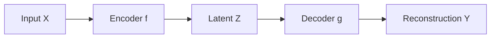

# Skill: write-math-spec

> Use this skill when turning an idea or a paper concept into a formal
> specification in `specs/`, before any code is written.

## Goal

A math spec is a self-contained document that defines:

1. The objects involved (variables, spaces, distributions)
2. The relationships between them (equations, constraints)
3. The procedure or algorithm in pseudocode
4. The properties the implementation should satisfy

A spec is **framework-agnostic** — it does not commit to PyTorch vs JAX, or
to any particular tensor shape convention. It describes the math.

## Procedure

1. **Find the source.** Locate the idea — usually a file in `notes/` or
   `resources/`. If the idea exists only in conversation, write a one-page
   note in `notes/` first and link to it.

2. **Name the spec.** `specs/NNN-short-name.md`, where NNN is a zero-padded
   sequence number. Look at the existing files to pick the next number.

3. **Open with a status table.** Every spec begins with a status table
   immediately after the title. The table is the single source of truth
   for which sections have been reviewed and what downstream work is
   permitted. See "Status table" below.

4. **Structure the spec with these sections, in order:**

   - **Context** — one paragraph: what problem this solves, what came before.
   - **Setup** — definitions of all symbols. Use a notation table if there are
     more than 5 symbols.
   - **Generative model** (if applicable) — a plate-notation diagram for any
     probabilistic content. See "Visuals" below.
   - **Objective** — the formal objective function or property of interest.
   - **Derivation** — the math, with steps a reader can verify.
   - **Algorithm** — pseudocode. Use plain numbered steps with mathematical
     notation. If a data-flow or control-flow diagram would clarify the
     algorithm, include one (see "Visuals").
   - **Properties to verify** — what an implementation should satisfy. These
     become the test suite. Be specific: "the loss is invariant under
     permutation of the batch dimension" is good; "it should work" is not.
   - **Open questions** — anything you're unsure about. Mark with `[?]`.
   - **References** — papers, prior work. Use `[CITATION NEEDED]` if unsure.
   - **Revision log** — appended below as the spec is revised. See
     "Revision log" below.

5. **Ask before guessing.** If the source is ambiguous on a definition or
   choice, ask the human collaborator. Do not silently pick a convention.

## Status table

Every spec opens with a table that tracks per-section review status:

```markdown
| Section | Status | Date |
|---|---|---|
| Context | draft | — |
| Setup | draft | — |
| Generative model | draft | — |
| Objective | draft | — |
| Derivation | draft | — |
| Algorithm | draft | — |
| Properties to verify | draft | — |
```

### Status values

- `draft` — written, not yet human-reviewed.
- `reviewed` — read carefully by the human collaborator and accepted.
- `needs-revision` — read and not accepted; specific concerns documented
  in the section itself (e.g., a `> [!note]` callout) or in
  `meta/what-didnt.md` with a `[spec-format]` tag.

Sections move from `draft` to `reviewed` (or `needs-revision`) only by
direct edit to the table. No justification line is required — the
deliberate edit *is* the act of review. If the human cannot bring
themselves to type the change, that itself indicates the section is not
actually reviewed.

The status table is also where omissions show up: if the spec doesn't
have a "Generative model" section because the math isn't probabilistic,
remove that row rather than leaving it as `draft`. An honest table is
small.

### Status transitions on revision

A `reviewed` section is not permanent. Any non-trivial edit to a
`reviewed` section drops it back to `draft`. This is not a punishment;
it is the recognition that the review was performed against a version
of the section that no longer exists. The downstream-approval rules
(below) then apply again: tests written against the old version may be
stale, implementation against the old version may be wrong, experiments
run against the old version may need to be rerun.

When Claude Code does a revision round, do them according to the > M: comments inline and add a Revision log entry categorising it as Correction/Clarification/Refinement. Then flip back the corresponding status entry to `draft`.

When you flip a section back to `draft` because of a revision, add an
entry to the revision log (see below) describing what changed and why.

### Who flips the status

The asymmetry is deliberate.

- **Forward transitions** (`draft → reviewed`) require a direct edit by
  the human collaborator. Claude does not flip a section to `reviewed`
  under any circumstance, even if asked to. The deliberate edit is the
  act of review.

- **Backward transitions** (`needs-revision → draft`) on revision are performed by whoever makes the
  revision — usually Claude Code, sometimes the human. When Claude
  applies a non-trivial edit to a `reviewed` section, Claude flips that
  section's status row back to `draft` as part of the same edit.
  This is automatic; the human does not have to ask.

  The rationale: forgetting to flip a section back to `draft` after a
  revision is a silent failure that would let downstream work proceed
  against an unreviewed section. The cost of that failure is much higher
  than the cost of a redundant flip.

### What each approval unlocks

The status table gates downstream work to prevent building on
unexamined foundations:

- **Setup + Objective both `reviewed`** → Claude may sketch the test
  scaffolding in `tests/test_NNN_*.py`: file structure, fixtures,
  imports, naming conventions. No actual property tests yet.
- **Derivation `reviewed`** → Claude may write the mathematical-property
  tests against the spec's "Properties to verify" section.
- **Algorithm `reviewed`** → Claude may write the implementation in
  `src/`.
- **All sections `reviewed`** → the spec is approved for red-team review
  (see `skills/red-team-spec.md`) and then for the experiment phase.

Downstream work is permitted but not automatic. Always confirm with the
human before starting the next stage.

## Visuals

Visual elements belong in specs when they clarify something prose
cannot. The default conventions:

### Generative models and probabilistic structure

Use **daft** (Python plate-notation package). Install with `pip install
daft`. The source script and the rendered SVG both live in `diagrams/`,
named to match the spec: a script at `diagrams/NNN-short-name-pgm.py`
producing `diagrams/NNN-short-name-pgm.svg`. The spec embeds the SVG:

```markdown

```

A minimal daft script template:

```python
"""Plate-notation diagram for spec NNN-short-name.

Run: python diagrams/NNN-short-name-pgm.py
Output: diagrams/NNN-short-name-pgm.svg
"""
import daft

pgm = daft.PGM()
# pgm.add_node("z", r"$z$", x=1, y=2)
# pgm.add_node("x", r"$x$", x=1, y=1, observed=True)
# pgm.add_edge("z", "x")
pgm.render()
pgm.savefig("diagrams/NNN-short-name-pgm.svg")
```

Both the script and the SVG are committed. The script is the source of
truth; the SVG is for rendering inside markdown.

Use daft for plate notation with simple node labels (single symbols,
basic subscripts, Greek letters). If a diagram needs richer math inside
nodes — long expressions, multi-line content, complex alignment —
escalate to TikZ (`tikz-bayesnet` LaTeX library). Note the escalation
in `meta/workflow-issues.md`.

### Algorithm / data-flow diagrams

Use **Mermaid** embedded directly inline in the spec markdown. GitHub,
VSCode preview, and Obsidian all render Mermaid natively. Example:

````markdown

````

No external rendering step. The text in the markdown *is* the diagram.

### When to include a diagram

A diagram earns its place when:

- The setup involves a graphical model. **Always** include a plate
  diagram for any spec with probabilistic structure.
- The algorithm has nontrivial control flow (branches, loops over
  populations, alternating updates).
- The data flow is hard to follow from prose alone.

A spec without a single diagram is a yellow flag: probabilistic content
without a plate diagram is usually under-specified, and an algorithm
without a flow diagram is often hiding a step.

## Revision log

Every non-trivial change to a spec after its first review is recorded
in a revision log at the bottom of the spec. Each entry has a date, a
category, and a short description.

### Format

```markdown
## Revision log

### YYYY-MM-DD — Category (Section §X.Y)

What changed, why, and how it was discovered. If the change affects
downstream artifacts (tests, implementation, experiments), note the
implication explicitly.
```

### Categories

Each revision falls into one of three categories. The category matters
because it determines what downstream work is affected:

- **Correction** — the math was wrong. The previous version of the
  section is now known to be incorrect. Any tests, implementation, or
  experimental results downstream of the corrected section are
  potentially invalid and must be reviewed.

- **Clarification** — the math was consistent but ambiguous. The
  section now pins down a choice that was previously implicit. Usually
  no implementation change is needed (the implementation already made
  some choice; the spec just now documents it), but tests may need to
  be sharpened to enforce the now-explicit choice.

- **Refinement** — the spec is extended with additional content. Prior
  work against the spec remains valid; new tests and possibly new
  implementation are added to cover the extension.

When in doubt between categories, escalate: prefer Correction over
Clarification, prefer Clarification over Refinement. The cost of
re-checking work that didn't need re-checking is much smaller than the
cost of trusting work that did.

### When to add a revision log entry

- Always, when flipping a `reviewed` section back to `draft`.
- Always, after substantive content changes to any section, even if the
  section was still at `draft`. The reasoning helps future review.
- Not needed for typo fixes, formatting tweaks, or pure prose
  clarifications that change no claims.

## Output

A new file at `specs/NNN-short-name.md` with all sections at `draft`
status, plus the diagram source and rendered files in `diagrams/`. The
spec should be readable by a labmate who has not seen the source idea.
After the first revision, the spec also has a revision log at the
bottom recording how it evolved.
