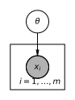

# Spec 000 — Static infomax prior, Mattingly Fig 1 reproduction

| Section | Status | Date |
|---|---|---|
| 0. Purpose and scope | reviewed | 170526 |
| Generative model | reviewed | 170526 |
| 1. Mathematical statement | reviewed | 170526 |
| 2. Why this objective | reviewed | 170526 |
| 3. Computational specification | reviewed | 170526 |
| 4. Test suite | reviewed | 170526 |
| 5. Report | reviewed | 170526 |
| 6. Layout | reviewed | 170526 |
| 7. Deferred choices (recap) | reviewed | 170526 |
| 8. Open questions for this spec | reviewed | 170526 |
| 9. References | reviewed | 170526 |
| 10. Revision log | n/a | — |

## 0. Purpose and scope

This is the first computational artefact in the project. The goal is to
reproduce, qualitatively, Figure 1 of Mattingly et al. 2018 ("Maximizing the
information learned from finite data selects a simple model"). Concretely:

- Given a Bernoulli likelihood `p(x | θ) = Binomial(x; m, θ)` with θ ∈ [0,1],
  compute the prior `p*(θ)` that maximises mutual information
  `I(Θ; X^m)`, for several values of m.
- Show that `p*` is discrete (a finite set of delta-function atoms), with K
  atoms growing as m grows.
- Verify the optimality condition (`f_KL(θ) = MI` on the support, below MI
  off it).
- Show that as m grows the atoms approach the Jeffreys prior
  `p_J(θ) = 1 / (π √(θ(1 − θ)))`.

**In scope**

- 1-D θ.
- Discrete-grid representation of `p(θ)`, with the data structure designed so
  that a future `AtomicPrior` (sub-grid atom refinement) and later a
  `ContinuousPrior` (particle / SMC) can plug in behind the same interface
  without rewriting downstream code. See §3.3.
- Blahut–Arimoto (BA) optimisation only. No atom-refinement post-step yet.
- A test suite that pins the qualitative claims as executable assertions.
- A report (`experiments/000-static-fig1/REPORT.md`) showing the figures and
  the test results.

**Out of scope for this spec**

- Multi-parameter θ (Mattingly §3 / Fig 4) — kept architecturally possible
  but not exercised. To be revisited in spec 002.
- The dynamic / sequential objective (Overleaf §2). Spec 001.
- Sub-grid atom refinement; the d_eff and `MI ∼ ζ log K` scaling laws;
  the Jeffreys-prior-pathology demonstration on hyperribbons; any
  daisy-chain or efficient-coding step. All flagged as later specs.
- Performance optimisation beyond "runs in reasonable time on a laptop".

This spec is also a deliberate workflow test: it is the first time we run
the spec → tests → code → report loop on this project. The spec itself
should be readable on its own without the paper open, because part of what
we are evaluating is whether the workflow produces audit-friendly artefacts.

## Generative model



The latent bias θ is drawn from the (to-be-optimised) prior `p(θ)`; each of
the m observed flips is i.i.d. Bernoulli(θ) conditional on θ. For computation
we use the sufficient statistic `x ~ Binomial(m, θ)`, i.e. the head count.

## 1. Mathematical statement

### 1.1 The model

The Bernoulli model with m trials. The parameter is θ ∈ [0, 1] (the bias of
the coin). The "experiment" consists of m i.i.d. coin flips; the sufficient
statistic is the count `x ∈ {0, 1, …, m}` of heads. The likelihood is

```
p(x | θ, m) = C(m, x) · θ^x · (1 − θ)^(m − x),     x ∈ {0, …, m},
```

with `C(m, x) = m! / (x! (m − x)!)` the binomial coefficient.

Two conventions worth flagging. First: Mattingly uses `m` for sample size and
treats it as a fixed property of the experiment, not as a random variable. We
follow the same convention. (The Overleaf and notebook use `n` instead;
inside this project we will use `m` to match the paper.) Second: because the
sample is summarised by the count, we treat `X = x` as a single random
variable over `{0, …, m}`. There is no need to enumerate sequences in `{0,1}^m`.

### 1.2 The objective

The mutual information between the parameter Θ ∼ `p(θ)` and the data
`X ∼ p(x) = Σ_θ p(x|θ) p(θ)` (the *expected data* under the current prior) is

```
I(Θ; X) = Σ_θ p(θ) · f_KL(θ; p),
f_KL(θ; p) = D_KL[ p(· | θ)  ‖  p(·) ]
          = Σ_x p(x | θ) · log( p(x | θ) / p(x) ).
```

We use base-e logarithms throughout; results in bits are obtained by
dividing by `log 2` at report time.

The optimisation problem is

```
p*(θ) = argmax_{p(·) ∈ Δ(Θ)} I(Θ; X),
```

where `Δ(Θ)` is the simplex of probability mass functions over the grid Θ
(see §3.1). The objective is concave in `p`; the
maximum *value* `MI* = I(Θ; X; p*)` is unique and equals the *channel
capacity* of `p(x|θ)`, and the optimal output marginal `p*(x)` is unique.
The optimal prior `p*(θ)` is unique only on its support set: distinct
mass distributions over the grid that map to the same `p*(x)` all
achieve `MI*`. Tests that compare priors across runs or grids (T5 in
particular) should therefore compare *supports* or *output marginals*,
not pointwise mass over θ.

### 1.3 The optimality condition

By Lagrange / KKT on `p(θ) ≥ 0` and `Σ_θ p(θ) = 1`, the optimal `p*`
satisfies

```
on support of p*:    f_KL(θ; p*) = MI*,
off support:         f_KL(θ; p*) < MI*.
```

This is the cleanest internal sanity check for any candidate `p*`: compute
`f_KL` against `p*` everywhere on the grid, and confirm flatness on the
support. We turn this into a test in §4.

In the continuous setting, the analyticity of `f_KL − MI` in θ implies the
support of `p*` is a finite set of points; this is the discreteness result
that Fig 1 visualises. We assume `N_θ` is large
enough to resolve the continuous-optimum atom spacing — by Mattingly's
analysis the inter-atom spacing in Fisher length is `O(1)`, which for
the Bernoulli model (`L = π√m`) translates to a θ-spacing of `~ 1/√m`.
The condition is therefore `N_θ ≫ √m`; the default `N_θ = 1000`
comfortably covers the sweep up to `m = 100`. On a fine grid
the resolved atoms appear as one or a few adjacent grid bins each.

### 1.4 The Blahut–Arimoto update

The algorithm of Blahut (1972) and Arimoto (1972) maximises `I(Θ; X)` over
`p(θ)` by fixed-point iteration:

```
p_{τ+1}(θ) = (1 / Z_τ) · exp( f_KL(θ; p_τ) ) · p_τ(θ),
Z_τ        = Σ_θ exp( f_KL(θ; p_τ) ) · p_τ(θ),
```

with `f_KL(θ; p_τ)` recomputed against the marginal
`p_τ(x) = Σ_θ p(x|θ) p_τ(θ)` at each step. Initialisation: uniform on the
grid. The update is well-defined on cells with `p_τ(θ) > 0`; mass strictly
zero stays zero, which is why we initialise uniform rather than e.g. on a
random subset.

The algorithm converges monotonically in `I(Θ; X)` (Blahut, Arimoto). We
will use both a value tolerance (`|I_{τ+1} − I_τ| < ε_I`) and a maximum
iteration cap; see §3.4.

### 1.5 Closed-form benchmarks

Two facts we will assert against in tests:

- **m = 1 closed form.** `p*(θ) = ½ δ(θ) + ½ δ(θ − 1)`, with
  `MI* = log 2` nats (= 1 bit). This is the cleanest reference: with one
  flip you can encode exactly one bit about a binary outcome, achieved
  by placing the prior on the two boundary atoms.
- **Jeffreys prior, m → ∞.** For *regular*
  models — compact parameter space, identifiable parametrisation,
  continuous positive-definite Fisher information on the interior —
  Bernardo's reference prior converges to the Jeffreys prior as
  `m → ∞` (Clarke & Barron 1994). Most parametric exponential families
  on a compact parameter space satisfy this, including Bernoulli;
  non-regular families — parameter-dependent support (e.g.
  Uniform(0, θ)), singular Fisher information (e.g. mixtures with
  unidentifiable components), or non-compact unbounded parameter
  spaces — do not. For Bernoulli the limit is
  `p_J(θ) = 1 / (π √(θ(1 − θ)))`. The CDF of
  the atom-mass distribution (a step function with K jumps of heights
  `λ_a` at the atom centroids) should approach the CDF of `p_J`. At
  any finite m the step function cannot match the continuous CDF
  exactly; the best-case Kolmogorov–Smirnov gap is bounded below by
  `~ 1/(2 K(m))`. We assert pointwise CDF agreement at `m = 100` only
  (test T4), and show convergence across the m-sweep visually in the
  report (§5).

There is no closed form for `p*` at intermediate m. The point of the BA
implementation is precisely to fill in that range.

### 1.6 Why this is a model-selection statement

(Exposition for the talk; not algorithmically load-bearing.) The result
generalises: in higher-dimensional Θ, atoms of `p*` preferentially sit on
boundaries of the parameter manifold, each boundary corresponding to a
*reduced model* (some parameter pinned to its limiting value). So `p*`
discretises the parameter space *and* picks out which parameter combinations
are worth keeping at all. The Bernoulli case is the smallest non-trivial
example: the "boundaries" are θ = 0 and θ = 1, and for m = 1 the optimal
prior lives entirely on them. Spec 002 will exhibit the multiparameter
version of this story.

## 2. Why this objective

This subsection exists for the lab-meeting audience. It can be skipped by
anyone implementing.

The static MI objective is the unique answer to a specific question: given
that I will collect m samples and then estimate θ, what prior maximises the
expected number of bits I will learn about θ from those samples? It is
**not** the same as maximum-entropy, which maximises entropy of `p(θ)`
itself rather than expected information from `X`. It is **not** Jeffreys,
which is the `m → ∞` limit of this same objective and so corresponds to
the (unphysical) assumption of indefinitely many future samples. And it is
**not** a posterior or a fitted distribution; the prior is computed before
any data are seen, from the likelihood function alone, and depends on the
sample budget m as a property of the experiment.

The reason this is interesting for cognition (and the reason the project
exists at all) is that an agent in the world generally knows roughly how
many observations it can collect before having to commit to a decision. If
we accept that quantity ("urgency") as part of the task specification, the
MI objective gives a normative reason for the agent to coarse-grain its
representation. Spec 001 will extend this to the sequential setting where
the budget m applies repeatedly across learning episodes.

## 3. Computational specification

### 3.1 Discretisation of θ

θ ∈ [0, 1] is approximated by a uniform grid of `N_θ` cells. We use
*cell-centred* values: `θ_i = (i + ½) / N_θ` for `i = 0, …, N_θ − 1`. Each
cell carries probability mass `p_i`; we treat the grid as a probability
mass function, not as a density.

Avoiding the endpoints θ = 0 and θ = 1 exactly is a deliberate choice:
the Bernoulli likelihood at θ = 0 puts all mass on x = 0, making `log p(x|θ)`
a `−∞` for x ≠ 0 and contaminating `f_KL` with infinities under naive
implementation. The cell-centred convention pushes the first and last cells
to `θ ≈ 1 / (2 N_θ)` and `θ ≈ 1 − 1 / (2 N_θ)`, where the likelihood is
non-degenerate.

Default `N_θ = 1000` for the headline runs. We also re-run at
`N_θ ∈ {200, 500, 2000}` to check that the qualitative results are stable
under grid refinement (Mattingly's Fig 2 makes the same check).

We mark this as **DC-1** (deferred choice 1): the cell-centred convention
means we can never place an atom exactly at θ = 0 or θ = 1, so the m = 1
test (§4) must compare against atoms at the first and last grid cells, not
literally at the endpoints. This will need a different convention if we
later want analytic boundary atoms.

### 3.2 Likelihood evaluation

Compute and cache `P[i, x] = p(x | θ_i, m)` for `i ∈ {0, …, N_θ − 1}` and
`x ∈ {0, …, m}`. This is a single `N_θ × (m + 1)` matrix of floats.
Use `scipy.stats.binom.pmf` or an explicit `log_binom` to avoid overflow
at large m.

We work in log-space where possible. Define

```
logP[i, x] = log p(x | θ_i, m)  =  log C(m, x) + x log θ_i + (m − x) log(1 − θ_i).
```

Then `p(x) = Σ_i p_i exp(logP[i, x])`. Use `logsumexp` for stability.

### 3.3 The prior interface

To keep the door open for `AtomicPrior` and `ContinuousPrior` later (see §0),
the prior is an abstraction over how `θ` is represented (grid cells,
atoms, particles). Functions that need to query the likelihood or `f_KL`
do so via a callable, so each `Prior` queries on its own support — there
is no fixed grid-shaped buffer in the interface.

```
class Prior(Protocol):
    def support(self) -> ndarray:
        # θ-values carrying probability mass.
    def masses(self) -> ndarray:
        # probability masses, summing to 1, aligned with support().
    def expected_data(self, log_likelihood_fn) -> ndarray:
        # p(x) = Σ_θ p(x|θ) p(θ).
        # log_likelihood_fn(θ_vec) returns log p(x|θ) of shape (len(θ_vec), n_x).
    def updated(self, f_kl_fn) -> "Prior":
        # one MI-improvement step.
        # f_kl_fn(θ_vec) returns f_KL evaluated at θ_vec.
```

`GridPrior` (this spec): support is the fixed cell-centred grid,
`updated()` is one BA iteration (§1.4, §3.4). `AtomicPrior` (later, when
sub-grid refinement lands): support is a small `(θ_a, λ_a)` list,
`updated()` is a gradient step on the atom positions and masses per
Mattingly §S5. `ContinuousPrior` (DC-3): support is a particle cloud,
`updated()` is an SMC step.

The interface unifies the protocol but not the algorithm: BA monotonicity
(for grids) and gradient/SMC convergence (for atoms/particles) are
guarantees of each subclass, not of the abstract `updated()`.

### 3.4 BA loop

```
p       ← uniform(N_θ)
log_p   ← log p                                                   # all = -log N_θ
I_prev  ← −∞
for τ in 0 ... τ_max:
    p_x      ← Σ_i p_i · P[i, x]                                  # marginal over x, shape (m+1,)
    f_KL_i   ← Σ_x P[i, x] · ( log P[i, x] − log p_x[x] )         # shape (N_θ,)
    I_τ      ← Σ_i p_i · f_KL_i
    log_p_new ← f_KL_i + log_p                                    # log-space BA step
    log_p_new ← log_p_new − logsumexp(log_p_new)                  # normalise
    if |I_τ − I_prev| < ε_I and τ > τ_min:
        break
    log_p  ← log_p_new
    p      ← exp(log_p)
    I_prev ← I_τ
return p, I_τ, f_KL_i
```

The BA update is carried out in log-space (`log_p_new = f_KL + log_p`,
normalised via `logsumexp`) per §3.2's stability convention. This costs
nothing for small `m` and is the only place in the loop where overflow
could plausibly bite at larger `m`.

Defaults: `τ_min = 10`, `τ_max = 5000`, `ε_I = 1e-10` (in nats). These are
generous; BA on Bernoulli converges much faster but we don't optimise yet.

### 3.5 Atom extraction

After convergence, "atoms" are visible as clusters of adjacent high-mass
cells. For visualisation and tests we extract them as follows:

1. Threshold: keep cells with `p_i > p_thresh` for some small `p_thresh`
   (default `1 / (10 N_θ)` — i.e. mass at least an order of magnitude above
   the uniform).
2. Group adjacent kept cells into runs (maximal stretches of consecutive
   indices).
3. For each run, report `θ_a = Σ_{i ∈ run} θ_i · p_i / Σ p_i` (mass-weighted
   centroid) and `λ_a = Σ_{i ∈ run} p_i`.

This is approximate and grid-dependent. A future `AtomicPrior` will yield
exact atom positions; for now we want clean tests on the centroids and
weights of detected runs.

We mark this as **DC-2**: the `p_thresh` and adjacency criterion are
heuristic. The tests below check stability of detected atoms under grid
refinement, which is the substantive property we care about.

### 3.6 Sweep over m

Run the BA loop for `m ∈ {1, 2, 3, 4, 5, 10, 20, 50, 100}`. For each,
record `MI*`, `K` (number of detected atoms), and `(θ_a, λ_a)` for each
atom. Save as a single results table for the report.

## 4. Test suite

These are acceptance criteria — the implementation must pass them before
the spec is considered fulfilled. Each test ties back to a specific claim
in §1.

**T1 — m=1 closed form (on the grid).** With `m=1`, after BA converges:
- `K = 2` atoms.
- Atom centroids at the first and last grid cells:
  `θ_a ∈ {1/(2 N_θ), 1 − 1/(2 N_θ)}` within `0.5 / N_θ` (half a cell).
- Atom masses within `1e-6` of `0.5` each (exact by the θ ↔ 1−θ symmetry
  of the optimum; the tolerance is just BA convergence slack).
- `MI*` within `1e-6` nats of the **analytic two-atom MI evaluated at the
  grid endpoints**:

  ```
  MI_ref(N_θ) = log 2 − H( 1/(2 N_θ) ),
  H(p)        = −p log p − (1 − p) log(1 − p)   (binary entropy in nats).
  ```

  At `N_θ = 1000` this gives `MI_ref ≈ 0.68885 nats`, deficit `≈ 4.3e-3`
  below `log 2`; the deficit scales like `(1/N_θ) log N_θ`. The continuum
  optimum `½ δ(0) + ½ δ(1)` with `MI = log 2` is the `N_θ → ∞` limit of
  `MI_ref`. Per DC-1 we test against the achievable grid optimum, not
  the continuum.

**T2 — f_KL flatness on support.** For every m in the sweep: at all grid
cells with `p_i > p_thresh`, `f_KL_i` agrees with the achieved `MI*` to
within a relative tolerance `1e-3`. Off-support cells satisfy
`f_KL_i ≤ MI*` (no positive violations beyond floating-point slack).

**T3 — Capacity bound (decoupled from §3.5).** For every m,
`MI* ≤ log K_upper + tol`, where
`K_upper = #{ i : p*_i > 1e-12 }` is a permissive count of grid cells
with non-trivial mass after a hard floor (any real support cell
exceeds 1e-12 by many orders of magnitude). `K_upper` is therefore an
upper bound on the true atom count, and the bound `MI* ≤ log K_upper`
holds whenever the math holds. This decouples T3 from §3.5's
atom-extraction heuristic, which retains its role for figures and the
results table but no longer drives the test. Use `tol = 1e-10`.
(This is the `MI ≤ log K` bound from Mattingly Fig 3C.)

**T4 — Convergence to Jeffreys (qualitative).** At `m = 100`, the
cumulative distribution function of the mass distribution agrees with the
CDF of the Jeffreys prior `p_J(θ)` in Kolmogorov–Smirnov distance below
`0.05`. (Generous, because at finite m we still see discreteness; this
test pins the *aggregate* shape, not pointwise convergence.)

**T5 — Grid invariance of atom locations.** Re-run at `N_θ = 200` and
`N_θ = 2000`. For each m in `{1, 2, 5, 10}`, detected atom counts agree;
atom centroids agree across grids to within `3 × max(1/N_θ)` of each
other. (i.e. atoms aren't an artefact of grid choice.)

**T6 — BA monotonicity.** `I_τ` is
non-decreasing across iterations, up to floating-point slack (`1e-10` per
step, absolute). The slack matches the realistic float64 rounding budget
for a summation over `N_θ = 1000` terms
of `|f_KL| ≲ log(m+1)`. This is the BA convergence guarantee.

**T7 — Algorithmic sanity on a degenerate case.** If the likelihood is
`θ`-independent (a fake "experiment that learns nothing"), then `MI* = 0`,
`f_KL ≡ 0`, and `p* = p_0` (uniform). Optional but cheap.

We do **not** test:

- Exact atom positions at intermediate m (no closed form, no point).
- The `MI ≈ (3/4) log K` scaling law (deferred to spec 002).
- Any property of the higher-dimensional case.

## 5. Report

Output to `experiments/000-static-fig1/REPORT.md`. Contents:

1. The figure(s): for each m, a plot showing `p*(θ)` (stems at detected
   atoms) and `f_KL(θ)` on the same axes; the horizontal line at `MI*`
   highlighted. This is our Fig 1.
2. A second plot showing the m = 100 atom CDF overlaid on the Jeffreys
   CDF.
3. A convergence plot: K–S distance between the atom CDF and the Jeffreys CDF as a function of m across the sweep, with the discreteness floor `1/(2 K(m))` overlaid. Visual sanity check, not a hard assertion — small-m points are expected to sit on the floor.
4. A small results table: `m`, `K`, `MI*` in bits, atom centroids and
   weights.
5. Test results: pass/fail status of T1–T7 with the numerical tolerances
   actually achieved.
6. Notes section: anything that went wrong, was surprising, or differs
   from the spec. Including DC-1 and DC-2 caveats.

The report should be self-contained enough that a lab-meeting attendee can
follow it without the spec, but should reference the spec for the maths.

## 6. Layout

```
specs/000-static-infomax-fig1.md          (this file)
src/infomax/__init__.py
src/infomax/likelihood.py                 (binomial likelihood, precomputation)
src/infomax/prior.py                      (Prior protocol + GridPrior)
src/infomax/ba.py                         (BA loop)
src/infomax/atoms.py                      (atom extraction)
src/infomax/jeffreys.py                   (closed-form Jeffreys for Bernoulli)
tests/test_static_infomax.py              (T1–T7)
experiments/000-static-fig1/
    run.py                                (sweep over m, generate figures)
    REPORT.md                             (the report)
    figures/                              (generated)
```

`bootstrap.py` at the repo root: leave to a separate step once we know what
dependencies we actually need. Likely `numpy`, `scipy`, `matplotlib`,
`pytest`.

## 7. Deferred choices (recap)

- **DC-1** Cell-centred grid means atoms are never exactly at θ = 0 or
  θ = 1; tests work with first/last grid cells. Revisit when we add an
  AtomicPrior.
- **DC-2** Atom extraction (`p_thresh`, adjacency) is heuristic. Revisit
  for AtomicPrior or when we move to multi-D Θ where adjacency is ambiguous.
- **DC-3** Continuous-θ support via SMC / particles: explicitly deferred,
  but the `Prior` protocol of §3.3 should not preclude it. We will revisit
  the protocol if we hit something that does.

## 8. Open questions for this spec

None marked blocking. The discussion of grid choice (DC-1), atom extraction
(DC-2), and the `Prior` protocol shape (DC-3) is the substantive content
the lab-meeting audience should see us reasoning about live.

## 9. References

- Mattingly, H. H., Transtrum, M. K., Abbott, M. C., & Machta, B. B.
  (2018). Maximizing the information learned from finite data selects a
  simple model. *PNAS*, 115(8), 1760–1765. The headline result and the
  figure being reproduced (Fig 1).
- Blahut, R. E. (1972). Computation of channel capacity and rate-distortion
  functions. *IEEE Transactions on Information Theory*, 18(4), 460–473.
  Original BA algorithm reference.
- Arimoto, S. (1972). An algorithm for computing the capacity of arbitrary
  discrete memoryless channels. *IEEE Transactions on Information Theory*,
  18(1), 14–20. The other half of the BA algorithm.
- Bernardo, J. M. (1979). Reference posterior distributions for Bayesian
  inference. *Journal of the Royal Statistical Society B*, 41(2),
  113–147. Reference prior framework; Jeffreys prior is the m → ∞ limit
  of the MI-maximising prior for regular models.
- Jeffreys, H. (1946). An invariant form for the prior probability in
  estimation problems. *Proc. Roy. Soc. A*, 186, 453–461. Original
  Jeffreys prior; for the Bernoulli case `p_J(θ) = 1 / (π √(θ(1 − θ)))`.
- Clarke, B. S. & Barron, A. R. (1994).
  Jeffreys' prior is asymptotically least favorable under entropy risk.
  *Journal of Statistical Planning and Inference*, 41(1), 37–60. DOI
  10.1016/0378-3758(94)90153-8. Regularity conditions under which
  Bernardo's reference prior reduces to Jeffreys as `m → ∞`; cited in
  §1.5.

## 10. Revision log

- **2026-05-17 — Refinement** (Generative model). Simplified plate notation
  in `diagrams/000-static-infomax-fig1-pgm.{py,svg}`: node renamed `x_i` →
  `x`, plate label changed from `i = 1, …, m` to just `m` in the corner.
  Caption prose under the diagram adjusted to match (no more `x_i`). No
  change to the underlying generative model. Per inline review comment.

- **2026-05-17 — Post-red-team revisions** (§1, §3, §4, §5). Findings
  triaged in `specs/000-static-infomax-fig1-redteam.md`. This entry
  covers the changes for the findings the human reviewer accepted with
  a confident instruction; F4, F11, F12, and the DC-1 follow-up on F1
  remain under discussion. Each change is tied to its finding ID.

  - **F1 [Correction]** §4 T1. Test reference value changed from `log 2`
    to the analytic two-atom MI evaluated on the actual cell-centred
    grid, `MI_ref = log 2 − H(1/(2 N_θ))`. Tolerances tightened (mass
    1e-6, MI 1e-6 nats) since the comparison is now apples-to-apples.
  - **F2 [Correction]** §3.4. Added `I_prev ← −∞` initialisation before
    the BA loop and explicit `I_prev ← I_τ` update at end-of-step;
    removed the `I_{τ−1}` reference that was undefined at τ = 0.
  - **F3 [Refinement]** §3.4. BA update rewritten in log-space
    (`log_p_new = f_KL + log_p`, normalised by `logsumexp`) so §3.2's
    "we work in log-space where possible" actually applies to the step
    where overflow could bite. Math unchanged.
  - **F5 [Refinement]** §1.5, §5. §1.5 prose replaced "empirical
    histogram approaches p_J" (apples-to-oranges) with a CDF-based
    statement consistent with T4, and noted the inherent KS floor
    `~ 1/(2 K(m))`. §5 gained an item 3: a convergence plot of KS
    distance vs m, with the discreteness floor overlaid.
  - **F6 [Clarification]** §1.2. Spelled out that the maximum *value*
    `MI*` and the optimal output marginal `p*(x)` are unique, while
    `p*(θ)` is unique only on its support. Added a one-line guidance
    for cross-grid prior comparisons (support- or marginal-based, not
    pointwise mass).
  - **F7 [Clarification]** §1.3. Added the fineness assumption
    explicitly: `N_θ ≫ √m`, motivated by Mattingly's atom-spacing
    scaling; noted that `N_θ = 1000` covers `m ≤ 100`.
  - **F8 [Correction]** §3.3. `Prior` protocol changed: `expected_data`
    and `updated` now take callables (`log_likelihood_fn`, `f_kl_fn`)
    so each `Prior` queries them on its own support. This makes
    `AtomicPrior` (and later `ContinuousPrior`) actually pluggable. The
    section also acknowledges that the per-subclass `updated()` step is
    a different optimiser (BA / gradient / SMC), not one shared
    algorithm.
  - **F10 [Refinement]** §4 T6. Per-step monotonicity slack widened
    from `1e-12` to `1e-10`, matched to the realistic float64 rounding
    budget for `Σ` over `N_θ = 1000` terms of `|f_KL| ≲ log(m+1)`.
  - **F9 [dismissed]** §1.2. "Expected data" terminology kept; the
    reviewer accepted the local usage.

  Note: `src/infomax/prior.py` stub no longer matches §3.3 after the
  F8 change. Left as-is intentionally — the Algorithm gate is now back
  to draft, and the stub will be re-aligned at the next implementation
  step.

  - **F4 [Refinement]** §4 T3. Rewritten to assert
    `MI* ≤ log K_upper + tol` against a permissive grid-cell count
    `K_upper = #{i : p*_i > 1e-12}`, decoupling the test from §3.5's
    atom-extraction heuristic. The extractor is unchanged and still
    drives the figure and the results table.
  - **F11 [Clarification]** §1.5, §9. §1.5's Jeffreys bullet now
    states the regularity conditions for Bernardo → Jeffreys explicitly
    (compact parameter space, identifiable parametrisation, continuous
    positive-definite Fisher information) and gives positive (regular
    exponential families on a compact parameter space, including
    Bernoulli) and negative (parameter-dependent support, singular
    Fisher, non-compact) examples. Clarke & Barron (1994) added to §9
    References.
  - **F12 [dismissed]** Generative-model diagram. The bare-`x`-in-plate
    convention with corner count `m` is the standard plate convention
    (Buntine 1994; Koller & Friedman 2009 §6.4; Bishop 2006 §8.1; PyMC
    and daft documentation) and means `m` i.i.d. copies of `x`. The
    current diagram correctly renders the Bernoulli generative model;
    the caption already flags that computation uses the sufficient
    statistic. No change.
  - **F1 follow-up [unchanged]** DC-1 kept as-is per reviewer's note;
    no spec edit beyond the T1 fix already recorded above.