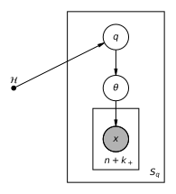

# Spec 001 — Does the info-optimal prior win at Kelly betting?

| Section | Status | Date |
|---|---|---|
| 0. Purpose and scope | reviewed | 250526 |
| Generative model | reviewed | 250526 |
| 1. Mathematical statement | draft | — |
| 2. Why this question | draft | — |
| 3. Computational specification | draft | — |
| 4. Test suite | draft | — |
| 5. Report | draft | — |
| 6. Layout | draft | — |
| 7. Deferred choices | draft | — |
| 8. Open questions | draft | — |
| 9. References | draft | — |
| 10. Revision log | n/a | — |

## 0. Purpose and scope

Spec 000 reproduced the *static* infomax prior `p*_n` (Mattingly Fig 1) —
the prior on `θ ∈ [0,1]` that maximises mutual information `I(Θ; X_{1:n})`
for a fixed sample budget `n` under a Bernoulli likelihood. The output
was a qualitative reproduction; whether `p*` is *good for anything
downstream* was never tested.

This spec is the smallest test of downstream utility. It asks:

> Does using `p*_n` as a Bayesian prior yield higher expected log-wealth
> in a Kelly-style betting game than using a smooth reference prior
> (Jeffreys, uniform), when the data-generating `θ` is drawn from a
> *different* (nonparametric Beta-mixture) distribution `q` than the
> prior the agent is using?

The "different `q`" requirement is the substantive one: if `q = p*` the
agent is artificially matched to nature and the answer is uninteresting.
We average over a hyperprior of `q`s and ask whether `p*` wins on
average and how often.

Two parts:

- **Part 1 (one-shot Kelly on a single toss).** The agent observes
  `X_{1:n}`, forms a posterior `p(θ | X_{1:n})`, and bets a Kelly
  fraction `f = 2 μ̂ − 1` on toss `n+1`, where `μ̂` is the posterior
  mean. *Only the posterior mean enters the bet*, so this part isolates
  whether `p*`'s posterior-mean function is better calibrated than the
  Beta priors'.
- **Part 2 (one-shot bet on a `k₊`-toss all-heads pattern).** Let
  `ω ∈ {0,1}^{k₊}` denote a fixed binary pattern over the `k₊` tosses
  immediately following the training data — i.e. tosses
  `n+1, …, n+k₊`. The agent bets even-money on the realised pattern
  equalling `ω`. The headline runs specialise to `ω = (1, …, 1)`
  ("all heads"); general `ω` is supported by the same math (§1.5) but
  deferred at the implementation level (DC-2 in §7). The bet payoff
  depends on the predictive probability of `ω`, which for the
  all-heads specialisation is the `k₊`-th raw posterior moment. This
  part exposes higher-moment / shape-level structure of `p*` that
  Part 1 cannot.

**In scope**

- Reuse spec 000's `blahut_arimoto` to compute `p*_n` on a grid; treat
  the converged grid masses as a discrete prior (no atom extraction
  needed for the betting computation, see §3.3).
- Closed-form computation of expected log-wealth `V̄₁` — the
  expected log-wealth from the Part-1 single-toss Kelly bet (one
  bet, one outcome) — and `V̄₂` — the expected log-wealth from the
  Part-2 `k₊`-toss pattern bet (one bet on a single `k₊`-long
  outcome sequence). Both reduce to a finite sum of Beta moments —
  see §1.4 and §1.5; no Monte-Carlo over `X_{1:n}` or `θ` is needed.
- A `q`-sampler for three hyperpriors (endpoint-favouring,
  interior-favouring, agnostic), each producing Beta-mixture samples
  with closed-form moments.
- A moment-matched Beta control `p_MM` for Part 2, isolating whether
  the discreteness of `p*` (beyond mean+variance) is doing work.
- A test suite verifying the closed-form formulas against Monte-Carlo
  references and against analytic limit cases.
- A report (`experiments/001-infomax-betting/REPORT.md`) with the
  per-cell mean / quantile / win-fraction summaries, plus diagnostic
  plots.

**Out of scope for this spec**

- The non-Kelly bet variant (fixed-stake binary bet) flagged in the
  note's §9. Listed as open question OQ-2.
- "Shape-beyond-moments" bets — i.e. bets whose payoff is a functional
  of the full posterior shape rather than a fixed-order moment. Open
  question OQ-3.
- The sequential / dynamic infomax extension (separate forthcoming
  spec). This spec uses static `p*_n` exactly as Mattingly defined it.
- Multi-parameter `θ`.
- Repeated-bet log-wealth trajectories (e.g. running Kelly across many
  episodes). One-shot expectation only.

This spec is also the first downstream-utility experiment in the
project, so its structure should be reusable for later "does the
info-optimal prior help at task X" questions.

## Generative model



This diagram describes the *external environment* — the
data-generating process the experiment uses to simulate "nature".
It is *not* what the agent assumes. The agent never sees `q` or
`𝓗`; it observes only `X_{1:n}` and reasons about `θ` through a
fixed prior `p ∈ {p*_n, p_J, p_U, p_MM}` chosen as a function of
the sample budget `n` alone (see the bottom of this section). The
marginal of `θ` under this generative model — i.e. the realised
`q_s` — is in general different from the agent's `p`. That
mismatch (agent ≠ nature) is the whole point of the experiment;
matching them by construction would make the comparison trivial.

Two stacked plates capture the simulation. The outer plate (`s = 1, …,
S_q`) is over independent samples of `q`: for each sample, a Beta-mixture
hyperprior `𝓗 ∈ {H1, H2, H3}` produces a mixture `q_s(θ)` parameterised
by `(K, w_s, {(a_{s,j}, b_{s,j})}_{j=1}^K)` (see §1.6). The inner plate
(`n` Bernoulli observations plus the bet outcomes) is *not actually
materialised at simulation time* — both `θ` and `X_{1:n}` are integrated
out analytically against `q_s` (see §1.4 and §1.5). The plate is shown
for conceptual completeness; the algorithm of §3 only ever samples `q_s`.

The agent's prior `p` (one of `p*_n`, `p_J`, `p_U`, or for Part 2 also
`p_MM`) is *not* coupled to `q` — that is the whole point of the
experiment. The agent picks `p` ahead of time as a function of the
sample budget `n` only.

## 1. Mathematical statement

### 1.1 Setup and notation

We follow spec 000's conventions for the Bernoulli model, with two
differences: (a) sample budgets are denoted `n` (per the note and the
betting literature), and the corresponding spec-000 variable `m` is the
same object; (b) the data is presented to the agent as the sufficient
statistic `k_n = Σ X_i ∼ Binomial(n, θ)`.

| Symbol | Meaning |
|---|---|
| `θ ∈ [0,1]` | Probability of heads on a Bernoulli toss. |
| `n` | Sample budget (number of observed tosses before the bet). |
| `k_n ∈ {0, …, n}` | Number of heads observed; sufficient statistic. |
|| > M: the above should be h_n instead of k_n, there are too many ks already. change everywhere|
| `k₊` | Number of *future* tosses the Part-2 bet is on. |
| `ω ∈ {0,1}^{k₊}` | The pattern bet on in Part 2. Fixed `ω = (1,…,1)` in the headline runs (see DC-2). |
| `p(θ)` | Agent's prior on `θ`. |
| `p_U`, `p_J` | `Beta(1,1)` (uniform) and `Beta(½, ½)` (Jeffreys). |
|| > M: Let's have a reference for the Jeffreys being this Beta distribution here|
| `p*_n` | The info-optimal prior for budget `n` (spec 000). Discrete, on the BA grid. |
| `p_MM` | Moment-matched Beta with the same mean and variance as `p*_n` (Part 2 only). |
| `μ̂_n(p, k)` | Posterior mean of `θ` given `k_n = k` under prior `p`. |
| `r̂_n(p, k, ω)` | Posterior predictive probability of pattern `ω` given `k_n = k` under `p`. For `ω = (1,…,1)` this is the `k₊`-th raw posterior moment. |
| `q(θ)` | A draw from the hyperprior over Beta mixtures (§1.6); the data-generating density. |
| `M_{r,s}(q)` | `∫₀¹ θ^r (1−θ)^s q(θ) dθ`. Generalised moment of `q`; closed form for Beta mixtures (§1.7). |
|| >M: what are r and s? what will this be used for?|
| `G₁`, `G₂` | Realised log-wealth growth for Parts 1 and 2 (§1.4, §1.5). |
| `V₁`, `V₂` | Expectation of `G` over `X_{1:n}` given `θ`. |
| `V̄₁`, `V̄₂` | Expectation of `V` over `θ ∼ q`. The headline quantity. |
| `Δ(p, p′)` | `V̄(p) − V̄(p′)` — the difference statistic we report. |

All logarithms in nats unless otherwise stated. Bits are obtained at
report time via `log 2`.

### 1.2 Reusing `p*_n` from spec 000

`p*_n` is the output of `blahut_arimoto` from spec 000 at sample budget
`n` and grid `N_θ = G` (default `G = 1000`, matching spec 000). The
returned `GridPrior` is a PMF over the cell-centred grid. For the
betting computations of this spec we treat the *grid masses* as the
discrete prior — no atom extraction. Concretely, `p*_n = Σ_{i=1}^{G}
p_i δ_{θ_i}` where `(θ_i, p_i)` is the BA output. See §3.3 for why this
is preferable to using the §3.5 atom-extraction heuristic.

The moment-matched control `p_MM` (Part 2) uses the mean and variance
of `p*_n` computed directly from the grid masses; it is the unique Beta
with those moments (closed form in §1.8).

### 1.3 Kelly fraction and realised log-growth

(See `tutorials/math/kelly.md` for a calibrated explainer of the
underlying Kelly identity and why log-utility is what bridges
posterior quality to measurable betting payoff. The derivation
below uses the result; the tutorial motivates it.)

In Parts 1 and 2 the bet is even-money on a binary outcome `Y ∈ {0,1}`:
the agent's belief gives `P(Y = 1) = π̂` for some `π̂` derived from
`p(θ | X_{1:n})`. The Kelly fraction is

```
f(π̂)  =  clip( 2 π̂ − 1,  −1 + ε_f,  1 − ε_f ).
```

The clip with a small `ε_f = 10⁻¹² ` is a numerical safety net. Without
it `π̂ ∈ {0, 1}` produces `log 0`. The clip is a tighter version of the
"do nothing if `π̂ ∈ {0,1}`" rule that betting analyses sometimes use;
it is structurally never triggered by the implementation in this spec
because `π̂` is a Bayesian posterior expectation under a prior with full
support on `(0, 1)` (Beta with positive shape parameters, or BA-output
mixture of cell-centred grid points strictly inside `(0,1)` — none of
which can return `0` or `1`). It exists as a guard against future
extensions.

Realised log-growth against truth `Y` with probability `π_true`:

```
g(Y, π̂)   =   Y · log(1 + f(π̂))  +  (1 − Y) · log(1 − f(π̂))
           =   Y · log(2 π̂)        +  (1 − Y) · log(2 (1 − π̂)),
```

where the second equality uses `1 + f = 2 π̂` and `1 − f = 2 (1 − π̂)`
(modulo the clip). Expected log-growth against `π_true`:

```
g̅(π_true, π̂)   =   π_true · log(2 π̂)  +  (1 − π_true) · log(2 (1 − π̂))
                =   log 2  −  H_B(π_true)  −  D_KL( Bern(π_true) ‖ Bern(π̂) ),
```

where `H_B(p) = −p log p − (1−p) log(1−p)` is the binary entropy. Kelly
optimality is the immediate consequence: `g̅` is maximised at `π̂ =
π_true`, with maximum `log 2 − H_B(π_true)`.

### 1.4 Part 1: one-shot bet on toss `n+1`

The agent's predictive probability of heads on toss `n+1` is the
posterior mean `μ̂ = μ̂_n(p, k_n)`. So `π_true = θ`, `π̂ = μ̂_n(p, k_n)`,
and the realised growth is

```
G₁(θ, p, X_{1:n})   =   g̅( θ,  μ̂_n(p, k_n) ).
```

`X_{1:n}` enters only through `k_n ∼ Binomial(n, θ)`; the expectation
over data is a finite sum:

```
V₁(θ, p, n)   =   Σ_{k=0}^{n}  C(n,k) θ^k (1−θ)^{n−k} · g̅( θ, μ̂_n(p, k) ).
```

Expanding `g̅`:

```
V₁(θ, p, n)
     =  log 2
        +  Σ_{k=0}^{n} C(n,k) θ^k (1−θ)^{n−k} ·
              [  θ · log μ̂_n(p,k)  +  (1−θ) · log(1 − μ̂_n(p,k)) ].
```

For each `(p, k)` the quantities `log μ̂_n(p,k)` and `log(1 − μ̂_n(p,k))`
are constants in `θ`. So averaging over `θ ∼ q`:

```
V̄₁(p, n, q)
     =  log 2
        + Σ_{k=0}^{n} C(n,k) [
              log μ̂_n(p,k)        · M_{k+1, n−k}(q)
            + log(1 − μ̂_n(p,k))   · M_{k,   n−k+1}(q)
          ].
```

This is the closed-form Part-1 expression. It is *exact* (no
Monte-Carlo) given the Beta-mixture parameters of `q` and the
posterior-mean function `μ̂_n(p, ·)`.

### 1.5 Part 2: one-shot bet on the `k₊`-toss all-heads pattern

The bet is on `ω = (1, …, 1) ∈ {0,1}^{k₊}` materialising over tosses
`n+1, …, n+k₊`. The agent's predictive probability of `ω` is `r̂_n(p,
k_n, ω) = E_{p(θ | k_n)}[ θ^{k₊} ]`, i.e. the `k₊`-th raw posterior
moment. The truth's probability of `ω` given `θ` is `r(θ) = θ^{k₊}`.

Same derivation as Part 1, with `π̂ = r̂_n(p, k_n, ω)` and `π_true =
r(θ)`:

```
V₂(θ, p, n, k₊)
     = Σ_{k=0}^{n}  C(n,k) θ^k (1−θ)^{n−k} · g̅( θ^{k₊}, r̂_n(p,k,ω) ).
```

Decomposing `g̅` and averaging over `θ ∼ q`:

```
V̄₂(p, n, q, k₊)
     =  log 2
        + Σ_{k=0}^{n}  C(n,k) [
              log r̂_n(p,k)         · M_{k+k₊, n−k}(q)
            + log(1 − r̂_n(p,k))    · ( M_{k, n−k}(q) − M_{k+k₊, n−k}(q) )
          ].
```

Exact for Beta-mixture `q`. Note that `M_{k, n−k}(q) − M_{k+k₊, n−k}(q)
= E_q[ θ^k (1−θ)^{n−k} (1 − θ^{k₊}) ]`, which is non-negative by
construction (each term is a probability against a non-negative
integrand).

### 1.6 Posterior-mean / posterior-pattern formulas per prior

For each prior type the spec pins the closed (or exact discrete) form
the implementation must use. These are the only places where the prior
type enters `V̄₁` or `V̄₂`.

**Beta `Beta(α, β)`:**

```
μ̂_n(Beta(α,β), k)               =   (α + k) / (α + β + n).
r̂_n(Beta(α,β), k, ω = 1^{k₊})   =   Π_{j=0}^{k₊−1}  (α + k + j) / (α + β + n + j),
                                 =   B(α + k + k₊, β + n − k) / B(α + k, β + n − k).
```

**Discrete `p* = Σ_a π_a δ_{θ_a}` (used for `p*_n` via the BA grid):**

```
w_a(k)         =   π_a · θ_a^{k} · (1 − θ_a)^{n − k}                  (unnormalised),
π'_a(k)        =   w_a(k) / Σ_{a'} w_{a'}(k),

μ̂_n(p*, k)     =   Σ_a θ_a · π'_a(k),
r̂_n(p*, k, ω) =   Σ_a θ_a^{|ω|} (1 − θ_a)^{k₊ − |ω|} · π'_a(k).
```

For `ω = (1,…,1)`, `r̂_n(p*, k, ω) = Σ_a θ_a^{k₊} · π'_a(k)` — the
`k₊`-th raw posterior moment under the discrete posterior. The discrete
formulas are evaluated in log-space to avoid underflow (see §3.4).

### 1.7 Beta-mixture moments `M_{r,s}(q)`

For `q(θ) = Σ_j w_j · Beta(θ; a_j, b_j)`:

```
M_{r,s}( Beta(a,b) )   =   B(a+r, b+s) / B(a, b),       r, s ≥ 0,
M_{r,s}(q)             =   Σ_j w_j · B(a_j+r, b_j+s) / B(a_j, b_j).
```

Evaluated in log-space via `scipy.special.betaln` to avoid the Beta
function overflowing at large shape parameters: `log M_{r,s}(Beta(a,b))
= betaln(a+r, b+s) − betaln(a, b)`, then the mixture sum is `Σ_j w_j ·
exp(log M_{r,s}(Beta(a_j, b_j)))` — safe because each per-component log
ratio is `≤ 0` for `r + s ≥ 1`.

### 1.8 Moment-matched Beta (`p_MM`, Part 2 only)

Given a prior `p̃` (in our use, `p̃ = p*_n`) with mean `μ` and variance
`σ²` strictly inside `(0, ¼)`, the unique Beta distribution with the
same first two moments has

```
ν   =   μ (1 − μ) / σ²   −   1,
α   =   μ · ν,
β   =   (1 − μ) · ν.
```

The constraint `σ² < μ(1−μ)` is necessary for `ν > 0` and is satisfied
by any non-degenerate distribution on `[0,1]` (it is the bound saturated
only by `Bern(μ)`). `p*_n` is multi-atom for all `n ≥ 2` (spec 000 §1.5
and §4 T2b), so `σ² < μ(1−μ)` strictly; for `n = 1`, `p*_1 =
½(δ_0 + δ_1)` with `σ² = μ(1−μ) = ¼` and `ν = 0` — `p_MM` is undefined
in that degenerate case and Part 2 excludes `n = 1` (see §3.5).

### 1.9 The hyperprior `𝓗` over `q`

`q(θ) = Σ_{j=1}^{K} w_j · Beta(θ; a_j, b_j)` with:

- `K` is a fixed factor per experimental cell (not drawn from a
  distribution within a cell).
- `w ∼ Dirichlet(𝟙_K)`. Symmetric, flat over the simplex.
- `(a_j, b_j)` drawn iid for `j = 1, …, K` from one of three
  hyperpriors:

| Tag | Shape parameter distribution | Qualitative meaning |
|---|---|---|
| `H1` | `a_j, b_j ∼ Uniform(0.3, 1.0)` | Endpoint-favouring; U-shaped or flat components. |
| `H2` | `a_j, b_j ∼ Uniform(2, 10)` | Interior-favouring; unimodal bumps in the interior. |
| `H3` | `log a_j, log b_j ∼ Uniform(log 0.3, log 10)` | Agnostic; mixes both regimes. |

We do not draw `K` from a hyperprior — `K` is a sweep dimension
(§3.5). Each `q`-sample is a deterministic function of `(𝓗, K, RNG
state)`.

### 1.10 Optimality reference (`p_oracle`, diagnostic only)

For a single fixed `θ_★` the optimal one-shot Kelly belief is `π̂ = θ_★`
in Part 1 and `π̂ = θ_★^{k₊}` in Part 2, giving expected log-growth
`log 2 − H_B(θ_★)` resp. `log 2 − H_B(θ_★^{k₊})`. Averaging against
`q`:

```
V̄₁^oracle(q)        =   log 2  −  E_q[ H_B(θ) ],
V̄₂^oracle(q, k₊)    =   log 2  −  E_q[ H_B(θ^{k₊}) ].
```

`V̄^oracle` is the *upper bound* that `V̄(p, n, q)` approaches as `n →
∞` (the posterior concentrates and `μ̂ → θ`). It is reported as a
reference line in the figures of §5 and used in tests T5, T6 as a
ceiling for the difference statistics.

## 2. Why this question

(Lab-meeting exposition; not algorithmically load-bearing.)

The Mattingly result (spec 000) gives a *normative* construction of a
prior — `p*_n` is information-theoretically optimal under a precisely
stated objective (expected information from `n` future samples). The
natural follow-up is: does this normative optimality translate into
better performance on any *downstream task an agent might actually
care about*? Kelly betting is the canonical case where optimal beliefs
turn into measurable wealth: log-wealth growth is a strictly proper
scoring rule (Gneiting & Raftery 2007), and the Kelly criterion makes
the connection to a financial-style log-wealth objective explicit
(Kelly 1956; MacLean, Thorp & Ziemba 2010). If `p*_n` does *not* beat
a smooth reference prior at Kelly betting, the normative optimality is
in some sense empty for decision-making purposes (or at least requires
a more careful argument about which downstream objectives it
implicates). If it does, we have evidence that the static infomax
construction is doing useful work beyond the channel-capacity
interpretation.

The two parts of the experiment expose different kinds of structure:

- **Part 1 (mean only):** the bet uses only the posterior mean, so any
  advantage of `p*` over Beta priors must come from the mean function
  `k ↦ μ̂_n(p*, k)` being better calibrated than the Beta posterior
  means `k ↦ (α+k)/(α+β+n)`. The Beta priors' mean functions are
  *affine in k* — `p*` can give a non-affine, possibly piecewise
  function (because the discrete posterior puts varying weight on
  different atoms as `k` varies). Whether non-affineness helps in
  expectation against `q` is the empirical question.

- **Part 2 (higher moment):** the bet payoff depends on `E[θ^{k₊}]`,
  which is sensitive to the *shape* of the posterior, not just its
  first moment. The moment-matched control `p_MM` isolates whether the
  discreteness of `p*` (the placement of atoms) is doing work *beyond*
  matching the first two moments. If `p*` beats `p_MM`, the
  shape-level structure is load-bearing.

The result will calibrate where the static infomax prior earns its
keep and where it does not. Either way it informs how seriously to take
`p*` as a candidate prior for the dynamic-infomax / AP-RV extension
that's in scope for later specs.

## 3. Computational specification

### 3.1 Reused infrastructure (spec 000)

- `infomax.likelihood.cell_centred_grid(n_theta)` — the `θ`-grid.
- `infomax.likelihood.binomial_log_likelihood(theta, m)` — the
  `log p(x | θ, m)` matrix, with `m` here playing the role of `n`.
- `infomax.ba.blahut_arimoto(...)` — the BA solver, with the same
  defaults as spec 000 (`α = 2.0`, `τ_max = 500_000`, `ε_I = 1e-12`).
- `infomax.prior.GridPrior` — the discrete-prior carrier.

No modification of spec 000 code is required for this spec. All new
work lives in new modules listed in §3.2.

### 3.2 New modules

`src/infomax/posteriors.py` — closed-form `μ̂_n(p, k)` and `r̂_n(p, k,
k₊)` for Beta and discrete priors. Public API:

```
def beta_posterior_mean(alpha: float, beta: float, k: int, n: int) -> float
def beta_posterior_pattern_prob(alpha: float, beta: float,
                                k: int, n: int, k_plus: int) -> float
def discrete_posterior_mean(thetas: NDArray, log_weights: NDArray,
                            log_likelihood_k: NDArray) -> float
def discrete_posterior_pattern_prob(thetas: NDArray, log_weights: NDArray,
                                    log_likelihood_k: NDArray,
                                    k_plus: int) -> float
```

The discrete versions take `log_weights = log π_a` and
`log_likelihood_k = (log θ_a) * k + (log(1−θ_a)) * (n−k)` (shape
`(|atoms|,)`) so the per-`k` computation is one logsumexp + one mean
without re-evaluating logs. `r̂` for `ω ≠ (1,…,1)` is *out of scope*
for this spec (DC-2).

`src/infomax/beta_mixture.py` — Beta-mixture parameterisation, moment
function, and moment matching. Public API:

```
@dataclass(frozen=True)
class BetaMixture:
    weights: NDArray   # shape (K,), sums to 1
    alphas:  NDArray   # shape (K,)
    betas:   NDArray   # shape (K,)

def beta_mixture_moment(mix: BetaMixture, r: int, s: int) -> float
def beta_mixture_mean(mix: BetaMixture) -> float          # M_{1,0}
def beta_mixture_variance(mix: BetaMixture) -> float       # M_{2,0} − M_{1,0}^2
def moment_match_beta(mean: float, variance: float) -> tuple[float, float]
```

`beta_mixture_moment` is the log-space implementation of §1.7 — no
factorial overflow at large `n + k`. `moment_match_beta` returns
`(α, β)` per §1.8; raises `ValueError` if `variance ≥ mean(1−mean)`.

`src/infomax/hyperprior.py` — samplers for H1, H2, H3. Public API:

```
HyperpriorTag = Literal["H1", "H2", "H3"]

def sample_q(tag: HyperpriorTag, K: int,
             rng: np.random.Generator) -> BetaMixture
```

Per `manage-randomness.md` rule 1: RNG passed explicitly. The sampler
draws `K` `(a_j, b_j)` pairs from the corresponding distribution and a
Dirichlet `w`. No further randomness anywhere in §3.

`src/infomax/kelly.py` — Kelly fraction, `g̅`, and the closed-form
expectations of §1.4 and §1.5. Public API:

```
KELLY_CLIP_EPSILON: float = 1e-12

def kelly_fraction(pi_hat: float) -> float                       # f = clip(2π̂ − 1, ±(1 − ε_f))
def expected_log_growth(pi_true: float, pi_hat: float) -> float  # g̅
def v_bar_1(posterior_mean_of_k: NDArray, n: int, q: BetaMixture) -> float
def v_bar_2(posterior_pattern_of_k: NDArray, n: int, k_plus: int,
            q: BetaMixture) -> float
def v_bar_1_oracle(q: BetaMixture) -> float                       # §1.10
def v_bar_2_oracle(q: BetaMixture, k_plus: int) -> float          # §1.10
```

`posterior_mean_of_k` and `posterior_pattern_of_k` are pre-computed
length-`(n+1)` arrays of `μ̂_n(p, k)` and `r̂_n(p, k, k₊)` respectively
— see §3.3 for the precomputation step.

`src/infomax/betting_driver.py` — orchestrator that ties the
sub-modules together. Public API:

```
@dataclass(frozen=True)
class BettingCell:
    part:        Literal[1, 2]
    n:           int
    k_plus:      int | None         # None for Part 1
    hyperprior:  HyperpriorTag
    K:           int                # mixture-component count for q
    s_q:         int                # number of q-samples

@dataclass(frozen=True)
class BettingResult:
    cell:               BettingCell
    v_bars:             dict[str, NDArray]    # per-prior, shape (s_q,)
    v_bar_oracle:       NDArray               # shape (s_q,)
    q_metadata:         list[dict]            # one entry per q-sample, see §3.4
    p_star_summary:     dict                  # mean, variance, K, K_upper of p*_n

def run_betting_cell(cell: BettingCell,
                     rng: np.random.Generator) -> BettingResult
```

The driver caches `p*_n` and the per-prior `μ̂_n(·,·) / r̂_n(·,·,·)`
arrays once per `(n, k_plus)`; the inner loop over `s_q` only draws a
new `q` and evaluates §1.4 / §1.5.

### 3.3 Representation of `p*_n` for betting

Spec 000 §3.5 extracts atoms from the BA output via a thresholding +
adjacency-run heuristic (DC-2 in spec 000). For the betting
computation we use the **raw grid masses** instead:

```
p*_n   =   Σ_{i=1}^{G} p_i · δ_{θ_i}     where (θ_i, p_i) = BA output.
```

Two reasons:

1. **Faithfulness.** The grid masses are the actual BA output. The
   extracted atoms inherit DC-2's grid-bias (~`1/N_θ` in centroid
   position; ~`1/N_θ` in mass) for no gain in the betting computation —
   we never need atom locations, only `Σ_a θ_a^j π'_a(k)`, which is
   identical when computed over the full grid versus over centroid
   clusters up to the DC-2 bias.

2. **Cost.** `G = 1000` × `n + 1 = 21` (largest `n` in the sweep) is
   `~ 2 × 10⁴` posterior-moment evaluations per `(p, n)` — trivial.

The `p*_n`-summary table in §5 still reports the extracted-atom `K`
(via `extract_atoms` from spec 000) so the visualisation in Plot C
shows interpretable atom locations; the table also reports the
permissive `K_upper = #{i : p_i > 10⁻¹²}` for consistency with spec
000 T3.

### 3.4 Algorithm

For each `(n, k_plus, hyperprior, K)` cell:

```
Inputs:  cell, rng
Compute p*_n via BA (cached across cells sharing n):
   grid          ← cell_centred_grid(G)
   log_lik       ← binomial_log_likelihood(grid, n)
   ba_result     ← blahut_arimoto(log_lik, grid)
   p_star_masses ← ba_result.prior.masses()

Precompute posterior-mean / pattern arrays for each prior:
   mu_hat[p, k]  for p in {p_star, p_J, p_U}, k in 0..n
   r_hat[p, k]   for p in {p_star, p_J, p_U, p_MM (Part 2)}, k in 0..n

For s in 0..S_q − 1:
   q_s           ← sample_q(hyperprior, K, rng)
   For each prior p:
       Compute M_{r,s}(q_s) for the (r,s) pairs Part 1 / Part 2 need.
       Compute V̄₁(p, n, q_s)  or  V̄₂(p, n, q_s, k_plus).
   Compute V̄_oracle(q_s).
   Store per-prior V̄ values, the q-sample parameters, and Δ.

Return BettingResult.
```

**Precomputation details.** For Part 1, the only `(r, s)` pairs needed
are `(k+1, n−k)` and `(k, n−k+1)` for `k = 0, …, n` (`2(n+1)`
moments). For Part 2 they are `(k+k₊, n−k)` and `(k, n−k)` for
`k = 0, …, n` (`2(n+1)` moments). Total `≤ 4(n+1)` moment evaluations
per `q`-sample, all closed form.

**Log-space evaluation of `r̂`.** For the discrete `r̂` formula the
naive expression `Σ_a θ_a^{k+k₊} (1−θ_a)^{n−k}` underflows at large
`n` or `k₊` for grid cells near the endpoints. The implementation
computes everything in log-space:

```
log w_a(k)         =   log π_a  +  k · log θ_a  +  (n − k) · log(1 − θ_a)
log Z(k)           =   logsumexp_a log w_a(k)
log π'_a(k)        =   log w_a(k) − log Z(k)
log r̂_n(p*, k, k₊) =   logsumexp_a [ k₊ · log θ_a + log π'_a(k) ]
                       (because (1 − θ_a)^0 = 1 for ω = all-heads)
```

For `r̂` close to 1 (numerator close to denominator), `log(1 − r̂)` is
evaluated via `log1p(−exp(log r̂))` rather than `log(1 − r̂)` directly,
to preserve precision (see test T1c). The same `log1p`/`expm1` care
applies to `log(1 − μ̂)` in Part 1.

**Per-`q`-sample metadata.** For each `q_s` we record the Beta-mixture
parameters `(w_s, {a_{s,j}, b_{s,j}})`, the hyperprior tag, `K`, and a
hash of the RNG state at draw time. This lets the report regenerate a
specific `q`-sample on demand, and lets follow-up analyses subset the
results by `q`-shape (e.g. "across `q`-samples whose mean is near
0.5").

### 3.5 Experimental design

**Sample-budget sweep `n`.** `n ∈ {2, 3, 5, 10, 20}`. We skip `n = 1`
because:

- `p*_1 = ½(δ_0 + δ_1)` is a known closed form (spec 000 T1) and
  ill-suited to Part 2 (variance saturates the `σ² ≤ μ(1−μ)` bound so
  `p_MM` is undefined per §1.8).
- The interest of the comparison is *not* in the trivially extreme
  case; the question is whether `p*` wins in the *small-but-not-trivial*
  regime where the prior matters and there is room for genuine
  calibration differences.

**Pattern length `k_plus`.** `k_plus ∈ {2, 3, 5}` for Part 2. Skipped
for Part 1 (Part 1 *is* `k_plus = 1`, recovered as a special case;
included implicitly via Part 1's own derivation, not duplicated under
Part 2).

**Hyperprior `𝓗`.** All three: `H1`, `H2`, `H3`.

**Mixture-count `K`.** `K ∈ {1, 2, 3}` for the headline runs. `K`
controls the complexity of the data-generating `q`; `K = 1` is a
single Beta (a recoverable case for the Beta priors, in the sense that
the priors' family includes `q`), `K = 2, 3` introduces multimodality.
The note flags expanding to larger `K` if results are not stable
(open question OQ-1).

**`q`-sample count `S_q`.** `S_q = 200` per cell. Monte-Carlo standard
error for the difference statistic `Δ(p*, p′)` over `S_q = 200` is
typically `≤ 5%` of the mean for well-behaved cells; we check this
empirically and increase to `S_q = 1000` for any cell with `MCSE /
|mean| > 0.1` (auto-decision recorded in `q_metadata`).

**Priors compared.** `{p*_n, p_J, p_U}` for Part 1; `{p*_n, p_J, p_U,
p_MM}` for Part 2.

**Seed.** Single experiment seed `20260525` (today's date per the
project's `manage-randomness` rule 2). The driver spawns one child RNG
per `(part, n, k_plus, hyperprior, K)` cell so cells are independent
streams: `rng_cell = rng_top.spawn(1)[0]` keyed deterministically off
the cell index. The exact spawn-key construction is pinned in §3.6.

**Determinism of `p*_n`.** BA is deterministic (spec 000 §3.4); no RNG
is threaded through it. All randomness in this spec is in `sample_q`.

### 3.6 Seed-stream layout

Concretely, the driver's top-level entry point looks like:

```
rng_top  =  np.random.default_rng(SEED)
cells    =  enumerate_cells(parts={1, 2}, n_sweep={2,3,5,10,20},
                            k_plus_sweep={2,3,5},
                            hyperpriors={H1,H2,H3}, K_sweep={1,2,3})
streams  =  rng_top.spawn(len(cells))     # one independent stream per cell
for (cell, rng_cell) in zip(cells, streams):
   ...
```

Cells are enumerated in a fixed lexicographic order (alphabetical by
field name, then natural order on values); spawning is order-dependent,
so cell ordering is part of the spec's reproducibility guarantee. The
ordering is pinned at the top of `betting_driver.py` and tested by
T11 (snapshot of the cell list with their stream-index seeds).

## 4. Test suite

### Eye test (manual gate before the full suite)

Before running the full automated suite a single eye test must pass
direct human review. Its purpose is to catch implementations that pass
every per-tolerance check but produce qualitatively absurd output (e.g.
`V̄` curves that are flat or that put `p*` indistinguishable from
`p_U`).

- **Configuration.** Part 1, `n = 5`, hyperprior `H3`, `K = 1`,
  `S_q = 500`, seed `20260525`. (Larger `S_q` than the headline for
  smoother histograms in the eye-test plot.)
- **Output.** A two-panel figure saved to
  `tests/figures/001_infomax_betting/eyetest_part1_n5_H3_K1.png`.
  - Left panel: histogram of `Δ(p*, p_J)` over the 500 `q`-samples,
    with `Δ(p*, p_U)` overlaid as a second histogram, and a vertical
    line at zero.
  - Right panel: scatter of `(V̄₁(p*) − V̄₁^oracle)` vs `(V̄₁(p_J) −
    V̄₁^oracle)`, one dot per `q`-sample, with the `y = x` diagonal.
    Points below the diagonal mean `p*` is closer to the oracle.
- **Acceptance.** Approved by direct human review against the
  qualitative expectation that `Δ` is centred near zero with both
  positive and negative tails (this is the lab-meeting-discussable
  shape — we genuinely don't know yet whether `p*` wins on H3 at
  `n = 5`), and that the scatter shows the priors are at least
  *correlated* across `q`-samples (i.e. they are not making
  independently random predictions; same `q` gives similar `V̄` for
  both priors).
- **Outcome of review** recorded in
  `experiments/001-infomax-betting/CODEGEN_LOG.md`. The full
  quantitative suite is run only after approval.

### Sweep design (test-side)

The test suite below makes choices about which values to sweep over:
`n`, `K`, `k_plus`, `S_q`, MC-reference sample sizes, seeds. Those
choices live in this subsection so spec review covers them; the test
file imports them as module-level constants.

**`n` sweep for per-`n` property tests.** `n ∈ {2, 3, 5, 10}` — a
four-point subset of the experiment sweep, dropping `n = 20` to keep
test runtime under a minute. The dropped point is the largest, where
no qualitative regime change is expected relative to `n = 10`.

**`K` sweep.** `K ∈ {1, 2}`. `K = 3` adds no qualitative behaviour
that `K = 2` does not already exhibit for property-checking purposes
and would treble test runtime. (Experiment sweep retains `K = 3`.)

**`k_plus` sweep.** `k_plus ∈ {2, 3}` for Part-2 property tests.
`k_plus = 5` retained in the experiment but skipped in tests because
`r̂ = E[θ^5]` underflows in float64 for `θ` very close to 0 unless the
log-space code path is correct — that *is* tested, in T1d (likelihood
underflow at `k_plus = 5`, single targeted test), so a `k_plus = 5`
sweep across all tests is redundant.

**`S_q` for MC-reference tests.** `S_q = 200` for closed-form-vs-MC
tests (T2, T3); MC reference uses `M = 5000` Monte-Carlo samples of
`X_{1:n}` per `θ` and `R = 50` `θ`-samples per `q`. Total
`200 · 50 · 5000 = 5 × 10⁷` Bernoulli draws per parametrised test
iteration — tolerable in CI for the small sweep above.

**Hyperprior sweep.** `H1, H2, H3` all parametrised.

**Test seeds.** All RNG-using tests construct `np.random.default_rng(
20260525 + offset)` where `offset` is a small per-test integer pinned
inline. Following `manage-randomness.md` rule 3 (visible literal seeds
in tests); the date stamp is per rule 2's convention.

**Atoms grid for `p*_n` tests.** Default `G = 1000` (matching spec
000). Grid invariance is *not* re-tested in this spec — that property
is inherited from spec 000 T5 and would only be re-tested if the
betting code accessed grid positions in some way that broke the
inheritance. It does not.

### Properties-to-tests table

Per `skills/derive-test-suite.md`. Test functions live in
`tests/test_001_infomax_betting.py`.

| # | Property | Verified by |
|---|---|---|
| P1 | `beta_mixture_moment(Beta(a,b), r, s)` matches `B(a+r, b+s)/B(a,b)` from `scipy.special.beta` to `1e-12` (closed form, §1.7). | `test_t1a_beta_moment_matches_scipy` |
| P1b | `beta_mixture_moment` of a mixture equals the weighted average of per-component moments (§1.7). | `test_t1b_mixture_moment_is_weighted_sum` |
| P1c | `log(1 − r̂)` evaluated via `log1p(−exp(log r̂))` agrees with the naive expression on values where naive is stable, and stays finite where naive does not (§3.4). | `test_t1c_log1p_minus_exp_stability` |
| P1d | `discrete_posterior_pattern_prob` at `k_plus = 5`, `n = 20`, `p*` with extreme-θ atoms returns a finite positive number (no underflow, §3.4). | `test_t1d_pattern_prob_no_underflow` |
| P2a | `V̄₁` closed form (§1.4) agrees with a Monte-Carlo estimate (sample `θ ~ q`, sample `X_{1:n} ~ θ`, evaluate `g̅`) within `4 · MCSE` (`p_J` on H3, `n=5, K=2`). | `test_t2a_vbar1_matches_monte_carlo` |
| P2b | `V̄₂` closed form (§1.5) agrees with a Monte-Carlo estimate within `4 · MCSE` for each of `(p_J, p_U, p_MM, p*)`, `n ∈ {3,5}`, `k_plus ∈ {2,3}`. | `test_t2b_vbar2_matches_monte_carlo` |
| P3 | `g̅(p, p) = log 2 − H_B(p)` (Kelly's matched-belief identity), pointwise across `p ∈ {0.1, 0.3, 0.5, 0.7, 0.9}`, atol `1e-12` (§1.3). | `test_t3_g_bar_at_matched_belief` |
| P4 | Closed-form Beta posterior mean agrees with discrete posterior mean computed by atomising `Beta(α, β)` on a `G = 10⁴` grid, atol `1e-3` (consistency check across §1.6's two branches). | `test_t4_beta_vs_discretised_posterior_mean` |
| P5 | `V̄(p, n, q) ≤ V̄_oracle(q)` for every `(p, n, q)` combination tested (Kelly upper bound, §1.10), atol `1e-10`. | `test_t5_oracle_upper_bound` |
| P6 | `V̄(p, n, q) → V̄_oracle(q)` as `n → ∞`: the gap at `n = 100` is at least `5×` smaller than at `n = 5` for any `(p, q)`, using `p = p_U` (Beta priors' posteriors concentrate at rate `1/√n`, §2). | `test_t6_oracle_limit_convergence` |
| P7 | Reflection symmetry: under `θ ↔ 1 − θ`, with `q` and `p` both reflected and `ω` swapped from all-heads to all-tails, `V̄` is invariant to ~`1e-10` (parametrised over the test `n`-sweep and Part-1/Part-2). | `test_t7_reflection_symmetry` |
| P8 | `moment_match_beta(μ, σ²)` returns `(α, β)` whose `Beta(α, β)` has mean `μ` and variance `σ²` to atol `1e-12` (round trip, §1.8). | `test_t8_moment_match_round_trip` |
| P9 | `moment_match_beta` raises `ValueError` when `σ² ≥ μ(1 − μ)`. | `test_t9_moment_match_invalid` |
| P10 | `sample_q` returns a valid `BetaMixture`: `K` components, non-negative weights summing to 1, all shape parameters in the hyperprior's support, across H1/H2/H3 and `K ∈ {1, 2, 3}`. | `test_t10_sample_q_validity` |
| P11 | Cell-stream snapshot: enumerating cells under the §3.5 sweep yields a list whose `(cell, stream_seed)` pairs match a frozen JSON snapshot (`tests/data/001_cell_streams.json`). Defends against silent re-ordering that would break reproducibility. | `test_t11_cell_stream_snapshot` |
| P12 | For `q = Beta(1, 1)` (uniform), `V̄₁(p_U, n, q) = log 2 − E_q[H_B(θ)]` to atol `1e-10` — i.e. for uniform `q`, the uniform prior is the oracle. Direct algebraic check using `H_B(θ) = −θ log θ − (1−θ) log(1−θ)`. | `test_t12_uniform_q_uniform_p_is_oracle` |
| P13 | Discrete posterior mean / pattern prob agree with a naïve dense-Bayes-rule reference: posterior over atoms computed by direct normalisation of `π_a · θ_a^k (1−θ_a)^{n−k}` matches the log-space code path to atol `1e-12` (no MC). | `test_t13_discrete_posterior_naive_vs_logspace` |
| P14 | Eye-test smoke: running the eye-test script with the spec's pinned config completes without exception and writes a non-empty PNG. (Not a correctness test; catches script-level breakage in CI.) | `test_t14_eyetest_smoke` |

We do **not** test:

- That `p*` wins on average against `p_J` or `p_U` in any specific
  cell. That is the *result* the experiment is designed to discover;
  asserting it in a test would make the experiment unfalsifiable.
- Exact `V̄` values per cell. Implementation correctness is checked
  via MC reference (T2a, T2b), oracle bounds (T5), and analytic limits
  (T6, T12); no per-cell expected-value snapshot.
- Spec 000 properties (BA monotonicity, grid invariance, etc.) — those
  are owned by `tests/test_000_static_infomax_fig1.py`.

### Eye test file structure

Per `skills/derive-test-suite.md` §Eye test file: the eye test lives
at `tests/eye_test_001_infomax_betting.py` (no `test_` prefix, so
pytest does not pick it up). It is a standalone script that:

1. Constructs the eye-test cell from §4 Eye-test config.
2. Runs `run_betting_cell` with the pinned RNG.
3. Generates the two-panel figure and writes it to
   `tests/figures/001_infomax_betting/`.
4. Prints to stdout a reminder that human approval is required before
   the full suite runs.

## 5. Report

The report lives at `experiments/001-infomax-betting/REPORT.md` and is
generated by `experiments/001-infomax-betting/run.py`. It is
self-contained enough that a lab-meeting attendee can follow it
without the spec, but references the spec for the maths.

This section pins the *experiment-side* choices that, if left implicit
in `run.py`, would force a future reviewer to read the script to know
what was measured. Visual styling decisions (DPI, layout, marker
sizes, colours) are not pinned here — they are properties of the
script.

### 5.1 Outputs

Under `experiments/001-infomax-betting/`:

- `figures/plot_a_part1_heatmaps.png` and
  `figures/plot_a_part2_heatmaps.png` — Plot A per part. One heatmap
  per `(hyperprior, K)` cell. For Part 1 the heatmap axes are `(n,
  comparison-prior)` — i.e. one column per `p′ ∈ {p_J, p_U}`. For
  Part 2 the heatmap axes are `(n, k_plus)`, with one heatmap per
  `(hyperprior, K, comparison-prior)` for `p′ ∈ {p_J, p_U, p_MM}`.
  Colour: `mean Δ(p*, p′)` in nats. Diverging colormap centred at
  zero; red = `p*` wins, blue = loses. Cells annotate the win
  fraction.
- `figures/plot_b_part1_distributions.png` and
  `figures/plot_b_part2_distributions.png` — Plot B per part. Per
  `(hyperprior, n)` (Part 1) or `(hyperprior, n, k_plus)` (Part 2)
  cell, a violin plot of the `Δ(p*, p_J)` distribution across the
  `S_q` `q`-samples. A second column overlays `Δ(p*, p_U)` (and
  `Δ(p*, p_MM)` for Part 2). Zero line marked.
- `figures/plot_c_p_star_atoms.png` — Plot C. One panel per `n`,
  showing the extracted-atom locations and weights of `p*_n` on a
  `[0, 1]` axis, with `p_J` and `p_U` overlaid as reference. Reuses
  `extract_atoms` from spec 000.
- `figures/plot_d_part2_k_plus.png` — Plot D (Part 2 only). For each
  `(hyperprior, n)`, the mean `Δ(p*, p_J)` and `Δ(p*, p_MM)` as a
  function of `k_plus ∈ {2, 3, 5}`. Two-panel layout per hyperprior;
  error bars are `± MCSE` over `S_q`.
- `figures/oracle_gap_part1.png` — Diagnostic. Per `(hyperprior, K)`,
  the *gap to oracle* `V̄^oracle − V̄(p)` as a function of `n`, with
  one curve per prior. Confirms qualitatively that all priors close
  the gap as `n` grows, and exposes which prior closes it fastest.
- `results_table_part1.json` and `results_table_part2.json` — per-cell
  summary; schema in §5.3.
- `q_samples_metadata.jsonl` — one line per `q`-sample across all
  cells, with cell index, sample index, hyperprior parameters, and
  the per-prior `V̄` values. This is the row-level table that the
  per-cell summary is computed from; it lets follow-up analyses
  re-aggregate (e.g. quantile cuts, conditional means) without
  re-running BA.
- `provenance.json` — per `manage-randomness.md` §Rule 4.
- `CODEGEN_LOG.md` — codegen / debugging notes per the existing
  spec-000 convention.
- `REPORT.md` — the report body itself; contents listed in §5.4.

### 5.2 Sweep coverage

The full experimental sweep of §3.5 (Part 1: `n ∈ {2,3,5,10,20}`,
hyperpriors `{H1,H2,H3}`, `K ∈ {1,2,3}`; Part 2: same with `k_plus ∈
{2,3,5}`) feeds `q_samples_metadata.jsonl` and the two per-part
results tables.

- **Plots A and B** use the full sweep — they *are* the headline
  visualisation of the headline experiment.
- **Plot C** uses the experiment-sweep `n` values
  (`{2, 3, 5, 10, 20}`); hyperprior and `K` are not relevant (Plot C
  is about `p*_n`, which does not depend on `q`).
- **Plot D** uses `n ∈ {3, 5, 10}` for the headline panels; the full
  `k_plus ∈ {2, 3, 5}` sweep is on the x-axis. Dropping `n = 2` and
  `n = 20` keeps the panel layout compact and brackets the regime
  where `k_plus`-dependence is most visible (`n = 2`'s posterior is
  almost prior-only; `n = 20`'s is almost likelihood-only).
- **Oracle-gap diagnostic** uses the full sweep, one curve per prior
  per hyperprior per `K`.

### 5.3 Auxiliary references and table schemas

**Oracle reference.** `V̄^oracle(q)` (§1.10) is computed per
`q`-sample and per `k_plus`, with the same `M_{r,s}(q)` evaluator the
priors use. No separate quadrature.

**`p*_n` atom extraction for Plot C.** Uses
`infomax.atoms.extract_atoms` from spec 000 with default `p_thresh`.
This is the *only* place in this spec where the §3.5 atom extractor
is consulted; betting computations use raw grid masses per §3.3.

**`results_table_part1.json` — one row per `(n, hyperprior, K,
comparison-prior)` cell.** Columns:

- `n`, `hyperprior` (`H1` / `H2` / `H3`), `K`, `comparison_prior`
  (`p_J` / `p_U`).
- `s_q` (int) — number of `q`-samples in the cell.
- `mean_delta_nats`, `mean_delta_bits` — mean of `Δ(p*, p′)` across
  `q`-samples.
- `mcse_nats` — Monte-Carlo standard error of the mean.
- `q10_delta`, `q50_delta`, `q90_delta` — quantiles of the per-sample
  `Δ` distribution.
- `win_fraction` — `mean(1{Δ > 0})`.
- `mean_vbar_p_star_nats`, `mean_vbar_comparison_nats`,
  `mean_vbar_oracle_nats` — raw `V̄` levels (not just the
  difference), so future analyses can recover absolute performance.

**`results_table_part2.json` — one row per `(n, k_plus, hyperprior, K,
comparison-prior)` cell.** Same columns plus `k_plus`. The
`comparison_prior` field now ranges over `{p_J, p_U, p_MM}`.

**`q_samples_metadata.jsonl` — one row per `q`-sample.** Columns:

- `part`, `n`, `k_plus`, `hyperprior`, `K`, `cell_index`,
  `sample_index`.
- `q_weights`, `q_alphas`, `q_betas` — full Beta-mixture
  parameterisation, so any `q` is reconstructible without rerunning
  the sampler.
- `vbar_p_star`, `vbar_p_J`, `vbar_p_U`, `vbar_p_MM` (Part 2 only),
  `vbar_oracle` — all in nats.

Computed but **not persisted**: the per-prior, per-`k`,
posterior-mean / pattern-prob arrays (length `n + 1` each). They are
recomputed cheaply by `run.py` from `p*_n` + the closed-form Beta
formulas; storing them per sample would balloon the JSONL with
redundant data.

### 5.4 Report body

The report body (`REPORT.md`) contains, in order:

1. **One-paragraph framing.** What the experiment asks and what the
   reader will see.
2. **Plot A (Part 1 + Part 2).** The headline heatmaps.
3. **Plot B (Part 1 + Part 2).** The win/loss distributions.
4. **Plot D (Part 2 only).** `k_plus`-dependence and the `p_MM`
   comparison.
5. **Plot C.** `p*_n` atom visualisation.
6. **Oracle-gap diagnostic.** How fast each prior closes the gap to
   the oracle in `n`.
7. **Headline numbers table.** A small markdown table extracted from
   `results_table_part1.json` / `..._part2.json` showing, for each
   `(part, n, hyperprior)`, the mean `Δ(p*, p_J)` (Part 1) and `mean
   Δ(p*, p_J)` + `mean Δ(p*, p_MM)` (Part 2), each with `± MCSE` and
   `win_fraction`.
8. **Test results.** Pass/fail status of T1–T14 with the achieved
   numerical tolerances.
9. **Notes.** Anything surprising or differing from the spec; the
   "what each result would mean" interpretation grid from the source
   note (§8 there), populated against the actual outcome; explicit
   commentary on whether each open question (OQ-1 through OQ-4) was
   advanced.

## 6. Layout

```
specs/001-infomax-betting.md             (this file)
diagrams/001-infomax-betting-pgm.py      (daft script)
diagrams/001-infomax-betting-pgm.svg     (rendered, committed)

src/infomax/posteriors.py                (§3.2)
src/infomax/beta_mixture.py              (§3.2)
src/infomax/hyperprior.py                (§3.2)
src/infomax/kelly.py                     (§3.2)
src/infomax/betting_driver.py            (§3.2)

tests/test_001_infomax_betting.py        (T1–T14 except T14 itself which is the eye-test smoke)
tests/eye_test_001_infomax_betting.py    (eye-test script; not pytest-collected)
tests/data/001_cell_streams.json         (T11 snapshot)
tests/figures/001_infomax_betting/       (eye-test output)

experiments/001-infomax-betting/
    run.py                                (main driver)
    REPORT.md                             (the report)
    CODEGEN_LOG.md                        (codegen notes)
    results_table_part1.json
    results_table_part2.json
    q_samples_metadata.jsonl
    provenance.json
    figures/                              (Plots A, B, C, D + diagnostics)
```

No modifications to spec-000 `src/infomax/` files. Spec 000's
`ba.py`, `prior.py`, `atoms.py`, `likelihood.py`, `jeffreys.py` are
imported as-is.

## 7. Deferred choices

- **DC-1** Bet structure is restricted to *even-money* Kelly bets.
  Non-Kelly (e.g. fixed-stake binary) variants are deferred to a
  follow-up spec (open question OQ-2). The closed-form derivations in
  §1.4 and §1.5 rely on the Kelly fraction `f = 2 π̂ − 1` and the
  particular `log(1 ± f) = log(2 π̂)` / `log(2 (1 − π̂))` collapse;
  other bet structures need a separate derivation.
- **DC-2** Pattern `ω` is restricted to all-heads (`ω = (1,…,1)`).
  General `ω` is supported by the same math (§1.5 with `r(θ) = θ^{|ω|}
  (1−θ)^{k₊ − |ω|}`), but the implementation only exposes the
  all-heads case in this spec. Generalising means widening
  `discrete_posterior_pattern_prob` and the `M_{r,s}(q)` request
  pattern; not a code rewrite, just a parameter addition. Deferred so
  the experimental design stays small.
- **DC-3** `q` is a Beta mixture. Other nonparametric families
  (Dirichlet-process draws on `[0,1]`, log-Gaussian density transforms)
  could be used; the closed-form `M_{r,s}` advantage would be lost
  and the implementation would need to fall back to quadrature against
  the density `q(θ)`. Deferred unless results are sensitive to the
  Beta-mixture restriction (open question OQ-1).
- **DC-4** `n = 1` is excluded from Part 2 because `p_MM` is undefined
  there (§1.8). Part 1 includes `n = 1` trivially since `p_MM` is not
  used in Part 1 — but for consistency the headline `n` sweep skips
  `n = 1` in both parts (the boundary case is well-understood
  analytically; we are interested in the regime where it is not).

## 8. Open questions

- **OQ-1.** Are the results stable as `K` grows? The headline runs
  use `K ∈ {1, 2, 3}`. If the qualitative ordering of priors changes
  meaningfully between `K = 2` and `K = 3`, we should push to `K ∈
  {5, 10}` and check stability. Decision criterion: if `Δ(p*, p_J)`'s
  sign flips for some `(n, 𝓗)` cell between `K = 2` and `K = 3`,
  push to `K = 5`.
- **OQ-2.** Does the result depend on the Kelly bet structure
  specifically? A fixed-stake binary-payoff bet would have expected
  log-growth proportional to `π̂` directly rather than to the
  log-score `g̅`; an analogous experiment under that structure would
  tell us whether the `p*`-advantage is specifically a log-proper-score
  phenomenon. Spec 002 candidate.
- **OQ-3.** Is there a bet whose payoff is a *functional* of the full
  posterior shape, not a fixed-order moment? A "pattern-frequency"
  bet (e.g. "fraction of future tosses in a long run that produce
  alternations") might do this. Hard to make analytic; deferred.
- **OQ-4.** At very small `n` (e.g. `n = 2`), `p*_n` may have only `2`
  or `3` atoms; the comparison with smooth priors is then almost a
  caricature. The note's §9 flagged this — worth examining at what
  `n` the comparison becomes interesting (i.e., at what `n` does `K*`
  cross 3, 4, 5?). Plot C surfaces this directly; whether it is
  worth a separate quantitative check depends on what Plot C shows.

## 9. References

- Mattingly, H. H., Transtrum, M. K., Abbott, M. C., & Machta, B. B.
  (2018). Maximizing the information learned from finite data selects
  a simple model. *PNAS*, 115(8), 1760–1765. The `p*` we use is the
  output of this paper's BA construction (spec 000).
- Kelly, J. L. (1956). A new interpretation of information rate.
  *Bell System Technical Journal*, 35(4), 917–926. The Kelly betting
  criterion and the log-wealth-growth objective.
- MacLean, L. C., Thorp, E. O., & Ziemba, W. T. (2010). *The Kelly
  Capital Growth Investment Criterion: Theory and Practice.* World
  Scientific. Modern reference for Kelly-style log-wealth analysis.
- Gneiting, T. & Raftery, A. E. (2007). Strictly proper scoring rules,
  prediction, and estimation. *Journal of the American Statistical
  Association*, 102(477), 359–378. Justifies log-score (= Kelly
  log-growth) as the canonical scoring rule for probabilistic
  predictions; the `g̅(p, p) = log 2 − H_B(p)` identity (§1.3) is the
  binary special case.
- Bernardo, J. M. (1979). Reference posterior distributions for
  Bayesian inference. *JRSS-B*, 41(2), 113–147. Cited via spec 000
  §1.5 for the `m → ∞` Jeffreys limit; relevant here as the
  smooth-prior comparison target.
- Jeffreys, H. (1946). An invariant form for the prior probability in
  estimation problems. *Proc. Roy. Soc. A*, 186, 453–461. The
  Jeffreys prior `p_J(θ) = 1 / (π √(θ(1 − θ)))` used as comparison
  prior `p_J` in this spec.

## 10. Revision log

### 2026-05-25 — Clarification (§0 Purpose and scope, Generative model)

Post-review revisions for §0 addressing five inline `> M:` comments
from the human reviewer, applied across two passes. All are
Clarifications: no math changes, no algorithmic changes, no test
changes. Section text moved from latent / ambiguous to explicit.
Modifications were first marked inline with red `<span>` wrappers;
the wrappers were stripped after the human reviewer accepted the
textual content on the second pass.

- **§0 Part 2 bullet.** `ω` was used (`ω = (1,…,1)`) before being
  defined. Added a sentence introducing `ω ∈ {0,1}^{k₊}` as a fixed
  binary pattern over the `k₊` post-training tosses, and pinned the
  all-heads specialisation with a forward reference to DC-2.
- **§0 in-scope bullet on `V̄₁` / `V̄₂`.** The two symbols were named
  but not distinguished. Added inline gloss: `V̄₁` is the Part-1
  single-toss-bet expected log-wealth, `V̄₂` is the Part-2
  `k₊`-toss-pattern-bet expected log-wealth.
- **§Generative model.** Added an opening paragraph stating
  explicitly that the diagram is the generative model of the
  external environment (nature), *not* the agent's belief. The
  agent's prior `p` is fixed and in general differs from the
  realised `q_s` — the mismatch is the experimental design's whole
  point.
- **§Generative model — diagram.** Rebuilt
  `diagrams/001-infomax-betting-pgm.{py,svg}`. Three concrete fixes,
  in order of when each was applied: (a) reversed plate add-order so
  the outer `S_q` plate doesn't paint over the inner plate with its
  white fill (the previous inner plate was geometrically present but
  visually invisible); (b) enlarged the inner plate's margins inside
  the outer so both borders render distinctly; (c) moved the inner
  plate's `n + k_+` label to the *bottom-right* corner so it sits
  *below* `x` (an earlier pass put it at top-right, above `x`, but
  that placement clashed with the θ→x arrow; the bottom-right
  placement keeps the label clear of both `x` and the incoming
  arrow). `𝓗` is kept outside the outer plate, reflecting that the
  hyperprior is fixed across `q`-samples.
- **Kelly math explainer.** Created `tutorials/math/kelly.md` per
  `tutorials/tutorial-readme.md`, calibrated to this spec. Covers:
  (i) the bet in the even-money-Bernoulli form §1.3 uses;
  (ii) why Kelly specifically — the
  `g̅ = log 2 − H_B(π_true) − D_KL(π_true ‖ π̂)` identity that
  ties expected log-wealth to KL from belief to truth, which is the
  bridge between `p*`'s information-theoretic optimality and a
  measurable downstream task; (iii) what that bridge means for spec
  001's structure (Part 1 mean-only, Part 2 `k₊`-th moment, OQ-3
  shape-beyond-moments); (iv) even-money vs general-odds extension
  (DC-1 in §7); (v) red-team failure modes specific to Kelly
  derivations. The tutorial-readme's normal trigger
  ("two `> M?:` occurrences") was overridden by the human reviewer
  on first occurrence, since Kelly recurs throughout §1–§8 and the
  second occurrence was visible at review time.
