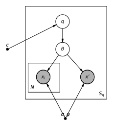
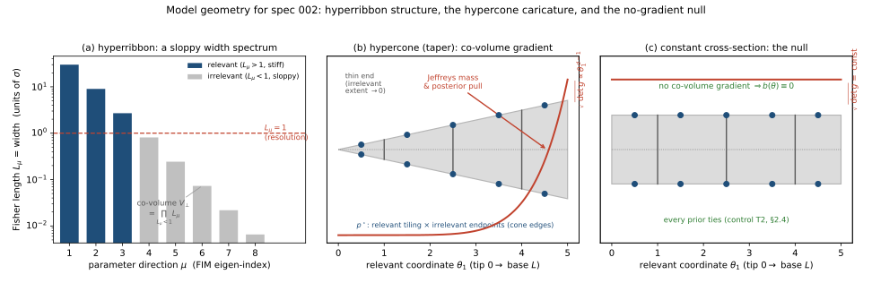

# Spec 002 — Does the infomax prior's high-`d` unbiasedness transfer to a foreign nature? (held-out predictive log-loss in ribbon geometry)

| Section | Status | Date |
|---|---|---|
| [0. Context](#0-context) | draft | 030626 |
| [1. Setup](#1-setup) | draft | 030626 |
| [1.2 Generative model](#12-generative-model) | draft | 030626 |
| [2. Objective](#2-objective) | draft | 030626 |
| [3. The case for transfer (and how it could fail)](#3-the-case-for-transfer-and-how-it-could-fail) | draft | 030626 |
| [4. Algorithm](#4-algorithm) | draft | — |
| [5. Properties to verify](#5-properties-to-verify) | draft | — |
| [6. Report](#6-report) | draft | — |
| [7. Open questions](#7-open-questions) | draft | — |
| [8. References](#8-references) | draft | — |
| [9. Derivations](#9-derivations) | draft | — |
| [10. Revision log](#10-revision-log) | n/a | — |

## 0. Context

Spec 000 reproduced the static infomax prior `p*` (discrete, `~√n` atoms, `→`
Jeffreys); spec 001 scored it as a *betting belief* and found it loses to smooth
priors — diagnosed in `notes/infomax_two_hats_and_directions.md` as a **two-hat
category error** (a *design* / least-favourable object scored as an *inference*
belief). Abbott & Machta (2023, "Far from Asymptopia") make the opposite-seeming
claim: in high-`d` **ribbon-geometry** models — models
whose space of *distinguishable predictions* is long and thin: a few parameter
directions the data can resolve and many it effectively cannot, the "sloppy"
spectrum typical of mechanistic models in science — fixed "uninformative"
priors (Jeffreys, and they show log-normal too) carry an enormous **posterior
bias** from the irrelevant *co-volume* (the combined extent
of the unresolvable directions, which a parameter-space measure such as Jeffreys
still weights even though it cannot change predictions), which the
data-adapted `p*` avoids. But their score is the
posterior-centre deviation `Δ`, evaluated **on data drawn from `p*` itself**
(`x ∼ p*`), and their `b(θ)=0` is the self-referential equalizer/KKT condition —
so what they establish is that `p*` codes *its own* source unbiasedly, not that it
infers a *foreign* nature `q` well.

This spec tests the one thing that separation leaves open. It is **not** "is `p*` a
good epistemic prior" — under a strictly proper score `p*` is dominated by the
<span style="color: red">prior matched to nature (its own pullback)</span> *by theorem* (the compensation identity, [§2.1](#21-the-score-redundancy--cumulative-held-out-predictive-log-loss)), and `p*` is a
design object by construction. It is the **transfer** question stated in
`notes/prediction_objective_for_priors.md` §0/§3:

> Does the high-`d`, coupled, ribbon-geometry setting create a difficulty that
> bites *deployable non-infomax* priors (Jeffreys, uniform-`θ`, log-normal)
> **disproportionately** — a co-volume pathology `p*` is structurally less
> sensitive to — and does that advantage **transfer** to held-out predictive
> accuracy under a *foreign* `q`, scored by a proper rule, rather than evaporating
> once `p*` is no longer flattered by self-sampling?

The transfer is expected to be **asymmetric**, and that asymmetry
is the crux. The deployable priors' bias is a *fixed feature of their posteriors* —
it appears whatever distribution generated the data, and it worsens as the
dimension grows — so it should carry over to a foreign `q`. `p*`'s apparent
unbiasedness, by contrast, is established by A&M only on data `p*` itself generated;
against a foreign `q` it instead pays for how far the data-distribution it predicts
sits from nature's, a penalty that does *not* grow with dimension. Whether `p*`'s
advantage survives once that self-sampling flattery is removed is the open empirical
question. The experiment is built to detect its own failure modes — a **negative
control** (a model with no co-volume pathology, where every prior must tie) and a
**cooperativeness sweep** over `q` (does `p*` win only when nature happens to live
where it expects?) — so the headline is not fixed in advance by an unstated choice
of `q`, the failure that sank `specs/001-infomax-betting-redteam_third.md` (its F1
finding). The quantitative form of the asymmetry (`O(d)` competitor bias vs `O(1)`
for `p*`) is derived in [§3.2](#32-the-heuristic-the-average-case-asymmetry-in-high-d).

A second strand follows from the same logic. The property that really matters here
is **budget dependence**: an uninformative prior should be a function of the
experiment's resolving power (`σ`, equivalently `N`), and Jeffreys — the `σ→0`,
infinite-budget limit — is exactly the budget-*independent* choice whose co-volume
bias the high-`d` setting punishes. But there is more than one budget-dependent way
to be uninformative. Alongside the capacity / infomax prior `p*` we therefore carry
a second budget-dependent prior as a **co-protagonist**: `p_proj`, the
projected-ML / NML (MDL) prior. The two are *siblings* — the same universal-coding
problem under different regret notions, nearly coinciding in hyperribbon geometry —
so the sharpest form of this spec's question is not "is `p*` a good epistemic prior"
nor "how well does `p_proj` approximate `p*`", but **does the harder capacity object
buy anything over the cheap MDL one on held-out prediction** ([§3.4](#34-the-second-protagonist-infomax-vs-mdl)).

## 1. Setup

### 1.1 Notation

| Symbol | Meaning |
|---|---|
| `d` | Number of model parameters (the dimension being stressed). |
| `θ ∈ Θ ⊂ ℝ^d` | Parameter vector. `Θ` a compact box (per model, [§4.1](#41-model-families)). |
| `m` | Number of observation times; the dimension of each observation `x ∈ ℝ^m`. Not the number of observations (that is `N`). |
| `y(θ) ∈ ℝ^m` | Prediction (mean-data) map; the model manifold is `{y(θ) : θ ∈ Θ}`. |
| `σ` | Gaussian observation-noise scale. The data budget enters only through `N`: `N` i.i.d. observations scale the Fisher information by `N`, equivalent to one observation at noise `σ/√N` (A&M §2.1 call this repetition count `M`; it is our `N`). |
| `p(x\|θ)` | Likelihood `= 𝒩(y(θ), σ²I_m)`, `x ∈ ℝ^m`. |
| `N` | Data budget: number of i.i.d. training observations `x_i ∼ p(·\|θ)` (each an `m`-vector; `N` is A&M's repetition count `M`). |
| `X_{1:N}` | The training sample `(x_1, …, x_N)`. |
| `x'` | A fresh held-out observation `∼ p(·\|θ)` (the single-step diagnostic). |
| `g(θ)` | Fisher information metric, `g_{μν}(θ) = σ^{-2} Σ_t ∂_μ y_t ∂_ν y_t` (Gaussian, [§4.1](#41-model-families)). |
| `L` | A Fisher length `∫√{ds²}`; "relevant" if `L>1`, "irrelevant" if `L<1`. |
| `q` | Nature's distribution over `θ` (the *foreign* truth). |
| `c` | The q-family cooperativeness knob ([§4.3](#43-foreign-q-family)): `c=0` cooperative (`q≈m_{p*}`-pullback), `c=1` non-cooperative. |
| `m_q(X_{1:N})` | Nature's `N`-fold data marginal `= ∫ p(X_{1:N}\|θ) q(dθ)`. |
| `π` | Agent's prior, one of `{p*, p_J, p_U, p_LN, q̄}`. |
| `p*` | Infomax / capacity-achieving prior, `argmax_π I(Θ;X)` ([§4.2](#42-prior-construction)). Discrete. |
| `p_J` | Jeffreys prior `∝ √{det g(θ)}`, normalised on `Θ`. |
| `p_U` | Uniform on the parameter box `Θ`. |
| `p_LN` | <span style="color: red">Normal in `θ` (log-normal in the rate `k_μ=e^{-θ_μ}`)</span> (A&M Eq. 10): `∝ Π_μ e^{-(θ_μ-θ̄)²/2σ̄²}`. |
| `q̄` | The hyper-averaged matched prior `= 𝔼_c[q]` (reference ceiling only, [§2.3](#23-q̄-is-the-ceiling-not-a-competitor)). |
| `m_π(X_{1:N})` | Agent's Bayes mixture `= ∫ p(X_{1:N}\|θ) π(dθ)`. |
| `π(θ\|X_{1:N})` | Posterior under prior `π`. |
| `I(Θ;X)` | Mutual information `= 𝔼_π D_{KL}(p(x\|θ)‖m_π)`. |
| `C` | Channel capacity `= sup_π I(Θ;X)`. |
| `b(θ)` | Bias pressure `= D_{KL}(p(x\|θ)‖m_π) − I(Θ;X)` (A&M Eq. 5). |
| `Δ(x)` | Posterior deviation `= σ^{-1}\|y(θ̂_x) − 𝔼_{π(θ\|x)} y(θ)\|` (A&M Eq. 9). |
| `R_N^q(π)` | The headline score: redundancy / cumulative held-out predictive log-loss ([§2.1](#21-the-score-redundancy--cumulative-held-out-predictive-log-loss)). |
| `I_q^{(N)}` | Matched floor `= 𝔼_{θ∼q} D_{KL}(p(X_{1:N}\|θ)‖m_q)` (prior-independent). |
| `G` | Per-axis grid resolution for the discrete `p*` solver ([§4.2](#42-prior-construction)). |

All logs in nats; bits `= nats/log 2` at report time.

### 1.2 Generative model



This diagram is the *external environment* (nature), **not** what the agent
assumes — same convention as spec 001. The double-circled
nodes are the fixed inputs: the noise scale `σ` and the geometry config `ψ`
(dimension `d`, observation times `t_1,…,t_m`, taper, rotation — [§4.1](#41-model-families)), plus the
cooperativeness knob `c` ([§4.3](#43-foreign-q-family)) that selects nature's distribution `q_c` over `θ`.

**The data-generating process.** One draw of the experiment is:

1. `θ ∼ q_c` — nature's true parameter for this draw.

2. `x_i ∼ 𝒩(y(θ), σ²I_m)` for `i = 1,…,N` — the `N` training observations the
agent conditions on. Here `y(θ) ∈ ℝ^m` is the model's mean-data map, the only place
the geometry enters and first appears. What kind of object
it is — the model manifold and its Fisher geometry — is laid out in **the model
geometry** immediately below; the exact map per family is in [§4.1](#41-model-families).

3. `x' ∼ 𝒩(y(θ), σ²I_m)` — a fresh held-out observation, the prediction target.

This repeats for `S_q` independent draws of `(q_c, θ, X_{1:N}, x')`. The agent
observes only `X_{1:N}` and is scored on how well its predictive distribution
explains the held-out `x'` — and, cumulatively, each `x_{t+1}` from `x_{1:t}`
([§2.1](#21-the-score-redundancy--cumulative-held-out-predictive-log-loss)).

**The model geometry.** The conceptual claims of [§0](#0-context),
[§2](#2-objective) and [§3](#3-the-case-for-transfer-and-how-it-could-fail) are all
statements about the geometry of the prediction set `{y(θ) : θ ∈ Θ}`. This block is
that geometry, in the detail those claims need; the three concrete families and
their exact maps are in [§4.1](#41-model-families).


**The model as a manifold of predictions.** All three
families share the Gaussian likelihood `p(x|θ) = 𝒩(y(θ), σ²I_m)`, so the model is
fixed entirely by the **prediction map** `θ ↦ y(θ) ∈ ℝ^m`: as `θ` ranges over the
box `Θ ⊂ ℝ^d`, `y(θ)` sweeps out a `d`-dimensional **model manifold** inside the
`m`-dimensional data space. What the data can *resolve* on that manifold is measured
not in the parameter coordinates `θ` but in the **Fisher metric**

$$
g_{\mu\nu}(\theta) \;=\; \frac{1}{\sigma^{2}}\sum_{t=1}^{m}
\frac{\partial y_t}{\partial \theta_\mu}\,\frac{\partial y_t}{\partial \theta_\nu},
\qquad \mu,\nu \in \{1,\dots,d\}.
$$

This is the Fisher information of the Gaussian
likelihood above: with `log p(x|θ) = −‖x−y(θ)‖²/(2σ²) + const`, the score is
`∂_μ log p = σ^{-2}(x−y(θ))·∂_μ y(θ)`, so
`g_{μν} = 𝔼_{x|θ}[∂_μ log p · ∂_ν log p] = σ^{-4}(∂_μ y)^⊤ 𝔼[(x−y)(x−y)^⊤](∂_ν y)`,
which collapses to the displayed sum because the noise covariance is
`𝔼[(x−y)(x−y)^⊤] = σ²I_m`.

The indices `μ, ν` run over the `d` parameter coordinates and
`t` over the `m` observation times. This `g` is the **pullback** of data-space
distance onto parameter space: to leading order the squared change in the *prediction*
caused by a parameter step `dθ`, measured in noise units, is the quadratic form

$$
ds^{2} \;=\; \frac{1}{\sigma^{2}}\,\big\|\,y(\theta+d\theta)-y(\theta)\,\big\|^{2}
\;=\; \sum_{\mu,\nu} g_{\mu\nu}(\theta)\,d\theta_\mu\,d\theta_\nu ,
$$

so a move in `θ` is "charged" by how far it shifts the
prediction, not by Euclidean distance in `θ`. Here `s` is **Fisher arc length** and
`ds` its line element — the leading `d` in `ds` and `dθ` is a differential, *not* the
dimension `d`. Two scales come out of this. *Locally*, the square-roots of the
eigenvalues of `g(θ)` give the rate at which a step along each principal direction
moves the prediction. *Globally*, the **Fisher length** `L_μ` of a direction is that
rate integrated over the extent the box `Θ` allows,

$$
L_\mu \;=\; \int \sqrt{ds^{2}}\quad\text{along principal direction }\mu ,
$$

which counts the resolvably-distinct predictions one passes
through from one end of the manifold to the other along that axis. This integrated
extent is exactly what the sloppy-models literature calls the manifold's **width**
along direction `μ` (panel a): *width* (geometric) and *Fisher length* (metric) are
**the same** quantity `L_μ`, with the local eigenvalue as its density. A direction is
**relevant** — equivalently **stiff** (large eigenvalue, large `L_μ`) — when `L_μ > 1`,
so the data can tell its two ends apart, and **irrelevant** / **sloppy** (small
eigenvalue, small `L_μ`) when `L_μ < 1`. Two derived volumes then carry the whole
argument, the **distinguishable-prediction volume** `V_g` and the **co-volume**
`V_⊥`:

$$
V_g \;:=\; \int_{\Theta}\!\sqrt{\det g(\theta)}\;d\theta \;\approx\; \prod_{\mu=1}^{d} L_\mu,
\qquad
V_\perp \;:=\!\!\prod_{\mu:\,L_\mu<1}\!\! L_\mu,
\qquad
p_J(\theta) \;=\; \frac{\sqrt{\det g(\theta)}}{V_g}.
$$

`V_g` — the Fisher (Riemannian) volume of the manifold, `≈`
the product of all `d` widths — is precisely the normaliser of the **Jeffreys prior**
`p_J = √det g / V_g`, so Jeffreys places mass in proportion to the local volume
element `√det g`. The **co-volume** `V_⊥` collects only the *irrelevant* widths: the
combined extent of the directions the data cannot pin down but a `√det g` measure
still weights. That single mismatch is the mechanism behind everything below.

**Hyperribbon structure (panel a).** The models of interest
are *sloppy*: the width spectrum `L_1 ≥ L_2 ≥ ⋯ ≥ L_d` falls off roughly
geometrically across many orders of magnitude, so a few directions are stiff and
relevant (`L_μ > 1`) while the rest are exponentially narrower and irrelevant
(`L_μ < 1`). A manifold is **long** along its few stiff directions (large `L_μ`: it
spans many distinguishable predictions there) and **narrow** along its many sloppy
ones (small `L_μ`) — "long and thin," a *hyperribbon*. Its distinguishable-prediction
volume `V_g ≈ ∏_μ L_μ` is dominated by the handful of stiff widths, while the sloppy
ones make up the unresolvable co-volume `V_⊥`. This is the structural fact behind
every conceptual claim in the spec: a prior `∝ √det g` (Jeffreys) weights
*parameter-space* volume, which is largest where `V_⊥` is largest — the **region of
`Θ`** (not a subspace) where the irrelevant directions are at their widest; for the
cone below, the thick base. That region contributes almost nothing to distinguishable
predictions, and a *vanishing fraction* of them as `d` grows. An uninformative prior
that instead tracks resolving power should weight only the relevant directions and
discount `V_⊥`. Whether doing so helps *predict a foreign nature* is the open question
([§2](#2-objective), [§3](#3-the-case-for-transfer-and-how-it-could-fail)); the
geometry is what makes the question non-trivial.

**The square hypercone (panel b).** The hypercone is the
simplest manifold that shows a hyperribbon's *decisive* feature in closed form. Its
prediction map is `y(θ) = (θ_1, r θ_2, …, r θ_d)` with a single **relevant**
coordinate `θ_1 ∈ [0, L]` and `d−1` **irrelevant** coordinates `θ_μ ∈ [0,1]` scaled
by the **taper** `r(θ_1) = θ_1/L`. Geometrically this is a cone: at relevant-coordinate
value `θ_1` the cross-section is a `(d−1)`-cube of side `θ_1/L`, shrinking linearly
from the full base (`θ_1 = L`) to a point at the tip (`θ_1 = 0`). The relevant axis
has Fisher length `≈ L ≫ 1`; the irrelevant widths taper to zero toward the tip. The
consequence is a **co-volume gradient**: `√{det g} ∝ θ_1^{d-1}`, growing steeply
toward the thick base. This single non-constant factor is what punishes Jeffreys —
its mass `∝ θ_1^{d-1}` piles at the base, and its posterior is pulled toward the thick
end by `Δ = (d−1)/x` for data at relevant value `x` ([§9.2](#92-hypercone-posterior-deviation-eq-922)),
*largest at the thin end* where a foreign `q` can place its data. `p*`, by contrast,
places discrete atoms an `O(1)` Fisher length apart (`≈2`, not literally 1) along the relevant axis and collapses
the irrelevant directions onto the boundary corners (below), so its pointwise bias is bounded by the
atom spacing — `O(1)`, independent of `d`.

**Hyperribbons, hypercones, and the three families.** The
relationship is *caricature and realisation*. The hypercone strips a hyperribbon down
to one relevant direction and a single tunable co-volume gradient (the taper), buying
closed forms (`√{det g} ∝ θ_1^{d-1}`, `Δ = (d−1)/x`) at the cost of realism. The
**exponential-decay** model (`y_t(θ) = Σ_μ a_μ e^{-k_μ t}`, `k_μ = e^{-θ_μ}`; A&M
Eq. 6) is the realistic instance of the same ribbon: a curved manifold whose FIM
eigenvalues span many orders and whose relevant directions are *not* coordinate-aligned
— so uniform-`θ` and log-normal fail there too, not only Jeffreys. This is the canonical sum-of-exponentials model of the Transtrum–Machta–Sethna
sloppy-models programme — the thin, curved hyperribbon drawn in their
manifold-boundary figures. Its boundary collapse is the *same* as the cone's, not a
projection artefact: along an irrelevant, sub-resolution direction the
capacity-achieving prior puts mass at **both** ends of the interval — the two-atom
solution of a short bounded channel, exactly the `m=1` binomial's atoms at `0` and `1`
(Smith 1971) — so `p*` lands atoms on the **corners** of each shrinking irrelevant
cross-section (`≥2` per irrelevant axis), never a single interior point; the cone does
this too (panel b: the pairs splay onto the two cone edges, merging at the tip). 

It is
*two* atoms, not one, because infomax grabs the `<1` bit a sub-resolution direction
still carries — its two endpoints are the most-distinguishable placement, while a
single point would carry none — so this is **coarse-graining to the boundary** (one
binary contrast, no interior detail), a literal single-point collapse only in the
`r→0` limit at the tip, where the two endpoints merge and the bit `→ 0`. A 2-atom
direction in fact usually encodes *much less* than one bit — `O(L²)` bits while its
endpoints sit `≲ 1` Fisher length apart, nearing a full bit only when they are well
separated (BA-verified; `notes/infomax_two_hats_and_directions.md` §7.4). 

`p_U`/`p_LN` fail in exp-decay but **not** in the bare cone because the axis-aligned
cone's relevant direction *is* the coordinate `θ_1`: a `θ`-uniform prior projects to
flat on `θ_1`, already the unbiased weighting, so only Jeffreys — which carries the
`θ_1^{d-1}` co-volume — is biased there. Coordinate priors fail only once the relevant
direction is *misaligned* with the parameter axes, by curvature (exp-decay) or the
rotation knob below; a `p*` win in the bare axis-aligned cone is a win over Jeffreys
alone (note §6.3). 

The **constant-cross-section** cone (panel c) is the hypercone with the taper switched
off, `r(θ_1) = r_0`: the cross-section no longer varies along the relevant axis,
`√{det g}` is constant, the co-volume gradient vanishes, and Jeffreys reduces to
uniform-on-the-relevant-coordinate. Two further knobs reshape the controlled geometry
without leaving the family — a **rotation** `θ ↦ Qθ` moving the relevant direction off
the coordinate axes (so coordinate priors become fair competitors), and a **boundary
curvature** sharpening convex vertices — here the *boundary*
is the edge of the bounded model manifold `{y(θ)}` (bounded because `Θ` is a box); a
*vertex* is a corner of it (the cone tip, or a corner of the base); *convex* means the
manifold bends away from the corner, so the region just *outside* it — the `σ`-noise
halo of data whose MLE projects back onto that corner — is large; *sharpening* the
vertex means raising its curvature (a more acute corner) so the halo grows, which the
NML-based `p_proj` over-weights while `p*` ignores it (the one axis on which
`p*` and the MDL sibling `p_proj` provably differ,
[§3.4](#34-the-second-protagonist-infomax-vs-mdl)). The exact maps, FIM, and knob
ranges are in [§4.1](#41-model-families).

**Why the conceptual claims ride on this geometry.** Every
load-bearing claim of the spec is a statement about `g(θ)` and its gradient. The
co-volume *bias* A&M attribute to Jeffreys is exactly the pull of the
`√{det g} ∝ θ_1^{d-1}` factor (panel b); its **absence** in the constant-cross-section
model (panel c) is why that model is the negative control — with no co-volume gradient
there is no pathology to avoid, so every prior must tie
([§2.4](#24-the-falsification-structure-the-50-gono-go-of-the-note), test T2). The
claimed *asymmetry* — competitor bias `O(d)` vs `p*`'s `O(1)` — is the contrast between
a gradient that steepens with `d` and an atom spacing that does not
([§3.2](#32-the-heuristic-the-average-case-asymmetry-in-high-d)). And the *transfer*
question is whether that geometric asymmetry, established by A&M on data `p*` itself
generates, survives once nature `q` is foreign and free to place its data in `p*`'s
atom gaps or at the thin end. The geometry above is the object on which all of these
are adjudicated.

The agent's prior `π ∈ {p*, p_J, p_U, p_LN}` (with `q̄` as a reference ceiling) is
**decoupled from `q`**: it is chosen from the likelihood geometry and the data
budget `N`/`σ` alone, exactly as in spec 001. That decoupling (agent ≠ nature) is
the whole point — it is what lets the held-out score test transfer rather than
self-consistency. The agent's prior is therefore omitted from this nature-only
diagram.

## 2. Objective

### 2.1 The score: redundancy = cumulative held-out predictive log-loss

The agent with prior `π` predicts the data through its Bayes mixture `m_π`. The
**redundancy** of `π` against a foreign nature `q`, over budget `N`, is

$$
R_N^q(\pi) \;=\; \mathbb{E}_{\theta\sim q}\,\mathbb{E}_{X_{1:N}\sim p(\cdot\mid\theta)}\Big[\log p(X_{1:N}\mid\theta) - \log m_\pi(X_{1:N})\Big] \\
\;=\; \mathbb{E}_{\theta\sim q}\,D_{\mathrm{KL}}\!\big(p(X_{1:N}\mid\theta)\,\|\,m_\pi(X_{1:N})\big). \tag{2.1.1}
$$

**Lower `R` is better:** it is a *loss* — the excess code-length /
log-loss over an oracle that knows `θ` — with <span style="color: red">`R_N^q(π) ≥ I_q^{(N)} ≥ 0`; the floor `I_q^{(N)}` (not `0`) is reached only by a
predictor matching nature's marginal, `m_π = m_q`</span>.

**Then why expect a *maximiser* of mutual information to help
minimise a loss?** The clash is nomenclatural: **three different "redundancies"**,
all built from the same per-`θ` loss `r_θ(π) = D_KL(p(X_{1:N}|θ) ‖ m_π)` (`≥ 0`,
lower is better), hide behind one word, and infomax's "max" and our "min" act on
different ones. Set side by side:

| "redundancy" | definition (from `r_θ(π)`) | `θ` ranges over | the operation on it | the optimiser |
|---|---|---|---|---|
| self-consistent (**mutual information**) | `I(π) = 𝔼_{θ∼π} r_θ(π)` | the prior `π` *itself* (`m_π` uses the same `π`) | **`max` over `π`** — *design*: pick the most-informative / least-favourable source | `p* = argmax_π I`; value `= C` (capacity) |
| **worst-case** | `R_N^{max}(π) = max_θ r_θ(π)` | an adversarial `θ` | **`min` over `π`** — the minimax-robust code | `argmin_π R_N^{max} = p*` (**same object** as row 1, by duality) |
| **foreign-`q` average** (this spec's score) | `R_N^q(π) = 𝔼_{θ∼q} r_θ(π) = I_q^{(N)} + D(m_q‖m_π)` | a *foreign* nature `q` | **`min` over `π`** — the loss we report | <span style="color: red">the prior matched to `q` (its own pullback)</span>, **not** `p*` <span style="color: red">(across the `c`-sweep the single fixed minimiser is `q̄`; see [§2.3](#23-q̄-is-the-ceiling-not-a-competitor))</span> |

Reading down the *optimiser* column dissolves the clash:
infomax's `argmax_π I` (row 1) and the minimax-robust `argmin_π R_N^{max}` (row 2)
are the **same operation on the same object** `p*` — the two faces of the
redundancy–capacity saddle (`redundancy-capacity.md`), so "maximising `I`" *is*
"minimising worst-case redundancy". Our score (row 3) is a **third** redundancy, and
its minimiser is <span style="color: red">the prior matched to `q` (its own pullback) — across the
`c`-sweep, the single fixed minimiser is `q̄`
([§2.3](#23-q̄-is-the-ceiling-not-a-competitor))</span>, **not** `p*`. So `p*` carries **no
guarantee** on row 3; it can beat only the *deployable* priors, and only when their
marginal mismatch `D(m_q‖m_π)` (the co-volume bias) exceeds `p*`'s — the open bet
([§2.2](#22-what-wins-means--and-what-cannot-be-asserted)). A&M's claim is
counterintuitive precisely because it asserts that the row-1/2 object `m_{p*}` is
*also* incidentally good on row 3 — its data-marginal stays close to a realistic `q`
in high `d` while the deployable priors' marginals do not.

This is a **strictly proper** score (Gneiting & Raftery 2007). A
scoring rule is *proper* if a forecaster minimises its expected value by reporting
the true predictive distribution, and *strictly* proper if that optimum is unique —
honesty is uniquely optimal; log-loss qualifies, since `𝔼_{x∼p}[−log q(x)]` is
minimised over `q` uniquely at `q=p`. A&M's `Δ` is **not** a scoring rule on a
predictive distribution at all: it is the distance between the posterior-mean
prediction and the MLE, a function of the predictive's *centre* only, so it neither
rewards a correctly-shaped predictive nor charges a miscalibrated spread.
`R_N^q` is the oracle-relative excess log-loss, and by the chain rule it equals the
**cumulative one-step-ahead predictive log-loss regret**,

$$
R_N^q(\pi) \;=\; \sum_{t=0}^{N-1}\, \mathbb{E}_{\theta\sim q}\,\mathbb{E}_{X_{1:t}\sim p(\cdot\mid\theta)}\, D_{\mathrm{KL}}\!\big(p(\cdot\mid\theta)\,\big\|\,m_\pi(\cdot\mid X_{1:t})\big),
$$

(`redundancy-capacity.md`; note §1.2, §4): each next
observation is predicted from those already seen, *before* it is incorporated —
that is the held-out/predictive character, internal to the training sequence
(prequential). The standalone fresh `x'` of [§1.1](#11-notation) is the lone `t=N`
term in isolation, reported only as a calibration diagnostic
([§4.4](#44-score-estimation), [§6](#6-report)), not part of the headline `R_N`.
It is the proper-score upgrade of A&M's `Δ`: it scores the *full* predictive
distribution, *held-out*, and — unlike `Δ`-on-`x∼p*` — under a *foreign* `q`.

By the **compensation identity** (Topsøe 1979), applied to the `N`-fold data
marginals — the laws of the *whole* training sequence
`X_{1:N}` under nature and under the agent, `m_q(X_{1:N}) = ∫ p(X_{1:N}|θ) q(dθ)`
and `m_π(X_{1:N}) = ∫ p(X_{1:N}|θ) π(dθ)`, i.e. the marginal likelihoods of the `N`
i.i.d. observations —

$$
\boxed{\;R_N^q(\pi) \;=\; \underbrace{I_q^{(N)}}_{\text{matched floor, }\pi\text{-free}} \;+\; \underbrace{D_{\mathrm{KL}}\!\big(m_q \,\|\, m_\pi\big)}_{\text{the only }\pi\text{-dependent term}}\;}\tag{2.1.2}
$$

where the prior-independent **matched floor** is

$$
I_q^{(N)} \;=\; \mathbb{E}_{\theta\sim q}\, D_{\mathrm{KL}}\!\big(p(X_{1:N}\mid\theta)\,\big\|\,m_q\big)
$$

(the redundancy nature would pay against its own marginal;
derived in [§9.1](#91-the-compensation-identity-for-the-n-fold-marginal-eq-212)).
So the entire prior-dependence of the held-out predictive loss is the **marginal
mismatch** `D(m_q‖m_π)` — how far the prior's Bayes-mixture data-marginal sits from
nature's.
The contest between two priors is exactly

$$
\Delta R(\pi,\pi') \;=\; R_N^q(\pi) - R_N^q(\pi') \;=\; D_{\mathrm{KL}}(m_q\|m_\pi) - D_{\mathrm{KL}}(m_q\|m_{\pi'}). \tag{2.1.3}
$$

**Computability.** Little of `R_N^q` is closed-form in a
curved, foreign-`q` setting; it is a Monte-Carlo estimate
([§4.4](#44-score-estimation)) — sample `θ ∼ q`, then `X_{1:N} ∼ p(·|θ)`, and
average `log p(X_{1:N}|θ) − log m_π(X_{1:N})`. The inner mixture `m_π(X_{1:N})` is
*exact* for the discrete `p*` (a finite sum over its atoms) and a grid-quadrature or
importance-sampling integral for the continuous priors. What *is* exact — the FIM
and Jeffreys density, the Gaussian per-`θ` log-likelihood, and the analytic
cross-checks (the hypercone `Δ=(d−1)/x` and the Gaussian KL split,
[§9](#9-derivations)) — feeds the controls and unit tests (T4–T6), not the headline
number.

### 2.2 What "wins" means — and what cannot be asserted

`p*` is interesting here **only** if its marginal `m_{p*}` sits closer to a foreign
`m_q` than the *best deployable non-infomax prior*'s does — i.e. if avoiding the
co-volume bias (real, `O(d)`, [§3.2](#32-the-heuristic-the-average-case-asymmetry-in-high-d)) outweighs the foreign-`q` mismatch it pays
(`O(1)` atom spacing + `D(m_q‖m_{p*})`). The headline statistic is therefore
`min_{π' ∈ {p_J, p_U, p_LN}} ΔR(p*, π')` — the gap from `p*` to the **best**
deployable competitor — as a function of `(d, σ, taper, rotation, c)`.

We **cannot** assert the sign of this gap and must not: that `p*` wins is the open
question. Asserting it would make the experiment unfalsifiable ([§5](#5-properties-to-verify) states this
explicitly). The test suite asserts only the *machinery* (decomposition,
construction, controls), never the headline.

### 2.3 `q̄` is the ceiling, not a competitor

Two floors must be kept distinct. *Per cell* (fixed `c`, nature `= q_c`), the floor
of `R_N^q` is the matched value `I_q^{(N)}`, attained by the prior whose marginal
matches *that* `q_c` (its own pullback) — not by `q̄`. *Across the `c`-sweep*, by
(2.1.2) the single fixed prior minimising the **`c`-averaged** `R` is the one whose
marginal matches nature's hyper-average, `m_π = 𝔼_c[m_q]` — i.e.
`q̄ = 𝔼_c[q]` (hierarchical/empirical Bayes; note §5.3). So `q̄` lower-bounds the
**`c`-averaged** `R` over all fixed priors: `p*` **cannot** beat it on the
`c`-average. `q̄` is plotted as the **reference ceiling** (the best deployable
fixed prior); the gap from each fixed prior up to `q̄` measures how much it loses by
not being matched. "Does `p*` beat `q̄`" is a non-question.

### 2.4 The falsification structure (the §5.0 go/no-go of the note)

Two screens decide whether the effect is real or self-served, replacing the
redundancy-capacity *tautology* (which cannot fail and is demoted to a unit test,
T3):

- **Negative control (flat co-volume ⇒ everyone ties).** In the constant-cross-
  section model (no taper, [§4.1](#41-model-families)), `√det g` is constant, `b(θ)≡0`, and there is no
  co-volume pathology to avoid: `R_N^q(p*) = R_N^q(p_J) = R_N^q(p_U)` within
  Monte-Carlo error, at every `d`. **If `p*` "wins" here, the result is an
  artefact** (T2). *Flat co-volume* means the
  irrelevant-direction co-volume (the product of the unresolvable Fisher lengths)
  does not vary along the relevant coordinate, so `√det g` is constant in `θ` and
  Jeffreys reduces to uniform-on-the-relevant-coordinate (`b(θ)≡0`). It is **not**
  the same as "the latents are independent": independent latents with equal-length
  irrelevant directions are the *special case* the note (§6.2) calls the null; the
  operative condition is the absent co-volume *gradient*, realised here by the
  constant-cross-section cone ([§1.2](#12-generative-model) panel c, [§4.1](#41-model-families); no taper).

- **Sign-of-advantage vs cooperativeness `c`.** `p*` wins the cooperative end
  (`c=0`, `q≈m_{p*}`) by self-sampling, trivially. The reported quantity is whether
  `min_{π'} ΔR(p*,π') < 0` *persists* into the non-cooperative range (`c→1`). Win
  across realistic `c` ⇒ transfer (positive result); win only at `c≈0` ⇒
  self-served (clean negative). This is a **reported curve**, not a pass/fail test.

## 3. The case for transfer (and how it could fail)

The contest ([§2.1](#21-the-score-redundancy--cumulative-held-out-predictive-log-loss))
reduces to the marginal mismatch `D(m_q‖m_π)`, and *nothing forces this to be
smallest for `p*`* on a foreign `q`. What follows is the strongest case we can make
— one real guarantee, one geometric heuristic — and, just as importantly, the ways
it can fail. It is an argument for *plausibility*, not a proof of the headline.

### 3.1 The one guarantee: worst-case over `q`

`p*` is the
capacity-achieving prior, and its mixture `m_{p*}` is the unique distribution
minimising the worst-case KL to the whole model family — the information radius /
KL-center: the equalizer condition gives `D(p(·|θ)‖m_{p*}) ≤ C` for **every** `θ`,
with equality on `supp(p*)` (`redundancy-capacity.md`; Kemperman 1974, Haussler
1997). Averaging that per-`θ` bound over *any* nature `q`,

$$
R_N^q(p^\star) \;=\; \mathbb{E}_{\theta\sim q}\, D_{\mathrm{KL}}\!\big(p(X_{1:N}\mid\theta)\,\big\|\,m_{p^\star}\big) \;\le\; \max_\theta D_{\mathrm{KL}}\!\big(p(X_{1:N}\mid\theta)\,\big\|\,m_{p^\star}\big) \;=\; C_N \qquad\text{for every } q. \tag{3.1.1}
$$

So `p*`'s foreign-`q` redundancy is **capped at capacity for
any `q` whatsoever** — `p*` can never be catastrophic. No fixed non-infomax prior
has this: by A&M's own score a prior's worst-case redundancy is `I_π + B(π)` with
`B(π)=max_θ b(θ)`, and `B(p_J)` *grows with dimension* (<span style="color: red">`>500` bits at
`d=26` in the exp-decay model — A&M §3.3; `≈55` bits in the hypercone</span>),
whereas <span style="color: red">`C_N` — the capacity of the `N`-fold channel, distinct from A&M's
single-`σ` mutual information `I⋆` — tracks only the **resolvable** complexity: roughly
flat in *nominal* `d` once `d>3` (A&M Fig. 5), growing only as `~(d_eff/2)·log N` in the
budget `N` (Clarke–Barron 1990; Rissanen 1996)</span>. This is exactly the "tautology"
[§2.4](#24-the-falsification-structure-the-50-gono-go-of-the-note) demotes to a unit
test (T3): it cannot *fail*, but its *content* — a `d`-controlled ceiling for `p*`
against an `O(d)` worst case for the competitors — is the load-bearing half of the
case for transfer.

### 3.2 The heuristic: the average-case asymmetry in high `d`

Bound (3.1.1) is worst-case; the experiment
scores an average, and the bridge is geometric (Quinn et al. 2023). The model
manifold is a **hyperribbon** ([§1.2](#12-generative-model)) whose widths fall off roughly geometrically, so the
space of *distinguishable predictions* is dominated by a few stiff directions, and
Jeffreys' weight `∝√det g` piles into the high-co-volume corner — a **vanishing
fraction** of that space as `d` grows, swinging by orders of magnitude under tiny
parameter changes. Hence for **any `q` whose predictions are spread over
distinguishable outcomes** (the natural notion of a nature that explores the
resolvable behaviours), most of `q`'s mass falls where `b_{p_J}(θ)>0` is large, so
`D(m_q‖m_{p_J})` inflates with `d` while `D(m_q‖m_{p*})` stays `O(1)`. A&M state the
same point as a **new invariance** — *predictions should be independent of
unobservable model detail* — which `m_{p*}` respects and `m_{p_J}` violates. Quinn
et al. also dispatch <span style="color: red">the discreteness objection</span> that a *discrete* `p*` must mis-predict
when the truth lies between atoms: along a **relevant** direction the atom spacing
*is* the resolution, so the error is no worse than rounding `θ` to its resolved
precision (within the noise); along an **irrelevant** direction, putting weight at
the boundary is just what an effective theory does (the discarded detail does not
move predictions). Both bound `p*`'s discretisation penalty at `O(1)` **without**
leaning on A&M's self-sampling — the part of their result that does *not* transfer
([§1.1](#11-notation)).

The asymmetry has a concrete closed form in the hypercone (A&M Appendix A.1; derived
in [§9.2](#92-hypercone-posterior-deviation-eq-922)). With one relevant coordinate
`θ_1` and `d−1` tapering directions, `√det g ∝ θ_1^{d-1}`, so the Jeffreys posterior
for an observation at relevant-coordinate value `x` (with `1 ≪ x ≪ L`) has mean
deviation `Δ = (d−1)/x + O(x^{-3})` (eq. (9.2.2)). This is a **pointwise** posterior
property — it references neither `p*` nor `q` — and it is *largest at the thin end*
(`x` small), precisely where an interior/edge foreign `q` places data; so the
deployable priors' bias **transfers** to any foreign `q` and grows like `O(d)`.
`p*`'s posterior, a finite mixture over atoms an `O(1)` Fisher length apart **in
prediction space**, has worst-case pointwise bias bounded by the atom spacing —
`O(1)` in noise units, *independent of `d`*. Self-sampling (`x∼p*`) lands data on
the atoms (bias `≈0`); a foreign `q` can land data in atom gaps, so `p*` pays `O(1)`
plus the marginal mismatch `D(m_q‖m_{p*})` of (2.1.2). Whether that net favours `p*`
once the self-sampling flattery is removed is the open empirical question.

### 3.3 Score decomposition: bias vs calibration (a diagnostic)

This subsection is **interpretive, not part of the headline**: it decomposes the
per-step held-out loss into two readable pieces so we can see *why* one prior beats
another and connect the score to A&M's `Δ`. Approximating each prior's
posterior-predictive as a Gaussian `m_π(x'|X_{1:N}) ≈ 𝒩(μ_π, Σ_π)` (a heuristic for
the discrete `p*`, whose true predictive is a finite mixture), the per-step KL splits
into a **bias term** and a **calibration term** — closed form in eq. (9.4.1),
[§9.4](#94-gaussian-biascalibration-split-eq-941).

The point of the split is the comparison to A&M. The **bias term** is a
precision-weighted `Δ²` — *exactly A&M's quantity*, up to weighting — while the
**calibration term** (predictive spread `Σ_π` against the noise `σ²I`) is precisely
what `Δ` cannot see: since `Σ_π = σ²I + Cov_π[y(θ)|X_{1:N}] ⪰ σ²I`, every Bayes
predictive is *over-dispersed* by its residual posterior uncertainty, and a proper
score charges that miscalibration whereas `Δ` — a centre-only statistic — does not.
Our redundancy score therefore *contains* A&M's `Δ` (as the bias term) and adds the
term `Δ` is blind to.

The split also says **the bias term is what decides the contest.** Because `p*`'s
atoms sit an `O(1)` Fisher length apart in prediction space, its calibration term is
`O(σ²)` even in atom gaps — a constant-factor effect — and a smooth well-specified
prior is the same `O(σ²)` order. So calibration *modulates* the boundary but does
not *decide* it; the decider is the `O(d)`-vs-`O(1)` transfer of the **bias** gap
([§3.2](#32-the-heuristic-the-average-case-asymmetry-in-high-d)). The calibration
term is **reported** as a PIT / over-dispersion diagnostic ([§6](#6-report)) and the
closed form is unit-tested (T5), but neither is the headline number — which is
computed from the *exact* mixture predictive, not this Gaussian approximation.

### 3.4 The second protagonist: infomax vs MDL

`p_proj` earns **co-protagonist** status (not control) because
it reaches the property this project actually cares about — **budget dependence** —
by a different route than `p*`. The principle: an uninformative prior should be a
*function of the resolving power* of the experiment (`σ`, equivalently `N`),
weighting parameter regions by what the data *at that budget* can tell apart. Both
priors below are explicit functions of `σ`, and **Jeffreys is the `σ→0`
(infinite-budget) limit of both** — its budget-*independence* is exactly the
property that sinks it in high `d` ([§3.2](#32-the-heuristic-the-average-case-asymmetry-in-high-d)).
Meta-cognitively: a resolution-limited agent's "prior" is fixed by what it can
learn, not by a budget-free notion of ignorance — and there is more than one
budget-dependent way to be uninformative.

**The two constructions.**

- **Capacity / infomax — `p*`.** `argmax_π I(Θ;X)`: the
  least-favourable / minimax-**expected**-redundancy prior (Bernardo's
  reference-prior lineage; `redundancy-capacity.md`). Its `σ`-dependence is the atom
  count `~√N`.
- **NML / MDL — `p_proj`.** `p_NML(x) = max_θ p(x|θ)/Z` is
  the **Shtarkov (1987) normalized-maximum-likelihood** distribution, with `log Z`
  the **Rissanen (1996) parametric (stochastic) complexity** (Grünwald 2007);
  `p_proj` is its pushforward through the MLE map `θ̂(x)` (A&M App. A.3
  "projected-ML" / Quinn §5.2 "adaptive slab-and-spike"). Its `σ`-dependence is the
  halo width `σ`. A&M/Quinn present it as an ad-hoc easy approximation of `p*`; its
  real pedigree is MDL, left uncited there.

**Why they coincide here.** The two solve the *same*
universal-coding problem under different regret notions — `p*` the worst-case
**expected** redundancy `max_θ 𝔼_{x|θ} log[p/q]`, NML the worst-case **pointwise**
regret `max_x[log max_θ p(x|θ) − log q]`. They nearly agree on our models for two
reasons: *(i) asymptotically*, both carry the same stochastic complexity
`(d/2)log(N/2π) + log∫√det g` (Clarke–Barron 1990; Rissanen 1996) — the shared
`σ→0` limit, which is Jeffreys; *(ii) in hyperribbon geometry at finite `σ`*,
resolution-adaptation is essentially **unique** (weight the few stiff directions,
collapse the sloppy ones onto edges), so both land on nearly the same prior and
nearly the same MI (Quinn et al. Fig. 12). They are **siblings**, not
approximation-and-original — so the live question is not "how well does `p_proj`
approximate `p*`" but **"does the harder capacity object buy anything over the cheap
MDL one on held-out prediction"** (the [§3.6](#36-falsification) falsification).

**Where they part, and is it reachable here.** Their one
structural difference is expected- vs pointwise-regret: NML weights by where the
worst *individual* data land (the noise halo just outside convex boundaries), `p*`
by *expected* distinguishability (Fisher length). This yields two contrastive
corners, **both reachable by tuning the hyperribbon ([§4.1](#41-model-families)), no
new model needed:**

- *Adversarial to `p_proj`, benign for `p*`:* sharpen a
  **convex vertex** (the cone tip / a high-curvature boundary) so the exterior halo
  piles up there, and score against a `q` on the **interior/faces**. NML
  over-weights the halo-collecting vertex; `p*` is unmoved. **Easy** — the
  hyperribbon already has skewed convex vertices; a boundary-curvature knob sharpens
  them.
- *Adversarial to `p*`, benign for `p_proj`:* a **smooth
  interior `q` finer than the atom spacing** at moderate `σ`. `p*`'s discrete
  mixture ripples (bounded `O(σ²)` — `σ`-spaced atoms have overlapping `σ`-wide
  blobs); `p_proj`'s cloud is smooth. **Easy** — needs only moderate `σ` and a
  smooth interior `q`, no model change; the effect is generic but mild.

Neither corner's winner is analytic; the
[§4.3](#43-foreign-q-family) / [§5.4](#54-sweep-design) sweep maps both. *Locating
where the two budget-dependent siblings diverge is precisely the measurement of what
the capacity route uniquely contributes* ([§6](#6-report)) — and is of more interest
here than discreteness per se, which it incidentally also measures.

### 3.5 What would sink it

None of the
above proves `p*` *wins the average-case contest this spec scores*, and several
things can make it lose:

1. **Worst-case ≠ average.** (3.1.1) bounds the worst `q`;
   for a **benign** `q` concentrated in the data-rich interior (low *effective*
   dimension), the deployable priors pay little — and `I_{p_J}<C` can let a smooth
   prior *beat* `p*` there. That is the 1-D / low-`d` regime where `p*` already
   loses (note §1); the cooperativeness sweep
   ([§2.4](#24-the-falsification-structure-the-50-gono-go-of-the-note)) exists to
   find where the sign flips.
2. **The real competitor is resolution-adapted, not
   Jeffreys.** Quinn et al.'s **projected-maximum-likelihood prior**
   ([§3.4](#34-the-second-protagonist-infomax-vs-mdl)) is a *smooth*,
   easy-to-sample prior that tracks `p*` closely on the MI score and "avoids
   Jeffreys' vices". If a smooth resolution-adapted prior also keeps `D(m_q‖m_π)`
   small, `p*` wins nothing a smooth prior could not, and its **discreteness does no
   work** (OQ-5, [§7](#7-open-questions)). Attributing a win to `p*` specifically
   therefore *requires* such a prior in the lineup; beating only Jeffreys / uniform
   / log-normal merely re-derives A&M.
3. **`q̄` dominates**
   ([§2.3](#23-q̄-is-the-ceiling-not-a-competitor)): `p*` cannot beat the matched
   ceiling; only the gap to the *best deployable* prior is live.
4. **A ceiling is not optimality.** (3.1.1) prevents
   catastrophe; it does not make `p*` *good* in absolute terms, since `C_N` itself
   can be sizeable at the small `N` this spec targets. `p*`'s case is
   **robustness / insurance**, not average-case optimality — a premium wasted on
   benign `q` (two-hats note §3).

### 3.6 Falsification

The expectation is *supported* if
`min_{π'} ΔR(p*,π') < 0` persists across the cooperativeness sweep **with the
projected-ML prior in `π'`**; it is *refuted* if `p*` ties or loses to the best
resolution-adapted prior, or wins only at `c≈0`. Bound (3.1.1) forecloses
neither.

## 4. Algorithm

Three caveats carry from [§3](#3-the-case-for-transfer-and-how-it-could-fail) into
the implementation:

- **Reference point.** A&M's `Δ` uses the in-sample MLE `θ̂_x`; the held-out bias
  term (eq. (9.4.1)) uses `y(θ_true)`. For held-out data `θ̂_{x'} ≈` projection of
  `x'`; we score against `y(θ_true)` throughout. The hypercone closed form
  (eq. (9.2.2)) is the in-sample reference and is used only as the calibration
  *cross-check* (T6), not as the score.
- **Discrete predictive.** The Gaussian-predictive approximation in
  [§3.3](#33-score-decomposition-bias-vs-calibration-a-diagnostic) is heuristic for
  the discrete `p*`; its true predictive is a finite Gaussian mixture. The score
  (2.1.1) is computed from the *exact* mixture, not the Gaussian approximation — the
  split (eq. (9.4.1)) is interpretive, used for the diagnostic decomposition, not
  for the headline number.
- **Finite `N`.** The mismatch `D(m_q‖m_π)` is the `O(1)` term that washes out as
  `N→∞` (interior posteriors agree, `I_q^{(N)}~(d/2)\log N → ∞`). The test must live
  at **finite `N`** — the "far from asymptopia" regime.

### 4.1 Model families

All three share the Gaussian likelihood `p(x|θ)=𝒩(y(θ),σ²I_m)` and FIM
`g_{μν}(θ)=σ^{-2}Σ_t ∂_μ y_t ∂_ν y_t`.

1. **Exponential-decay (primary; A&M Eq. 6).**
   `y_t(θ) = Σ_{μ=1}^d a_μ e^{-k_μ t}`, `k_μ = e^{-θ_μ}`, `a_μ = 1/d`, observed at
   `m` times `t`. `∂_μ y_t = a_μ t k_μ e^{-k_μ t}` (closed-form FIM, [§9.3](#93-exponential-decay-fim)). This is
   the model where uniform-`θ` and log-normal demonstrably fail (curved manifold,
   relevant directions not coordinate-aligned), and the eye-test anchor (A&M
   Fig. 5).
2. **Square hypercone (analytic companion; A&M Appendix A.1).**
   `y(θ) = (θ_1, r θ_2, …, r θ_d)`, `r(θ_1)=θ_1/L`, `0≤θ_1≤L`, `0≤θ_μ≤1`. Gives the
   closed-form `Δ=(d−1)/x` (9.2.2) for the calibration cross-check (T6). A **tunable
   rotation** `θ ↦ Q θ` of the embedding (orthogonal `Q`, angle swept, [§5](#5-properties-to-verify) sweep)
   moves the relevant direction off the coordinate axes so that uniform-`θ` is no
   longer trivially unbiased (note §6.3) — making it a fair competitor in the
   controlled model too. A **boundary-curvature** knob (sharpening the cone tip / a
   vertex) is also exposed: per [§3.4](#34-the-second-protagonist-infomax-vs-mdl)
   it is the one axis on which `p*` and `p_proj` provably differ — a sharp convex
   vertex makes the NML-based `p_proj` over-weight the halo there while `p*` is
   unmoved.
3. **Constant-cross-section cone (negative control).** As (2) but `r(θ_1)=r_0`
   constant (taper `=0`): `√det g` constant, `b(θ)≡0`, no co-volume gradient.

### 4.2 Prior construction

- **`p*` — discrete infomax prior.** *Primary method (small `d`):* multi-dimensional
  Blahut–Arimoto on a `θ`-grid of `G` cells per axis, generalising spec 000's 1-D
  solver, with the continuous-output `f_KL(θ)=D(p(x|θ)‖m_π)` estimated by the
  kernel-density approximation of A&M Appendix A.2 (Eq. A1) or by Monte-Carlo over
  `x`. *Cross-check / larger `d`:* atomic optimisation (L-BFGS over atom positions
  and weights) per A&M Appendix A.2, i.e. the method of `mcabbott/AtomicPriors.jl`.
  The two methods must agree on `R` (T7b) where both are feasible. **The `p*`
  solver is the principal new infrastructure and the main feasibility risk — see
  [§7](#7-open-questions) OQ-1.**
- **`p_J` — Jeffreys.** `∝ √det g(θ)`, normalised over `Θ` by grid quadrature.
  Closed-form FIM from [§4.1](#41-model-families); in the hypercone, cross-checked against the analytic
  `p_J(θ_1) ∝ θ_1^{d-1}` (T4).
- **`p_U` — uniform** on the box `Θ`.
- **`p_LN` — log-normal** in `θ` (A&M Eq. 10), `θ̄=0`, `σ̄=1` per coordinate
  (auto-chosen; please confirm — see [§7](#7-open-questions) OQ-3).
- **`p_proj` — projected-ML / NML prior (co-protagonist, [§3.4](#34-the-second-protagonist-infomax-vs-mdl)).**
  The law of the MLE `θ̂(x)` for `x ∼ p_NML ∝ max_θ p(x|θ)` (A&M App. A.3; Quinn
  §5.2). For Gaussian noise `p_NML` is a band of width `σ` around the manifold `Y`,
  so the sampler draws `x` near `Y` and projects to its MLE; `m_{p_proj}` is then
  evaluated like any continuous prior (quadrature, or directly from the sampled
  cloud). It is **not** a control — it is the second *budget-dependent* prior, and
  its gap to `p*` is a headline read ([§3.4](#34-the-second-protagonist-infomax-vs-mdl),
  [§6](#6-report)). Exact sampler pinned at implementation ([§7](#7-open-questions) OQ-6).
- **`q̄` — reference ceiling** `= 𝔼_c[q]`, computed from the q-family ([§4.3](#43-foreign-q-family)).

### 4.3 Foreign-`q` family

`q` is a distribution over `θ` parameterised by a **cooperativeness** knob
`c ∈ [0,1]`, interpolating between two anchors **defined in prediction space** then
pulled back to `Θ`:

- `c=0` (**cooperative**): `q` places `θ` so that `y(θ)` is ≈ uniform over the
  *distinguishable* predictions — i.e. `m_q ≈ m_{p*}` (nature lives where `p*`
  expects). 
- `c=1` (**non-cooperative**): `q` concentrates on the *thin end* of the manifold
  and in the *gaps between `p*`'s atoms* (nature lives where `p*` does not expect).

Implemented as a mixture `q_c = (1−c)·q_{coop} + c·q_{non}`. **The exact
parameterisation of `q_{coop}`/`q_{non}` is an open choice ([§7](#7-open-questions) OQ-2); it must span
cooperative→non-cooperative and is reported per-sample so results can be subset by
`q`-shape.** No other randomness enters the model.

Now that `p_proj` is a competitor ([§3.4](#34-the-second-protagonist-infomax-vs-mdl)),
the family must **also** span the **interior↔boundary** axis that separates `p*`
from `p_proj`: an *interior-smooth* `q` (supported in the manifold bulk, finer than
the atom spacing — stresses `p*`'s discreteness) and a *boundary/vertex-concentrated*
`q` (stresses `p_proj`'s halo over-weighting). This may fold into the same `c` knob
(cooperative ≈ near `p*`'s atoms; non-cooperative ≈ interior gaps and edges) or run
as a second knob; pinned in [§7](#7-open-questions) OQ-2.

### 4.4 Score estimation

For each cell `(model, d, σ, taper, rotation, c)`:

```
1.  Build y(·), FIM g(·) on the θ-box.
2.  Construct priors: p* (BA / atomic), p_J ∝ √det g, p_U, p_LN, p_proj (§3.4), q̄.
3.  For s = 1 .. S_q:
        θ_s        ~ q_c                                   # nature's truth
        X_{1:N}    ~ p(·|θ_s)          (N i.i.d. draws)    # training sample
        for each prior π:
            log m_π(X_{1:N}) = log ∫ p(X_{1:N}|θ') π(dθ')   # mixture marginal
            R_s(π)  = log p(X_{1:N}|θ_s) − log m_π(X_{1:N})  # per-sample redundancy
        record R_s(π) for all π, plus q-sample metadata.
4.  R_N^q(π) = mean_s R_s(π);  report MCSE.
5.  Decomposition cross-check: estimate I_q^{(N)} and D(m_q‖m_π) separately,
        verify R_N^q(π) = I_q^{(N)} + D(m_q‖m_π)  (T1).
```

**`m_π(X_{1:N})` evaluation.** Discrete `p*`: exact finite sum
`logsumexp_a [log λ_a + log p(X_{1:N}|θ_a)]`. Continuous priors: grid quadrature
over `Θ` for small `d`; for the badly-behaved case where `X_{1:N}` is far from the
prior's mass (A&M Appendix A.4), Bennett's method / importance sampling. All in
log-space.

**Single-step held-out diagnostic.** Optionally draw a fresh `x' ∼ p(·|θ_s)` after
the `N` training draws and record the one-step loss `−log m_π(x'|X_{1:N})` and the
PIT of `x'` under `m_π(·|X_{1:N})` — feeds the calibration diagnostic ([§3.3](#33-score-decomposition-bias-vs-calibration-a-diagnostic), [§6](#6-report)).

**Randomness.** One child RNG per cell, spawned from a single experiment seed
(`manage-randomness.md`); BA itself is deterministic. Seed pinned in [§5](#5-properties-to-verify) Sweep
design.

## 5. Properties to verify

Test functions live in `tests/test_002_foreign_q_prediction.py`. The suite pins the
*machinery*; it deliberately does **not** assert the headline ([§2.2](#22-what-wins-means--and-what-cannot-be-asserted)).

### 5.1 Property-to-tests table

| # | Property (spec §) | Verified by |
|---|---|---|
| P1 | Redundancy decomposition `R_N^q(π) = I_q^{(N)} + D(m_q‖m_π)` ([§2.1](#21-the-score-redundancy--cumulative-held-out-predictive-log-loss), [§9.1](#91-the-compensation-identity-for-the-n-fold-marginal-eq-212)) | `test_t1_redundancy_decomposition` |
| P2 | **Negative control**: flat co-volume ⇒ `R(p*)=R(p_J)=R(p_U)` within MCSE, all `d` ([§2.4](#24-the-falsification-structure-the-50-gono-go-of-the-note)) | `test_t2_negative_control_ties` |
| P3 | `p*` machinery (demoted tautology): equalizer `b(θ)=0` on `supp(p*)`, `≤0` off; `I_{p*}=C` ([§2.4](#24-the-falsification-structure-the-50-gono-go-of-the-note), [§4.2](#42-prior-construction)) | `test_t3_pstar_equalizer` |
| P4 | Jeffreys construction: `p_J ∝ √det g` normalises; matches analytic `θ_1^{d-1}` in hypercone ([§4.2](#42-prior-construction)) | `test_t4_jeffreys_construction` |
| P5 | Gaussian KL closed form (9.4.1) matches numeric KL of two Gaussians ([§3.3](#33-score-decomposition-bias-vs-calibration-a-diagnostic), [§9.4](#94-gaussian-biascalibration-split-eq-941)) | `test_t5_gaussian_kl_split` |
| P6 | Hypercone closed-form `Δ=(d−1)/x` matches numeric `p_J`-posterior deviation, `1≪x≪L` ([§3.2](#32-the-heuristic-the-average-case-asymmetry-in-high-d), [§9.2](#92-hypercone-posterior-deviation-eq-922)) | `test_t6_hypercone_delta` |
| P7a | `m_π(X_{1:N})`: discrete sum (p*) vs quadrature agree ([§4.4](#44-score-estimation)) | `test_t7a_mixture_marginal_consistency` |
| P7b | `p*` solver: grid-BA vs atomic agree on `R` where both feasible ([§4.2](#42-prior-construction)) | `test_t7b_pstar_method_agreement` |
| P8 | Floors: `R_N^q(π) ≥ I_q^{(N)} ≥ 0` per cell; `q̄` minimises the **`c`-averaged** `R` ([§2.3](#23-q̄-is-the-ceiling-not-a-competitor)) | `test_t8_floors` |
| P9 | A&M prior-side reproduction: `I_{p*}(d) ≥ I_{p_J}(d)` and `B_{p*}(d) ≤ B_{p_J}(d)`, all `d` ([§0](#0-context); A&M Fig. 5) | `test_t9_am_prior_side_dominance` |
| P10 | Determinism: fixed seed ⇒ identical `R` arrays across runs ([§4.4](#44-score-estimation)) | `test_t10_seed_determinism` |
| P11 | `p_proj` construction: `p_NML` normalises; `I_{p_proj}(d) ≈ I_{p*}(d) ≫ I_{p_J}(d)` (Quinn Fig. 12) ([§3.4](#34-the-second-protagonist-infomax-vs-mdl), [§4.2](#42-prior-construction)) | `test_t11_pproj_construction` |
| — | **Headline** `min_{π'∈{p_J,p_U,p_LN,p_proj}} ΔR(p*,π') < 0`, and the `p*`-vs-`p_proj` sign across the interior↔boundary axis | *not tested — the open questions ([§3.6](#36-falsification), [§3.4](#34-the-second-protagonist-infomax-vs-mdl)); asserting either would make the experiment unfalsifiable* |

### 5.2 Test descriptions

**T1 — Redundancy decomposition.** For a fixed cheap cell, estimate `R_N^q(π)`
directly via (2.1.1) and independently via `I_q^{(N)} + D(m_q‖m_π)` (separate MC of
each term); assert agreement within combined MCSE. Defends against a mis-derived or
mis-estimated score — the single tightest check that the headline quantity means
what [§2.1](#21-the-score-redundancy--cumulative-held-out-predictive-log-loss) says.

**T2 — Negative control.** In the constant-cross-section model (§4.1.3) at each
`d ∈` sweep, assert `|R(p*) − R(p_J)|`, `|R(p*) − R(p_U)|`, `|R(p*) − R(p_proj)|`
are within `3·MCSE`. This is the [§2.4](#24-the-falsification-structure-the-50-gono-go-of-the-note) falsification screen: with no
co-volume gradient, no prior can beat another on `D(m_q‖m_π)`, so a `p*` "win" here
(over *any* competitor, including the budget-dependent `p_proj`) exposes an
estimator bias or a rigged comparison. The most important non-headline test in the
suite.

**T3 — `p*` equalizer (the demoted capacity tautology).** Confirm the solver
returns a genuine capacity prior: `b(θ) = D(p(x|θ)‖m_{p*}) − I_{p*}` is `≈0` on
`supp(p*)` and `≤0` (up to numerical slack) off it, and `I_{p*}` equals the BA
fixed-point value. This *cannot* speak to the headline (it is the redundancy–
capacity theorem) and is here only as a unit test of the new multi-`d` solver.

**T4 — Jeffreys construction.** `Σ p_J = 1` after quadrature normalisation; in the
hypercone the marginal on `θ_1` matches the analytic `∝ θ_1^{d-1}` ([§9.2](#92-hypercone-posterior-deviation-eq-922)) within
quadrature tolerance. Catches a wrong `det g`, a missing normaliser, or an
axis-ordering bug.

**T5 — Gaussian KL split.** For random `(y, σ, μ_π, Σ_π)`, the closed form (9.4.1)
matches a direct numeric `D_{KL}(𝒩‖𝒩)`. Decoupled from the model; catches a sign or
trace error in the bias/calibration decomposition used by the [§6](#6-report) diagnostic.

**T6 — Hypercone `Δ`.** Construct the hypercone `p_J` posterior at observations with
`1 ≪ x ≪ L` (e.g. `L=50`, `x≈10`, `d∈{6,11,26}` per A&M), and assert the numeric
posterior-mean deviation matches `(d−1)/x` within `O(x^{-3})` tolerance. Cross-check
against A&M Appendix A.1 — validates the bias mechanism the whole spec rests on.

**T7a — Mixture-marginal consistency.** For a discrete `p*` and a coarse continuous
prior, `log m_π(X_{1:N})` from the exact atom sum agrees with grid quadrature on a
shared support to tight tolerance. **T7b — `p*` method agreement.** Where both
grid-BA and the atomic optimiser are feasible (small `d`), the resulting `R_N^q`
agree within MCSE + solver tolerance. Defends against a solver-specific artefact
driving the result.

**T8 — Floors.** *(a) Per cell:* `R_N^q(π) ≥ I_q^{(N)} ≥ 0` for every prior `π`
(the prior-dependent term `D(m_q‖m_π) ≥ 0`), with the per-cell minimum attained by
the prior matched to *that* `q_c`. *(b) Across `c`:* among the fixed priors, the
`c`-averaged `R` is minimised by `q̄` ([§2.3](#23-q̄-is-the-ceiling-not-a-competitor)). A per-cell violation means the score
or the marginal estimator is wrong; a violation of (b) means the `q̄` construction
is wrong. Note `q̄` need **not** win per cell — only on the `c`-average — so this
test does *not* assert `R(q̄) ≤ R(π)` cellwise.

**T9 — A&M prior-side reproduction.** Over the `d`-sweep, `I_{p*}(d) ≥ I_{p_J}(d)`
and `B_{p*}(d) ≤ B_{p_J}(d)` (worst-case bias). This is A&M's *established* result
(Fig. 5) — known shape, not our headline — so it is a legitimate quantitative check
that the prior-side machinery (model, `p*`, MI/`b` estimators, Jeffreys) is correct
before the foreign-`q` scoring runs.

**T10 — Determinism.** Two runs with the same seed produce bit-identical `R`
arrays. Standard reproducibility guard (`manage-randomness.md`).

**T11 — `p_proj` construction.** `p_NML ∝ max_θ p(x|θ)` integrates to a finite `Z`
on the compact `Θ` and normalises, and the resulting `p_proj` reproduces the
A&M/Quinn result that a *resolution-adapted* prior captures essentially the same
information as `p*` and far more than Jeffreys: `I_{p_proj}(d) ≈ I_{p*}(d) ≫
I_{p_J}(d)` over the `d`-sweep (Quinn Fig. 12). Validates the second
budget-dependent prior ([§3.4](#34-the-second-protagonist-infomax-vs-mdl))
before it enters the foreign-`q` contest; a `p_proj` whose MI tracks Jeffreys
rather than `p*` signals a broken NML / MLE-projection construction.

We do **not** test: the headline sign ([§2.2](#22-what-wins-means--and-what-cannot-be-asserted)); exact `p*` atom positions at
intermediate `d` (no closed form); behaviour at `d` beyond the solver's feasible
range ([§7](#7-open-questions) OQ-1).

### 5.3 Eye test (manual gate before the full suite)

**Anchor — A&M (2023), Figure 5.** The figure plots, vs dimension `d` (same data,
same noise across `d`): *(top)* mutual information `I(X;Θ)/log 2` — the optimal
prior roughly **flat/high**, Jeffreys **declining to < 1 bit**; *(bottom)*
worst-case bias `max_θ b(θ)/log 2` — `≈ 0` for `p*`, **rising** for Jeffreys. This
is A&M's established result with an unambiguous known shape, freely available
([Entropy 25(3):434, MDPI, CC BY](https://www.mdpi.com/1099-4300/25/3/434)); it is
**not** this spec's headline (the foreign-`q` predictive contest), so it is a valid
correctness anchor for the prior-side machinery.

- **Configuration.** Exponential-decay model (§4.1.1), `m=26` times in `1≤t≤5`,
  `σ=0.1`, `a_μ=1/d`; `d` swept over the solver-feasible range
  (`d ∈ {1,2,3,4}` for grid-BA; extend toward A&M's `d≤26` only if the atomic
  method is used — see [§7](#7-open-questions) OQ-1). Priors `p*`, `p_J`. Seed `20260601`
  (auto-chosen — today's date per `manage-randomness.md`; please confirm).
- **Output.** A two-panel figure
  `tests/figures/002_foreign_q_prediction/eyetest_am_fig5.png`: `I/log2` and
  `max_θ b/log2` vs `d`, one line per prior.
- **Acceptance.** Human-reviewed against the *known* features: `I_{p*}` flat-to-
  gently-varying while `I_{p_J}` declines; `B_{p*}≈0` while `B_{p_J}` rises with
  `d`. A figure where Jeffreys does **not** degrade, or where `p*` is not flat,
  exposes a wrong FIM, a mis-normalised Jeffreys, or a broken MI/`b` estimator —
  before any foreign-`q` number is trusted. Outcome recorded in
  `experiments/002-foreign-q-prediction/CODEGEN_LOG.md`; the full suite runs only
  after approval.

#### 5.3.1 Eye-test file structure

Standalone script `tests/eye_test_002_foreign_q_prediction.py` (no `test_` prefix,
not pytest-collected): builds the exp-decay model over the `d`-sweep, computes
`p*` and `p_J`, estimates `I` and `max_θ b` for each, writes the two-panel PNG, and
prints a reminder that human approval gates the suite. Running it *is* the smoke
check; it must complete and write a non-empty figure before review.

### 5.4 Sweep design

Values the test code uses, pinned here (not in the test file). Auto-decisions are
flagged for ratification.

- **Dimension `d`.** `d ∈ {1, 2, 3, 4}` (grid-BA-feasible). *Why:* `d=1` is the
  spec-000 sanity floor; `d=2` is A&M's Fig. 1 minimal setting (small effect — the
  boundary, note §6); `d=3,4` show the trend. Reaching A&M's dramatic `d≥11`
  requires the atomic solver and is **deferred** ([§7](#7-open-questions) OQ-1).
- **Noise / budget `σ`.** `σ ∈ {0.05, 0.1, 0.2, 0.4}` with `N=1`, *or* `σ=0.1` with
  `N ∈ {1,2,4,8}` (equivalent via `σ/√N`). *Why:* `σ=0.1` matches A&M; the spread
  spans "far from asymptopia" (large `σ`, small `N`) to nearer it. (Auto-chosen
  range; please confirm.)
- **Taper.** `{0 (negative control), 1 (full hypercone), 0.5}` in the hypercone
  family. *Why:* `0` is the T2 control; `1` is A&M's case; `0.5` locates the onset.
- **Rotation angle (hypercone).** `{0, π/8, π/4}`. *Why:* `0` is axis-aligned
  (uniform-`θ` unbiased strawman, note §6.3); nonzero makes uniform-`θ` a fair
  competitor. (Auto-chosen; please confirm.)
- **Boundary curvature (hypercone).** `{moderate, sharp}` vertex sharpening.
  *Why:* the axis on which `p*` and `p_proj` provably differ ([§3.4](#34-the-second-protagonist-infomax-vs-mdl));
  `moderate` ≈ A&M's cone, `sharp` stresses `p_proj`'s halo over-weighting. (Auto-chosen;
  please confirm.)
- **Cooperativeness `c`.** `c ∈ {0, 0.25, 0.5, 0.75, 1}`. *Why:* the [§2.4](#24-the-falsification-structure-the-50-gono-go-of-the-note) sign-flip
  sweep needs the cooperative and non-cooperative ends plus enough interior to see
  where the sign changes; it must also span **interior↔boundary** so the
  `p*`-vs-`p_proj` contest is mapped ([§3.4](#34-the-second-protagonist-infomax-vs-mdl), [§4.3](#43-foreign-q-family)). (Auto-chosen density; please confirm.)
- **Grid resolution `G`.** Per-axis `G=50` for `d≤2`, `G=30` for `d=3`, `G=20` for
  `d=4` (so the grid stays `≤ 10^6` cells). *Why:* `G ≫ √(budget)` resolves the
  `~√n` atom spacing (spec 000 §1.3) while keeping `d`-dim BA tractable. Grid-
  refinement check at one cell: `G ∈ {20, 30, 50}`. (Auto-chosen; please confirm.)
- **`q`-samples `S_q`.** `S_q = 500` per cell, raised to `2000` for any cell with
  `MCSE/|mean ΔR| > 0.1`. *Why:* the headline is a difference of large terms (the
  matched floor `I_q` cancels in `ΔR`), so the difference needs more samples than an
  absolute mean. (Auto-chosen; please confirm.)
- **Seed.** Single experiment seed `20260601`; one child stream per cell via
  `rng.spawn`, cells enumerated in fixed lexicographic order.
- **Test-suite subset.** T1, T3, T5, T7, T10 run at a single cheap cell
  (`exp-decay, d=2, σ=0.1, c=0.5`); T2 over the `d`-sweep in the control model; T6
  at `d∈{6,11,26}` (hypercone, analytic — no solver needed); T9 and T11 over the
  full `d`-sweep. The experiment script ([§6](#6-report)) runs the full cross-product.

## 6. Report

Report at `experiments/002-foreign-q-prediction/REPORT.md`, generated by
`experiments/002-foreign-q-prediction/run.py`.

### 6.1 Outputs

Under `experiments/002-foreign-q-prediction/`:

- `figures/am_fig5_reproduction.png` — `I/log2` and `max_θ b/log2` vs `d` (the
  eye-test figure, exp-decay), priors `p*`, `p_J`, `p_LN`, `p_proj` (the last
  reproducing Quinn Fig. 12: `p_proj` tracks `p*`, not Jeffreys).
- `figures/transfer_vs_c.png` — the headline: `min_{π'∈{p_J,p_U,p_LN,p_proj}} ΔR(p*,π')`
  and the gap to `q̄`, vs cooperativeness `c`, one panel per `d`. The [§2.4](#24-the-falsification-structure-the-50-gono-go-of-the-note) sign-of-advantage curve.
- `figures/pstar_vs_pproj.png` — `ΔR(p*,p_proj)` across the interior↔boundary axis
  and the curvature knob, localising where the two budget-dependent siblings diverge
  ([§3.4](#34-the-second-protagonist-infomax-vs-mdl)).
- `figures/R_vs_d.png` — `R_N^q(π)` vs `d` per prior (incl. `p_proj`), at fixed
  `(σ, c)`, with the `q̄` ceiling line.
- `figures/negative_control.png` — `R(π)` vs `d` in the constant-cross-section
  model; the curves should coincide (visual companion to T2).
- `figures/calibration_pit.png` — PIT histogram / over-dispersion of the held-out
  `x'` under each prior's predictive (the [§3.3](#33-score-decomposition-bias-vs-calibration-a-diagnostic) calibration diagnostic).
- `results_table.json` — per-cell summary; schema in [§6.3](#63-table-schema).
- `provenance.json` — git `HEAD`, `HEAD:src/infomax`, package versions, spec commit
  hash (per `meta/workflow-issues.md` "Wire experiment commit hashes …" — recorded
  at run time, **not** hand-edited, and cited by REPORT.md).
- `REPORT.md` — body per §6.4.

### 6.2 Sweep coverage per output

`am_fig5_reproduction.png` uses the exp-decay `d`-sweep at `σ=0.1`.
`transfer_vs_c.png` and `R_vs_d.png` use the full `(d, σ, c)` cross-product in the
exp-decay (primary) and rotated-hypercone (controlled) models.
`negative_control.png` uses the constant-cross-section model only.
`results_table.json` carries the full cross-product.

### 6.3 Table schema

`results_table.json` — one row per `(model, d, σ, taper, rotation, c)` cell:

- `model`, `d`, `sigma`, `taper`, `rotation`, `curvature`, `c` — the cell key.
- `R_mean[π]`, `R_mcse[π]` for `π ∈ {p*, p_J, p_U, p_LN, p_proj, q̄}` (nats).
- `delta_R_best` — `min_{π'∈{p_J,p_U,p_LN,p_proj}} (R[p*] − R[π'])` and its MCSE (the
  headline statistic), and `delta_R_pproj = R[p*] − R[p_proj]` separately (the
  sibling-divergence read, [§3.4](#34-the-second-protagonist-infomax-vs-mdl)).
- `I_pstar`, `I_pJ`, `I_pproj`, `B_pstar`, `B_pJ` (bits) — the A&M/Quinn prior-side scores.
- `pstar_n_atoms`, `pstar_method` (`grid-BA` / `atomic`).
- `S_q`, `seed_stream` — provenance.

Computed but **not persisted**: per-sample `R_s` arrays (length `S_q`), the full
grids, the q-sample parameters (kept in a separate `q_metadata.jsonl` so the table
stays small but a `q`-subset analysis can re-key off it).

### 6.4 Report body

1. A&M Fig. 5 reproduction (with the eye-test approval note).
2. The transfer-vs-`c` headline figure, per `d`, with the negative-control panel
   and the `p*`-vs-`p_proj` sibling-divergence panel (§3.4) alongside.
3. `R` vs `d` with the `q̄` ceiling.
4. Calibration diagnostic.
5. A table embedding `d`, `c`, `delta_R_best`, and the gap to `q̄`.
6. Test results: T1–T10 pass/fail with achieved tolerances.
7. Notes: the §2.4 verdict (transfer / self-served), solver-method caveats (OQ-1),
   and anything surprising.

## 7. Open questions

- **OQ-1 (blocking infrastructure).** The multi-`d` `p*` solver is the principal new
  build and the feasibility ceiling. Grid-BA is `O(G^d)` and realistically caps at
  `d≈4`; A&M's dramatic regime (`d≥11`) needs the atomic L-BFGS optimiser
  (`AtomicPriors.jl`-style). *Decision needed:* port the atomic optimiser now (wider
  `d`, more faithful, more work) or ship grid-BA first (small-`d` boundary only) and
  defer the atomic method? The spec is written so grid-BA suffices for the minimal-
  setting result; the atomic method is required only to reach A&M's `d`. [?]
- **OQ-2 (definition).** The exact `q_{coop}`/`q_{non}` parameterisation ([§4.3](#43-foreign-q-family)). It
  must be defined in prediction space and span cooperative→non-cooperative; the
  concrete family (e.g. mixtures of pulled-back uniforms on manifold edges vs
  interior) needs a human choice so the cooperativeness axis is principled, not
  reverse-engineered to a desired answer. It must **also** span the
  **interior↔boundary** axis ([§3.4](#34-the-second-protagonist-infomax-vs-mdl),
  [§4.3](#43-foreign-q-family)) so the `p*`-vs-`p_proj` contest is mapped, not only
  `p*`-vs-Jeffreys. [?]
- **OQ-3 (convention).** `p_LN` meta-parameters `(θ̄, σ̄)` — A&M use `(0,1)`; do we
  follow, or tune to make `p_LN` the *strongest* deployable competitor (A&M note a
  tuned variational prior can approximate `p*`)? The honest competitor is the best
  deployable non-infomax prior ([§2.2](#22-what-wins-means--and-what-cannot-be-asserted)), which argues for at least a light tune. [?]
- **OQ-4 (scope).** Primary model = exp-decay (curved, all competitors fail) with
  the rotated hypercone as the controlled companion. Is that the right split, or
  should the controlled rotated-hypercone be primary (closed-form `Δ`, cleaner
  boundary location) with exp-decay as the realism check? Either way the controlled
  model needs a **tunable convex-vertex curvature** ([§4.1](#41-model-families)) —
  the only axis on which `p*` and `p_proj` provably differ ([§3.4](#34-the-second-protagonist-infomax-vs-mdl)). [?]
- **OQ-5.** Discreteness is **not** assumed to be the load-bearing property (per the
  discussion behind this spec); a resolution-adapted *smooth* prior might capture
  the same benefit. [§3.5](#35-what-would-sink-it)
  (failure mode 2) sharpens this from "nice to have" to *required for attribution*:
  Quinn et al.'s **projected-maximum-likelihood prior** `p_proj` (the smooth
  near-optimal prior of A&M App. A.3 / Quinn §5.2) should join the competitor set
  `π'`, because a `p*` win that `p_proj` also achieves implicates
  *resolution-adaptation*, not *discreteness* — and beating only Jeffreys / uniform
  / log-normal merely re-derives A&M. Open: include `p_proj` in the headline
  lineup now (the principled choice), or defer it to a follow-up once the
  Jeffreys-class contest is mapped? [?]
- **OQ-6 (`p_proj` sampler).** The concrete sampler for `p_NML` / `p_proj` —
  rejection from a box enclosing the `σ`-tube, or sample-on-`Y`-(by area)-then-add-
  `σ`-noise-then-project-to-MLE — and the `m_{p_proj}` estimator (sampled cloud vs
  quadrature). A&M/Quinn assert it is "easy to sample" but pin no recipe; choose one
  and verify against T11 ([§4.2](#42-prior-construction)). [?]

## 8. References

- Abbott, M. C. & Machta, B. B. (2023). Far from Asymptopia: Unbiased
  High-Dimensional Inference Cannot Assume Unlimited Data. *Entropy* 25(3), 434.
  [doi:10.3390/e25030434](https://doi.org/10.3390/e25030434);
  [open-access PDF / figures](https://www.mdpi.com/1099-4300/25/3/434);
  code [mcabbott/AtomicPriors.jl](https://github.com/mcabbott/AtomicPriors.jl).
  The bias-pressure `b(θ)`, posterior deviation `Δ`, the exp-decay and hypercone
  models, and Fig. 5 (eye-test anchor).
- Mattingly, H. H., Transtrum, M. K., Abbott, M. C. & Machta, B. B. (2018).
  Maximizing the information learned from finite data selects a simple model.
  *PNAS* 115(8), 1760–1765.
  [doi:10.1073/pnas.1715306115](https://doi.org/10.1073/pnas.1715306115). The
  finite-data `p*`; spec 000.
- Quinn, K. N., Abbott, M. C., Transtrum, M. K., Machta, B. B. & Sethna, J. P.
  (2023). Information geometry for multiparameter models. *Rep. Prog. Phys.*
  [doi:10.1088/1361-6633/aca6f8](https://doi.org/10.1088/1361-6633/aca6f8). Multi-`d`
  `p*`, MBAM, the high-`d` Jeffreys-as-inference-prior catastrophe.
- Clarke, B. S. & Barron, A. R. (1994). Jeffreys' prior is asymptotically least
  favorable under entropy risk. *JSPI* 41(1), 37–60.
  [doi:10.1016/0378-3758(94)90153-8](https://doi.org/10.1016/0378-3758(94)90153-8).
  `p* → ` Jeffreys; minimax redundancy.
- Gneiting, T. & Raftery, A. E. (2007). Strictly proper scoring rules, prediction,
  and estimation. *JASA* 102(477), 359–378.
  [doi:10.1198/016214506000001437](https://doi.org/10.1198/016214506000001437).
  Log-loss is strictly proper ⇒ the matched prior is Bayes-optimal ([§2.3](#23-q̄-is-the-ceiling-not-a-competitor)).
- Topsøe, F. (1979). Information-theoretical optimization techniques. *Kybernetika*
  15(1), 8–27.
  [link](https://www.kybernetika.cz/content/1979/1/8). The compensation identity
  (2.1.2).
- Bernardo, J. M. (1979). Reference posterior distributions for Bayesian inference.
  *JRSS-B* 41(2), 113–147.
  [doi:10.1111/j.2517-6161.1979.tb01066.x](https://doi.org/10.1111/j.2517-6161.1979.tb01066.x).
  Reference prior as a design device, explicitly not a belief.
- Smith, J. G. (1971). The information capacity of amplitude- and
  variance-constrained scalar Gaussian channels. *Information and Control* 18(3),
  203–219.
  [doi:10.1016/S0019-9958(71)90346-9](https://doi.org/10.1016/S0019-9958(71)90346-9).
  Discreteness of capacity-achieving inputs (continuous output).
- Blahut, R. E. (1972). Computation of channel capacity and rate-distortion
  functions. *IEEE Trans. IT* 18(4), 460–473.
  [doi:10.1109/TIT.1972.1054855](https://doi.org/10.1109/TIT.1972.1054855); Arimoto,
  S. (1972). *IEEE Trans. IT* 18(1), 14–20.
  [doi:10.1109/TIT.1972.1054753](https://doi.org/10.1109/TIT.1972.1054753). The BA
  solver (spec 000), generalised to multi-`d` here.
- Shtarkov, Yu. M. (1987). Universal sequential coding of single messages.
  *Problems of Information Transmission* 23(3). The
  normalized-maximum-likelihood (NML) distribution and its minimax *pointwise*
  regret — the object behind `p_proj` ([§3.4](#34-the-second-protagonist-infomax-vs-mdl)).
  *(Page numbers vary between the Russian original and the English translation and
  are not yet verified against the source — confirm before quoting them.)*
- Rissanen, J. (1996). Fisher information and stochastic complexity. *IEEE Trans.
  IT* 42(1), 40–47. [doi:10.1109/18.481776](https://doi.org/10.1109/18.481776). NML
  parametric complexity `log Z = (d/2)log(N/2π)+log∫√det g`; the MDL bridge to the
  capacity / Jeffreys codes ([§3.4](#34-the-second-protagonist-infomax-vs-mdl)).
- Grünwald, P. D. (2007). *The Minimum Description Length Principle.* MIT Press
  (ISBN 978-0-262-07281-6). NML, stochastic complexity, and the asymptotic
  equivalence of MDL, Bayes/Jeffreys, and capacity codes ([§3.4](#34-the-second-protagonist-infomax-vs-mdl)).
- Clarke, B. S. & Barron, A. R. (1990). Information-theoretic asymptotics of Bayes
  methods. *IEEE Trans. IT* 36(3), 453–471.
  [doi:10.1109/18.50382](https://doi.org/10.1109/18.50382). The stochastic-complexity
  expansion shared by the capacity and NML codes ([§3.4](#34-the-second-protagonist-infomax-vs-mdl)).
- In-repo: `notes/prediction_objective_for_priors.md` (the maths this spec
  formalises), `notes/infomax_two_hats_and_directions.md` (the two-hat diagnosis),
  `tutorials/math/redundancy-capacity.md` (compensation identity, equalizer),
  `tutorials/math/nml-mdl.md` (NML / stochastic complexity — the `p_proj` sibling of
  §3.4, the pointwise-regret dual of capacity),
  `tutorials/math/kelly.md`, `specs/000-static-infomax-fig1.md`,
  `specs/001-infomax-betting.md` and `specs/001-infomax-betting-redteam_third.md`
  (the F1 predetermined-by-`q` pathology this design guards against).

## 9. Derivations

### 9.1 The compensation identity for the `N`-fold marginal (eq. (2.1.2))

Starting from (2.1.1) with `θ` averaged under nature `q`:

$$
\begin{aligned}
R_N^q(\pi)
 &= \mathbb{E}_{\theta\sim q}\int p(X_{1:N}\mid\theta)\,\log\frac{p(X_{1:N}\mid\theta)}{m_\pi(X_{1:N})}\,dX_{1:N} \\
 &= \mathbb{E}_{\theta\sim q}\int p(X_{1:N}\mid\theta)\Big[\log\frac{p(X_{1:N}\mid\theta)}{m_q(X_{1:N})} + \log\frac{m_q(X_{1:N})}{m_\pi(X_{1:N})}\Big]dX_{1:N} \\
 &= I_q^{(N)} + \int m_q(X_{1:N})\,\log\frac{m_q(X_{1:N})}{m_\pi(X_{1:N})}\,dX_{1:N} \\
 &= I_q^{(N)} + D_{\mathrm{KL}}\!\big(m_q \,\|\, m_\pi\big),
\end{aligned}
\tag{9.1.1}
$$

where line 3 uses `𝔼_{θ∼q} p(X_{1:N}|θ) = m_q(X_{1:N})` in the second term and
`I_q^{(N)} := 𝔼_{θ∼q} D_{KL}(p(X_{1:N}|θ)‖m_q)` in the first. The first term is
prior-independent; the second is `≥ 0`, zero iff `m_π = m_q`. Minimising over fixed
priors of the `c`-average gives `m_π = 𝔼_c[m_q]`, attained by `π = q̄` ([§2.3](#23-q̄-is-the-ceiling-not-a-competitor)).

### 9.2 Hypercone posterior deviation (eq. (9.2.2))

For the hypercone (§4.1.2), `√det g(θ) = r(θ_1)^{d-1} = (θ_1/L)^{d-1}` (A&M
Appendix A.1; the relevant `√det g_rel = 1 + O(L^{-2})`). Integrating the irrelevant
coordinates gives the effective Jeffreys marginal `p_J(θ_1) ∝ θ_1^{d-1}`. For one
observation `x` along the relevant axis (noise `σ=1`),

$$
p(\theta_1\mid x) \propto e^{-(x-\theta_1)^2/2}\,\theta_1^{\,d-1},\qquad
\frac{d}{d\theta_1}\Big[-\tfrac12(x-\theta_1)^2 + (d-1)\log\theta_1\Big] = 0 \;\Rightarrow\; \theta_1 = x + \frac{d-1}{\theta_1}, \tag{9.2.1}
$$

so to leading order for `1 ≪ x ≪ L` the posterior mode/mean sits at
`θ_1 ≈ x + (d-1)/x`, giving

$$
\Delta \;=\; \big|\langle\theta_1\rangle_{p_J(\theta_1\mid x)} - x\big| \;=\; \frac{d-1}{x} + O\!\big(x^{-3}\big). \tag{9.2.2}
$$

The prior factor `θ_1^{d-1}` pulls the centre toward the thick end; the pull grows
with `d` and is largest at small `x` (the thin end).

### 9.3 Exponential-decay FIM

With `y_t(θ)=Σ_μ a_μ e^{-k_μ t}`, `k_μ=e^{-θ_μ}`,
`∂y_t/∂θ_μ = a_μ e^{-k_μ t}(-t)(\partial k_μ/\partial θ_μ) = a_μ t\,k_μ\,e^{-k_μ t}`
(using `∂k_μ/∂θ_μ = -k_μ`). Hence
`g_{μν}(θ) = σ^{-2} Σ_{t} (a_μ t k_μ e^{-k_μ t})(a_ν t k_ν e^{-k_ν t})`, a
closed-form `d×d` matrix per `θ`, from which `p_J ∝ √det g` and the eye-test scores
follow.

### 9.4 Gaussian bias/calibration split (eq. (9.4.1))

Approximate a prior's posterior-predictive for the held-out `x'` as a Gaussian,
`m_π(x'|X_{1:N}) ≈ 𝒩(μ_π, Σ_π)` — exact for the smooth priors in the
Gaussian-manifold limit, heuristic for the discrete `p*` (whose true predictive is a
finite Gaussian mixture; the headline score uses the exact mixture,
[§3.3](#33-score-decomposition-bias-vs-calibration-a-diagnostic)). The per-step
held-out KL of nature's likelihood against this predictive is the standard KL
between two Gaussians,

$$
D_{\mathrm{KL}}\!\big(\mathcal{N}(y(\theta),\sigma^2 I)\,\|\,\mathcal{N}(\mu_\pi,\Sigma_\pi)\big)
= \tfrac12\Big[\underbrace{(\mu_\pi-y(\theta))^{\!\top}\Sigma_\pi^{-1}(\mu_\pi-y(\theta))}_{\text{bias term}}
+ \underbrace{\sigma^2\,\mathrm{tr}\,\Sigma_\pi^{-1}-m+\log\tfrac{\det\Sigma_\pi}{\sigma^{2m}}}_{\text{calibration term}}\Big]. \tag{9.4.1}
$$

The **bias term** is a precision-weighted `Δ²` (A&M's quantity, up to weighting);
the **calibration term** — predictive spread `Σ_π` against the noise `σ²I` — is
exactly what `Δ` cannot see. Since `Σ_π = σ²I + Cov_π[y(θ)|X_{1:N}] ⪰ σ²I`, the
predictive is over-dispersed by the residual posterior uncertainty about the
prediction. The interpretation, and the consequence that calibration is `O(σ²)` so
the bias gap decides the contest, are in
[§3.3](#33-score-decomposition-bias-vs-calibration-a-diagnostic).

## 10. Revision log

### 2026-06-01 — Initial draft (all sections)

First draft, derived from `notes/prediction_objective_for_priors.md` (as revised
2026-06-01 to retire the "is `p*` a good epistemic prior" framing in favour of the
foreign-`q` transfer question, add the self-consistency asymmetry caveat, require
rotation/curvature in the minimal model, and replace the capacity tautology with
the negative-control + sign-flip go/no-go). Principal open items carried as OQ-1
(multi-`d` `p*` solver feasibility — blocking), OQ-2 (the `q`-cooperativeness
family), and OQ-4 (primary-model choice). All sections at `draft` pending human
review; per the gating rules, no test scaffolding or code until Setup + Objective
are `reviewed`.

### 2026-06-01 — Clarification + Refinement (§0, §1.1, §1.2 Generative model)

Round 1 of human review (status set to `needs-revision` on [§0](#0-context), Generative model,
[§1](#1-setup)). Changes per inline `> M:` comments:

- **[§0](#0-context) [Clarification].** Added a plain-language gloss of *ribbon geometry* and
  *co-volume* (no notation, which is undefined at that point), and rewrote the
  closing "asymmetry" paragraph in plain language; the quantitative form (`O(d)`
  vs `O(1)`, hypercone `Δ=(d−1)/x`) is relegated to §3.3 (as of that round), where the machinery
  exists.
- **[§1.2](#12-generative-model) [Refinement].** Moved the Generative-model section out of the Context
  area into Setup (as [§1.2](#12-generative-model), after the notation table where the symbols are
  defined), and added the explicit **data-generating process** (the three-step
  draw), previously only described in prose. `y(θ)` is now introduced where it
  first appears (the likelihood), not listed prematurely. The diagram gains a
  fixed `(σ,ψ)` node so the noise scale and geometry config appear on the
  generative model; diagram source/SVG updated.
- **[§1.1](#11-notation) [Clarification].** Disambiguated `m` (output dimension / observation
  times) from `N` (number of i.i.d. observations), and unified A&M's repetition
  count `M` with our `N` — the same object, so the symbol `M` is dropped.
- **Whole spec [mechanical].** Internal `§X.Y` references made clickable
  (GitHub-style anchors, matching the status table); external references (to the
  notes, A&M, sibling specs) left as plain text. Unpainted, per the
  move/renumber convention. NB markdown anchors cannot truly *auto-update* on
  renumbering (M6's "preferably") — a build-time check would be needed; flagged
  for a possible workflow-issue.

Prose modifications are marked in red `<span>`; relocations of unchanged text and
the link-ification are left unpainted. Status of [§0](#0-context), [§1](#1-setup), [§1.2](#12-generative-model) returned to `draft`.
No downstream artefacts exist yet, so nothing is invalidated.

### 2026-06-01 — Clarification (§2 Objective)

Round 2 of human review (§2 set to `needs-revision`). Changes per inline `> M:`
comments; the math is unchanged throughout, so all are Clarifications.

- **[§2.1](#21-the-score-redundancy--cumulative-held-out-predictive-log-loss)
  [Clarification].** Stated explicitly that `R_N^q` is a *loss* (lower is better).
  Addressed the central question — how a *maximiser* of mutual information can be
  expected to *minimise* a loss — with a **side-by-side table** of the three
  distinct redundancies (self-consistent / mutual information, worst-case, and the
  foreign-`q` average that is our score) and the argmax/argmin acting on each: the
  infomax `argmax_π I` and the minimax `argmin_π R_N^{max}` are the *same* object
  `p*` (redundancy–capacity duality), whereas our score's minimiser is the matched
  `q̄`, not `p*`. Defined *strictly proper* and why A&M's `Δ` is not a proper
  scoring rule. Put the cumulative one-step-ahead regret in a displayed
  (unnumbered) equation, and clarified that the headline `R_N` is prequential while
  the fresh `x'` is the `t=N` calibration diagnostic. Spelled out the `N`-fold
  marginals; gave the matched floor `I_q^{(N)}` as a displayed equation; fixed a
  §9.1 link broken by a review comment.
- **[§2.2](#22-what-wins-means--and-what-cannot-be-asserted) [Clarification].**
  Added a *Computability* note: `R` is Monte-Carlo (exact atom-sum for `p*`,
  quadrature / importance-sampling for the continuous priors); only the priors,
  per-`θ` likelihood, and analytic cross-checks are closed-form.
- **[§2.4](#24-the-falsification-structure-the-50-gono-go-of-the-note)
  [Clarification].** Defined *flat co-volume* (constant `√det g`, no co-volume
  gradient) and distinguished it from latent independence (a special case).

Prose modifications in red `<span>`; the new side-by-side table and the two new
displayed equations are unpainted (a red `<span>` breaks `$$` math, and a table
cannot be wrapped in one), same convention as new equations. Status of §2 returned
to `draft`, dated today. No downstream artefacts exist yet, so nothing is
invalidated.

### 2026-06-01 — Refinement (§2.5 added; §7 OQ-5)

Round 3, on request: a **mathematical justification** for *why* `p*` might do well
on the foreign-`q` score, since the contest carries no guarantee. New §2.5 lays out
(a) the one real guarantee — the redundancy–capacity / KL-center bound
`R_N^q(p*) ≤ C_N` for **every** `q` (eq. (2.5.1)), unique to `p*`, against an `O(d)`
worst case for fixed non-infomax priors; (b) the geometric heuristic for the
average case (hyperribbon-width hierarchy and the vanishing high-co-volume corner,
Quinn et al. 2023; A&M's "new invariance"; Quinn's "truth-between-atoms" replies
bounding the discretisation penalty at `O(1)` *without* self-sampling); and (c) a
candid failure-mode column — worst-case ≠ average (benign `q` flips it), the real
competitor is the resolution-adapted **projected-ML prior** not Jeffreys (so a win
may implicate resolution-adaptation, not discreteness), `q̄` dominates anyway, and a
ceiling is not optimality. Read the longer companion paper
`resources/quinn.html` (Quinn et al. 2023) for the hyperribbon-width and
projected-ML material; the substantive additions are the KL-center ceiling (2.5.1)
and the explicit falsification condition. §7 OQ-5 sharpened: the projected-ML prior
is now flagged as *required for clean attribution*, not merely nice-to-have.

This is additive (no existing claim changed), hence **Refinement**. New prose is
red; eq. (2.5.1) is unpainted (red `<span>` breaks `$$`). §2 stays `draft`. No
downstream artefacts exist yet.

### 2026-06-01 — Refinement (§2.6 added; `p_proj` promoted to co-protagonist across §4–§8)

Round 4, on request: pin down the relationship between the two budget-dependent
priors and propagate the consequences. New **§2.6** states the unifying principle —
*budget dependence* — and shows `p*` (capacity / minimax-**expected** redundancy)
and `p_proj` (the Shtarkov-NML / Rissanen-MDL distribution pushed through the MLE)
as two routes to it, with Jeffreys the budget-free `σ→0` limit of both; why they
coincide (shared stochastic complexity asymptotically; near-unique
resolution-adaptation in hyperribbon geometry); and the two contrastive corners
(convex-vertex halo → bad for `p_proj`; smooth interior `q` finer than atom spacing
→ bad for `p*`), both constructible by tuning the hyperribbon. The reframing is that
`p_proj` is a **sibling, not an approximation**, so the live question becomes "does
capacity buy anything over the cheap MDL prior on held-out prediction" — and that
budget-dependence, not discreteness, is the object of interest.

Downstream (unreviewed sections, **no red** per instruction): §4.1 gains a
boundary-curvature knob; §4.2 adds the `p_proj` construction; §4.3 adds the
interior↔boundary `q`-axis; §4.4 adds `p_proj` to the prior set. §5 adds **P11/T11**
(`p_proj` construction + Quinn-Fig.-12 MI reproduction), includes `p_proj` in the
negative control (T2) and the **four-way** headline statistic, and adds the
curvature sweep. §6 adds the `p*`-vs-`p_proj` divergence figure and threads `p_proj`
(and `I_pproj`, `delta_R_pproj`, the `curvature` key) through the figures/table. §7
extends OQ-2 (q must span interior↔boundary) and OQ-4 (model needs tunable convex
curvature) and adds **OQ-6** (the `p_proj` sampler). §8 adds Shtarkov (1987),
Rissanen (1996), Grünwald (2007), and Clarke–Barron (1990). No downstream artefacts
exist yet, so nothing is invalidated.

### 2026-06-01 — Restructure (old §3 dissolved; new §3 "case for transfer"; red stripped)

Round 5, on review of §3. The old **§3 "Derivation"** had no coherent job: it sat
redundantly between §2 (which states the results) and §9 (which derives them in
full), so it is **dissolved**. Its pieces were redistributed — old §3.1
(compensation identity) deleted as a restatement of §2.1/§9.1; old §3.3 (the `O(d)`
vs `O(1)` asymmetry narrative) folded into the transfer argument; old §3.2 (Gaussian
bias/calibration split) moved to a new **§9.4** with its closed form, eq. label
`(3.2.1)→(9.4.1)`; old §3.4 (calibration bounded) folded into the new diagnostic
subsection; old §3.5 (caveats) moved to a short preamble under §4. The hypercone
deviation result is now tagged `(9.2.2)` in §9.2 (was `(3.3.1)`, which had no defining
home once old §3.3 was removed).

To declutter §2 "Objective" (which had ballooned), the two analytical subsections
were promoted out of it: **old §2.5** ("why expect `p*` to transfer") and **old §2.6**
(`p_proj` / budget dependence) now form the new **§3 "The case for transfer (and how
it could fail)"**, sitting just before the algorithm: §3.1 the worst-case guarantee,
§3.2 the average-case asymmetry (with the hypercone closed form cited to §9.2), §3.3
the bias-vs-calibration **diagnostic** (stating explicitly that it is interpretive,
not the headline: our proper score contains A&M's `Δ` as the bias term and adds the
calibration term `Δ` cannot see), §3.4 the `p_proj` co-protagonist, §3.5 what would
sink it, §3.6 falsification. A short **p_proj framing paragraph** was added to §0;
§0 flips `reviewed → draft`. §2 now stops at §2.4. All `~20` cross-references were
repointed accordingly.

Per instruction, **all red review-markup was stripped** from the live sections
(content preserved); the human will re-review. Historical revision-log entries
(including their now-stale anchors) are left untouched as the audit trail. No
downstream artefacts exist yet, so nothing is invalidated.

### 2026-06-03 — Refinement (§1.2 model geometry added; geometry figure)

On request, expanded [§1.2](#12-generative-model) with a **model geometry** block, so
the conceptual claims of [§0](#0-context) / [§2](#2-objective) /
[§3](#3-the-case-for-transfer-and-how-it-could-fail) can be evaluated against a
concrete picture of the manifold *before* the conceptual-part red-team — rather than
meeting the geometry for the first time, thinly, in §4.1. The new block (inserted
after the data-generating process, before the agent-decoupling note) covers, in five
bold-lead paragraphs: the model as a prediction manifold with its Fisher metric,
widths, relevant/irrelevant split, distinguishable-prediction volume and co-volume;
the **hyperribbon** sloppy-spectrum structure; the **square hypercone** caricature
with its taper, cross-section, co-volume gradient `√det g ∝ θ_1^{d-1}` and closed-form
`Δ=(d−1)/x`; the **caricature↔realisation** relationship tying the hypercone, the
exp-decay ribbon and the constant-cross-section null together with the
rotation/curvature knobs; and a closing paragraph mapping each conceptual claim
(co-volume bias, the `O(d)`-vs-`O(1)` asymmetry, the negative control, transfer) back
to a property of `g(θ)`. The exact maps/FIM stay in [§4.1](#41-model-families)
(untouched — §4 is to be revamped separately); §1.2 forward-references it.

New artefact: `diagrams/002-foreign-q-prediction-geometry.py` →
`002-foreign-q-prediction-geometry.svg`, a three-panel figure (sloppy width spectrum;
tapering hypercone with co-volume gradient, Jeffreys pull and `p*` atoms;
constant-cross-section null), embedded at the head of the new block.

New prose in §1.2 is red `<span>`; the figure embed and the inline geometry formulas
(backtick code, matching §1.2's existing style) are unpainted (a red `<span>` is not
needed around code spans and the embed is not prose). [§1.2](#12-generative-model)
flips `reviewed → draft`, dated today. Cross-references into the new block were added
at [§2.4](#24-the-falsification-structure-the-50-gono-go-of-the-note) (negative
control) and [§3.2](#32-the-heuristic-the-average-case-asymmetry-in-high-d) (the
hyperribbon heuristic); these are bare navigational anchors that change no claim, so —
per the Round-1 link-ification convention — they are unpainted and §2/§3 stay
`reviewed`. No downstream artefacts exist yet, so nothing is invalidated.

### 2026-06-03 — Clarification (§1.2 model-geometry review comments resolved)

A round of inline `> M:` review comments on the new §1.2 geometry block, resolved in
place (comments removed; §1.2 stays `draft`, edited prose still red for re-review):

- **Fisher metric → display LaTeX.** Now a display equation with the derivatives in
  fraction form `∂y_t/∂θ_μ` and the index ranges stated (`μ,ν` over the `d`
  parameters, `t` over the `m` observation times).
- **Pullback defined.** Added the line-element display
  `ds² = σ^{-2}‖y(θ+dθ)−y(θ)‖² = Σ g_{μν}dθ_μdθ_ν` and the gloss that `g` charges a
  `θ`-move by how far it shifts the *prediction*.
- **Fisher length spelled out; `d`-ambiguity removed.** `L_μ = ∫√{ds²}` is now a
  display equation; the text states `s` is Fisher arc length, `ds` its line element,
  and that the leading `d` is a differential, *not* the dimension `d`.
- **Width ↔ length ↔ stiff/sloppy unified.** Width (geometric) and Fisher length
  (metric) are stated to be the *same* quantity `L_μ`, with the local FIM eigenvalue
  as its density; relevant = stiff = large eigenvalue = `L_μ>1`, irrelevant = sloppy =
  small = `L_μ<1`. "Long" = has large-`L_μ` directions; "narrow" replaces the looser
  "thin" for the small-`L_μ` ones.
- **Symbols introduced.** `V_g` (distinguishable-prediction / Fisher volume) and `V_⊥`
  (co-volume) now have display-equation definitions, used in the hyperribbon paragraph
  and the figure (panel a relabelled `L_μ`; co-volume `V_⊥`).
- **Jeffreys-mass aside made load-bearing.** "Un-normalised Jeffreys mass" → the
  explicit `p_J = √det g / V_g`, so `V_g`'s role (Jeffreys' normaliser; mass ∝ `√det
  g`) is the actual mechanism rather than a side remark.
- **"Corner" de-jargoned.** "high-co-volume corner" → "the **region of `Θ`** (not a
  subspace) where the irrelevant directions are at their widest — for the cone, the
  thick base."

Display equations are unpainted (a red `<span>` breaks `$$`), per the §2.1 convention;
the figure was regenerated. No downstream artefacts exist yet, so nothing is
invalidated.

### 2026-06-03 — Clarification (§1.2 second comment round)

A second round of inline `> M:` comments on §1.2, resolved in place; the prior round's
markup having been accepted/stripped, **only this round's additions are red**:

- **Metric ← likelihood made explicit.** Added (red) the one-line FIM derivation from
  the Gaussian likelihood: `∂_μ log p = σ^{-2}(x−y)·∂_μ y` and
  `g_{μν} = 𝔼[∂_μ log p · ∂_ν log p]` collapsing to the displayed sum because
  `𝔼[(x−y)(x−y)^⊤] = σ²I_m`.
- **Bat-wing / `p*` atom structure.** Confirmed the exp-decay model is the canonical
  Transtrum–Machta–Sethna sum-of-exponentials hyperribbon, and corrected the atom
  picture: along an irrelevant sub-resolution direction `p*` puts mass at **both**
  endpoints (the two-atom short-channel solution, `m=1` binomial at `0`/`1`, Smith
  1971), i.e. on the **corners** of each irrelevant cross-section (`≥2` per axis), not
  one point — the same in the cone, not a projection artefact. The hypercone
  paragraph's "onto the boundary" was upgraded (red) to "boundary corners."
- **Why coordinate priors fail in exp-decay but not the bare cone.** Added (red): the
  axis-aligned cone's relevant direction *is* `θ_1`, so `θ`-uniform projects to flat
  on `θ_1` (unbiased) and only Jeffreys is biased; `p_U`/`p_LN` fail only once the
  relevant direction is misaligned (curvature or the rotation knob), so a `p*` win in
  the bare cone is over Jeffreys alone (note §6.3).
- **Boundary / vertex / convex / sharpening defined.** Added (red): the *boundary* is
  the edge of the bounded manifold `{y(θ)}`, a *vertex* a corner of it, *convex* that
  the manifold bends away (so the exterior `σ`-halo whose MLE projects there is large),
  and *sharpening* = raising the corner's curvature so that halo — which NML/`p_proj`
  over-weights and `p*` ignores — grows.

No equations added this round, so all changes are red-`<span>` prose. §1.2 stays
`draft`. No downstream artefacts exist yet, so nothing is invalidated.

### 2026-06-03 — Fix (geometry figure: `p*` atoms on the cone edges)

Follow-up to the atom-structure clarification above. The figure had drawn `p*`'s atoms
on the cone **spine** (one per relevant tile), which contradicts the corner-collapse
text and is wrong for `d=2` (where panel b *is* the full manifold and the single
irrelevant direction is the vertical axis). Corrected: each relevant tile now carries a
**pair** of atoms on the two cone edges (the irrelevant direction's endpoints), splaying
toward the base and merging at the tip. The §1.2 prose gained (red) the reason it is two
atoms and not one — infomax extracts the `<1` bit a sub-resolution direction still
carries, so "collapse" is coarse-graining to the boundary, a true single-point collapse
only in the `r→0` (tip) limit — and the stale "figure shows only the relevant tiling"
parenthetical was replaced. Figure regenerated.

### 2026-06-03 — Clarification (§1.2: a 2-atom direction encodes ≪ 1 bit)

Added one red sentence in §1.2: a 2-atom direction usually encodes *much less* than
one bit (`O(L²)` until its endpoints are well separated), with a pointer to the new
`notes/infomax_two_hats_and_directions.md` §7.4. That §7.4 records the
Blahut–Arimoto verification of the atom-count rule (`K=2` for `L≲3.33`, i.e. Smith's
`2A₀`; `K≈1+L/2.5`, linear — *not* `L^{4/3}`; the 2-atom MI running 0.04→1 bit with
separation) and the discrete-latent / decision-vs-resolution caveat. NB the §1.2
phrase "atoms `≈1` Fisher length apart" is now known loose (BA gives `~2.5`); left
unchanged this round pending a dedicated pass. §1.2 stays `draft`.

### 2026-06-03 — Clarification (spacing phrase fixed; red stripped from §1.2; §3 → draft)

The dedicated pass flagged just above, plus a red-markup cleanup:

- **"≈1 Fisher length apart" → "`O(1)`".** The BA check (now
  `notes/infomax_two_hats_and_directions.md` §7.4) gives an interior atom spacing of
  `~2.5`, not 1, so the inaccurate "≈1" was corrected to `O(1)` in all three places it
  appeared: §1.2 (with "`≈2`, not literally 1") and §3.2 / §3.3 (the bias/calibration
  argument, which only needs `O(1)` and is unaffected). The exact constant is
  geometry-dependent; §7.4 carries the BA number.
- **Red markup stripped from §1.2.** All five `<span style="color: red">` review spans
  (the comment-resolution edits of the prior rounds) were removed, content preserved —
  the audit trail is in the entries above.

Editing §3.2 / §3.3 flips **§3 `reviewed → draft`** (dated today), per the status
convention; the change is a single `≈1 → O(1)` substitution in two spots and is
trivially re-reviewable. §1.2's red is now gone but its status stays `draft` — the
`draft → reviewed` flip is the human's, by direct edit.

### 2026-06-03 — Correction + Clarification (§0, §1.1, §2.1, §3.1, §3.2; conceptual red-team pass conc01)

First processing round of the conceptual red-team report
`specs/002-foreign-q-prediction-redteam-conc01.md` (sub-agent findings F1–F8,
human-annotated). This entry covers the confident-decision findings (F2, F3, F5, F8);
F1, F4, F6, F7 are still open in chat and not yet applied.

- **[§2.1](#21-the-score-redundancy--cumulative-held-out-predictive-log-loss)
  [Correction] (F2).** The "Lower `R` is better" line stated `R_N^q(π) ≥ 0`, "reached
  only by a predictor matching nature" — conflating the trivial bound with the
  operative floor and contradicting §2.3/§9.1. The floor is `I_q^{(N)} > 0`, not `0`.
  Corrected to `R_N^q(π) ≥ I_q^{(N)} ≥ 0`, with the floor `I_q^{(N)}` (not `0`) reached
  only at `m_π = m_q`.
- **[§2.1](#21-the-score-redundancy--cumulative-held-out-predictive-log-loss) +
  [§0](#0-context) [Correction] (F3).** The three-redundancy table's row 3, the prose
  restatement after it, and the §0 "dominated by the matched prior `q̄`" sentence all
  named `q̄` as the minimiser of the *per-`q`* score. By the compensation identity
  (2.1.2) the per-`q` minimiser is the prior matched to *that* `q` (its own pullback);
  `q̄` minimises only the **`c`-averaged** score ([§2.3](#23-q̄-is-the-ceiling-not-a-competitor)).
  Re-pointed all three to the pullback, each with the `c`-average→`q̄` parenthetical so
  §2.1 is consistent with §2.3 rather than contradicting it.
- **[§3.1](#31-the-one-guarantee-worst-case-over-q) [Clarification] (F5).** The clause
  "`C_N` tracks only the resolvable complexity (`~(d_eff/2)·log N`, roughly flat in
  nominal `d` — A&M Fig. 5)" attached an `N`-scaling claim to a fixed-`N` figure and
  merged three distinct objects (the `N`-fold capacity `C_N`, A&M's single-`σ` `I⋆`,
  and the Clarke–Barron/Rissanen budget term). Split the attribution: "flat in nominal
  `d`" → A&M Fig. 5; "`~(d_eff/2)·log N`" → Clarke–Barron 1990 / Rissanen 1996; named
  `C_N` as the `N`-fold capacity distinct from `I⋆`; pinned ">500 bits at `d=26`" to
  A&M's exp-decay model (§3.3) and added the hypercone's `≈55` bits. The section's
  claims are unchanged — only the source attributions are sharpened — hence
  Clarification.
- **[§1.1](#11-notation) [Correction] (F8a).** The `p_LN` label "Log-normal in `θ`" was
  wrong: the density `∝ e^{-(θ-θ̄)²/2σ̄²}` is *normal* in `θ` and log-normal in the rate
  `k=e^{-θ}` (A&M Eq. 10 text). Relabelled "Normal in `θ` (log-normal in the rate `k`)".
- **[§3.2](#32-the-heuristic-the-average-case-asymmetry-in-high-d) /
  [§3.4](#34-the-second-protagonist-infomax-vs-mdl) [Clarification] (F8b, partial).**
  Hedge-word pass: "the **obvious** objection" → "the discreteness objection" (names the
  condition). The §3.4 "essentially **unique**" already carries its precise qualifier
  ("in hyperribbon geometry at finite `σ`"), so it is unchanged; the "clearly has much
  more weight" hedge the finding cited (inherited from A&M) is not present in the
  current text. The §3.2 "the **natural** notion" hedge is the *same sentence* as F4
  (still open as `> M?:`), so it is deferred to the F4 round to avoid pre-empting that
  resolution.

Prose edits are marked in red `<span>`, including the two §2.1 table-cell edits (inline
spans within the cell, not a wrapped table — the changed text only). Status of
[§0](#0-context), [§1](#1-setup), [§2](#2-objective) flipped `reviewed → draft` (dated
today); [§3](#3-the-case-for-transfer-and-how-it-could-fail) was already `draft`. No
downstream artefacts exist yet, so nothing is invalidated.
